# 🛰️ JAM ENGINE — Engineering Documentation

> **Streamify's decentralized listen-together engine.** A telecom-grade distributed
> state machine living natively on Android — skew-free clock synchronization,
> lossless tick telemetry, a Kalman-locked playback loop, a conflict-free shared
> queue, a crash-proof mutation journal, and host authority that survives the
> death of the device holding it.

| | |
|---|---|
| **Branch** | `jamv3-eng` |
| **Phases shipped** | 4 / 4 — Physics → State → Immortality → Integration |
| **Native modules (Rust)** | 6 (`jam_clock`, `tick_matrix`, `kalman_pll`, `jam_crdt`, `jam_outbox`, `jam_governor`) |
| **Kotlin modules** | `JamEngine` (1,244 LOC), `FractionalIndexEngine`, `PlaybackReadyGate`, `SyncAudioProcessor` hooks, `NativeBridge` FFI surface |
| **Server surface** | 2 hand-applied SQL migrations · 4 RPCs · Postgres Changes + Broadcast channels |
| **Rust unit tests** | 14/14 green (deterministic lifecycle style) |
| **FFI entry points** | 25 panic-shielded JNI functions |

---

## Table of Contents

1. [Design Philosophy](#1-design-philosophy)
2. [The Four Phases](#2-the-four-phases)
3. [System Architecture](#3-system-architecture)
4. [Wire Protocol Catalog](#4-wire-protocol-catalog)
5. [Deep Dive: Skew-Free Clock (P1)](#5-skew-free-clock)
6. [Deep Dive: Tick Matrix & Gap Repair (P2)](#6-tick-matrix)
7. [Deep Dive: Kalman PLL (P4)](#7-kalman-pll)
8. [Deep Dive: CRDT Shared Queue (P6)](#8-crdt-queue)
9. [Deep Dive: WAL Outbox (P5)](#9-wal-outbox)
10. [Host Lifecycle & Succession (P8)](#10-host-lifecycle)
11. [The Death Pivot](#11-the-death-pivot)
12. [Event-Driven Readiness FSM (P9)](#12-ready-gate)
13. [FGS-Tied Runtime](#13-fgs-runtime)
14. [End-to-End Journey](#14-end-to-end-journey)
15. [Data Model](#15-data-model)
16. [Security & Trust Model](#16-security-model)
17. [Failure-Mode Playbook](#17-failure-playbook)
18. [Performance Budgets](#18-performance-budgets)
19. [Constants Registry](#19-constants-registry)
20. [Deployment Runbook](#20-deployment-runbook)
21. [Testing Matrix](#21-testing-matrix)
22. [Roadmap](#22-roadmap)

---

## 1. Design Philosophy

Every consumer listen-together product on the market — Spotify Jam included —
treats sync as a server-dictated polling problem:

| Concern | Spotify Jam (centralized) | Streamify Jam (decentralized) |
|---|---|---|
| **Who is host?** | Server dictates; server outage kills rooms | DB-backed TTL lease + deterministic succession on-device |
| **Clock truth** | Server timestamp | Cristian handshake over monotonic domain — OS NTP skew mathematically irrelevant |
| **Queue edits** | JSON patch over fragile socket; races possible | Operation-based CmRDT with element tombstones — merge is order-independent |
| **Socket drop** | In-flight edits vanish | SQLite WAL outbox replays idempotently on heal |
| **Host app killed** | Room dies | Death Pivot: successor inherits the *dead host's extrapolated trajectory* — guests hear nothing |
| **Transition gap** | Preloaded server-side | Predictive `NEXT_IS` pre-buffering into Media3 cache — zero dead air |

The engine treats distributed sync as a **DSP phase-locking problem**, not an HTTP
problem. Every number in this document exists to serve one of three guarantees:

1. **Sub-50 ms inter-device alignment** during steady playback.
2. **Zero-dead-air track transitions** across every member.
3. **Rooms that never die**: host crashes, network partitions, and Android's
   process killer are all *expected* inputs, handled by protocol — not by luck.

---

## 2. The Four Phases

```
┌────────────────────────────────────────────────────────────────────────┐
│  PHASE 1 — PHYSICS          clock · ticks · PLL                        │
│  ├── P1  Wall-clock poisoning      → jam_clock.rs   (Cristian + EMA)   │
│  ├── P2  Silent tick loss          → tick_matrix.rs (seq ring + repair)│
│  └── P4  PI integral windup        → kalman_pll.rs  (feed-forward seek)│
├────────────────────────────────────────────────────────────────────────┤
│  PHASE 2 — STATE            CRDT · journal · auth                      │
│  ├── P5  Single-socket fragility   → jam_outbox.rs  (WAL journal)      │
│  ├── P6  Queue write races         → jam_crdt.rs    (CmRDT merge)      │
│  └── P7  Unauthenticated broadcast → jam_rpc.sql    (Postgres gate)    │
├────────────────────────────────────────────────────────────────────────┤
│  PHASE 3 — IMMORTALITY      leases · succession · pivot                │
│  ├── P8  Host death = room death   → TTL lease + A+B succession        │
│  └── P9  Magic timer sleeps        → PlaybackReadyGate FSM             │
├────────────────────────────────────────────────────────────────────────┤
│  PHASE 4 — INTEGRATION      the nervous system                         │
│  └── U1/U2/U4  FGS-tied loops · realtime push · dead-man gating        │
└────────────────────────────────────────────────────────────────────────┘
```

---

## 3. System Architecture

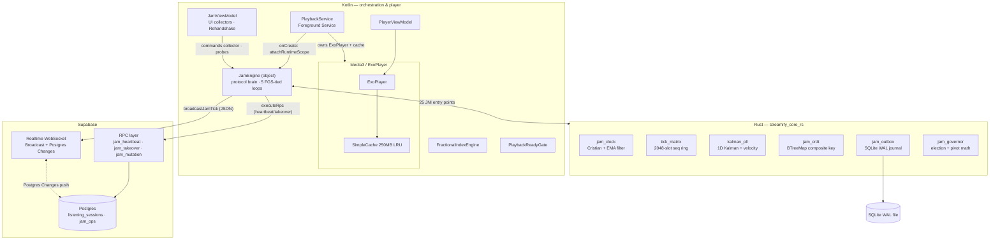

### Module responsibility map

| File | LOC | Responsibility |
|---|---:|---|
| `app/…/jam/JamEngine.kt` | 1,244 | Protocol brain: epochs, wire dispatch, succession, 5 FGS loops, CRDT/outbox routing |
| `app/…/jam/FractionalIndexEngine.kt` | 81 | IEEE-754 midpoint ordering with mantissa-exhaustion detection |
| `app/…/jam/PlaybackReadyGate.kt` | 80 | Event-driven READY→seek→play FSM (replaces `delay(300)` sleeps) |
| `rust/src/jam_clock.rs` | 219 | Cristian handshake, best-sample + EMA offset fusion |
| `rust/src/tick_matrix.rs` | 362 | Sequence ring, gap synthesis, adaptive cadence |
| `rust/src/kalman_pll.rs` | 220 | State-aware position tracking, feed-forward seek |
| `rust/src/jam_crdt.rs` | 460 | CmRDT merge, tombstones, compaction folds |
| `rust/src/jam_outbox.rs` | 410 | SQLite WAL journal: enqueue/poll/ack/replay/GC |
| `rust/src/jam_governor.rs` | 203 | Deterministic election, Death-Pivot extrapolation |
| `supabase/sql/jam_rpc.sql` | 154 | Auth-bound mutation path (P7) |
| `supabase/sql/jam_lease.sql` | 193 | TTL lease + A+B succession RPCs (P8) |

---

## 4. Wire Protocol Catalog

All traffic rides a single Supabase Realtime WebSocket as Phoenix-style JSON.
Room broadcast topic: `realtime:jam_<CODE>` (uppercase). Row-change topic:
`realtime:public:listening_sessions:id=eq.<uuid>`.

### 4.1 Control intents (epoch-gated)

| Action | Sender | Key fields | Effect on receiver |
|---|---|---|---|
| `TRACK_CHANGE` | Host | `track_json`, `position_ms` | Guest loads + pins exact position via Ready Gate |
| `SEEK` | authorized | `position_ms` | Hard seek + regime reset |
| `PLAY` / `PAUSE` | authorized | — | Transport control + regime reset |
| `TICK` | **host only** | `seq`, `host_mono`, `duration_ms` | Gap-repaired ingest → Kalman decision |

### 4.2 State ops (CRDT)

| Action | Fields | Semantics |
|---|---|---|
| `OP` | `o_id`, `o_sender`, `o_type`(1=Add/2=Remove/3=Reorder), `o_policy`, `o_cad`, `o_frac_bits`, `o_target` | Deterministic CmRDT merge; at-least-once delivery safe (op_id dedup) |
| `QUEUE_SNAPSHOT` | `q_snapshot[]` | Compacted fold for late joiners |

### 4.3 Session lifecycle

| Action | Direction | Purpose |
|---|---|---|
| `SYNC_REQ` / `SYNC_ACK` | guest → host → guest | Cristian t0/t1/t2/t3 handshake (P1) |
| `NEXT_IS` | host → guests | T-minus-30s pre-hydration intent (P3) |
| `HOST_TAKEOVER` | new host → all | Carries `t_host`, `t_epoch`, `t_pivot_pos`; epoch-gated adoption |
| `PRESENCE` | everyone | Roster liveness pulse (5 s) |
| `POLICY` | host | `HOST_ONLY` ↔ `EVERYONE` control switch |
| `SESSION_END` / `LEAVE` | host / guest | Room teardown / departure |

---

## 5. Skew-Free Clock

**Problem (P1):** `System.currentTimeMillis()` differs across devices by up to
seconds (carrier NTP). Extrapolating host position from wall clocks injects that
skew directly into every seek.

**Solution:** Cristian's four-timestamp exchange computed entirely on the
**monotonic domain** in Rust. Guests map their local monotonic clock into the
host's timeline; wall time is never consulted again inside Jam math.

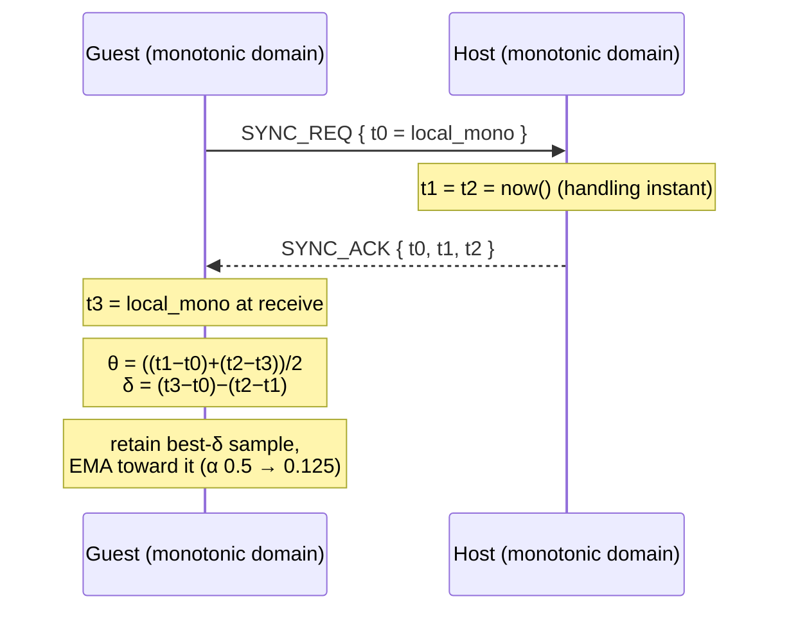

**Domain discipline (critical invariant):**

| Stamp | Domain | Why |
|---|---|---|
| `t0`, `t3` | Guest **raw** monotonic (`getLocalMonotonicMs`) | Synced values would feed θ back into itself — double-counting |
| `t1`, `t2` | Host synced (= raw; host offset ≡ 0) | Defines the target timeline |
| Everything post-lock | `getSyncedJamMonotonicMs()` everywhere | Single time source for extrapolation, PLL, pivots |

**Filter:** first sample snaps instantly; thereafter only samples within 1.5×
the best round-trip are accepted, EMA-smoothed. Lock requires ≥3 good samples;
RTTs >2 s or negative deltas are discarded as artifacts.

---

## 6. Tick Matrix

**Problem (P2):** ticks ride a fire-and-forget broadcast; drops are invisible
and a lost tick is indistinguishable from a stall.

**Contract — 24-byte frame** (transport is JSON; this is the canonical native layout):

| Offset | Field | Type | Notes |
|---|---|---|---|
| 0 | `magic` | u32 | `0x4A414D54` ("JAMT") |
| 4 | `seq` | u32 | Monotonic per host |
| 8 | `pos_ms` | i64 | Synced-domain position |
| 16 | `host_mono_ms` | i64 | Synced stamp used by Kalman age correction |
| 24 | `state` | u8 | 0 PLAYING · 1 PAUSED · 2 LOADING |
| 25 | `policy` | u8 | 0 HOST_ONLY · 1 EVERYONE |
| 26 | reserved | [u8;6] | Forced zero — integrity-checked |

**Pipeline on every received tick:**

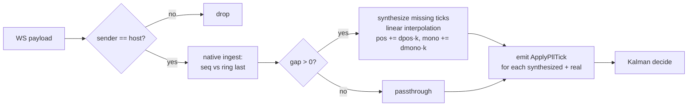

**Adaptive cadence (host side):**

| Condition | Interval |
|---|---|
| Steady state | 1000 ms |
| ≤2 s after any regime change (convergence burst) | 250 ms |
| Final 15 s before track end (transition alignment) | **50 ms** |

The cadence lives in a dedicated coroutine outside the 200 ms UI poll — the 50 ms
tier is physically reachable because it never shares a scheduler tick with UI work.

---

## 7. Kalman PLL

**Problem (P4):** pure PI loops accumulate integral windup across pause/play
regimes; recovery manifests as seconds of audible 0.96×–1.04× pitch drift.

**State:** position estimate `x`, rate-error `v`, covariance `p`.

$$x_{k|k-1} = x_{k-1} + v_{k-1}\cdot\Delta t \qquad P_{k|k-1} = P_{k-1} + Q$$
$$K_k = \frac{P_{k|k-1}}{P_{k|k-1}+R} \qquad x_k = x_{k|k-1} + K_k(z - x_{k|k-1})$$

**Decision bands:**

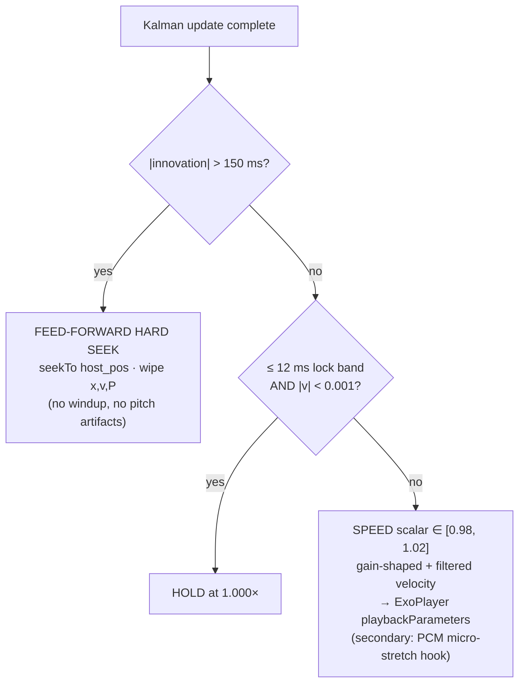

| Regime | Behaviour |
|---|---|
| `PAUSED` tick | Velocity clamped to 0, tracking frozen — resume re-initializes clean (**zero windup**) |
| Track transition | `markRegimeChange()` → PLL reset + convergence burst cadence |
| Host takeover | PLL reset + tick-matrix reset (see §10) |

Process/measurement noise: `Q_pos = 4.0`, `Q_vel = 0.05`, `R = 36` (≈ ±6 ms
residual jitter after upstream gap repair).

---

## 8. CRDT Queue

**Problem (P6):** concurrent adds raced against full-snapshot PATCHes; removals
matched title+artist strings and destroyed distinct versions.

**Design:** operation-based CmRDT. Elements are identified by the **add op's own
`op_id`**; removals carry `target_add_op_id` and tombstone the element, so a late
replayed `ADD` after its `REMOVE` is suppressed regardless of arrival order.

### Merge rules

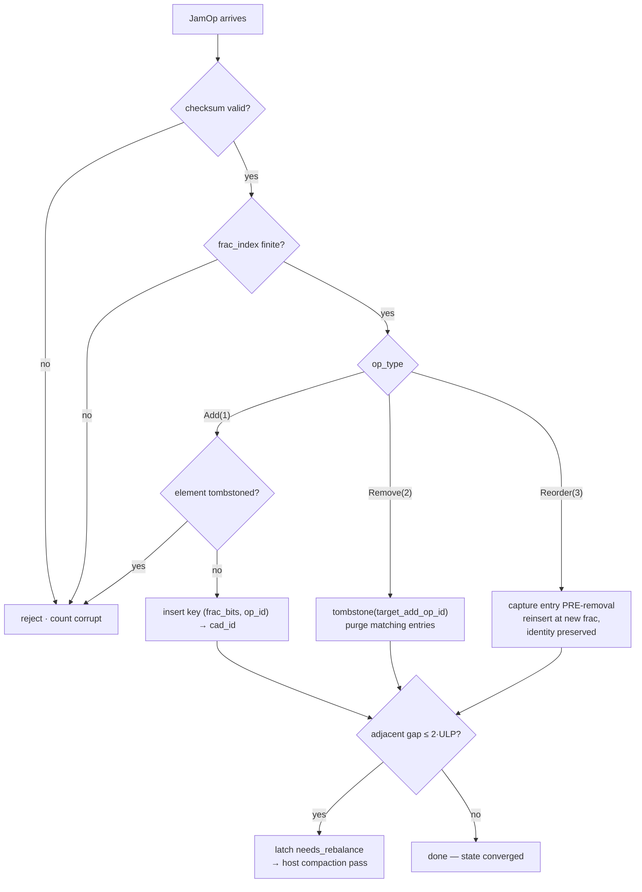

**Convergence guarantee (R1 fix):** ordering key is the composite
`(frac.to_bits(), add_op_id)`. Two replicas applying identical op sets in
different orders produce bit-identical maps — including the nasty case where two
guests insert into the same gap and compute the same midpoint fraction (tie broken
by op_id, deterministically).

**Identity parity (R3 fix):** CAD-IDs are minted exclusively through
`repository::generate_cad_id_u64` — byte-exact FNV-1a over normalized
title/artist plus the `/3` duration bucket. The Jam never forks the hasher.

**Folds ship tombstones:** `(queue_triples, tombstone_ids)` — fresh replicas
cannot resurrect removed elements when replaying history.

### Fractional indexing

Midpoints between neighbours; ~50 same-spot inserts exhaust the double mantissa,
at which point `needs_rebalance` latches and the host re-spaces indices during
compaction. Detection is **relative-ULP** aware (`gap ≤ scale × ε × 2`), not a
naïve absolute epsilon.

---

## 9. WAL Outbox

**Problem (P5):** mutations sent directly over the socket died with the socket.

**Design:** local-first journaling. Every mutation is (1) applied optimistically
to the CRDT view, (2) persisted to a SQLite WAL table, then (3) flushed
asynchronously. Delivery is **at-least-once**; hosts deduplicate by `op_id`
(`UNIQUE` index), making replay harmless.

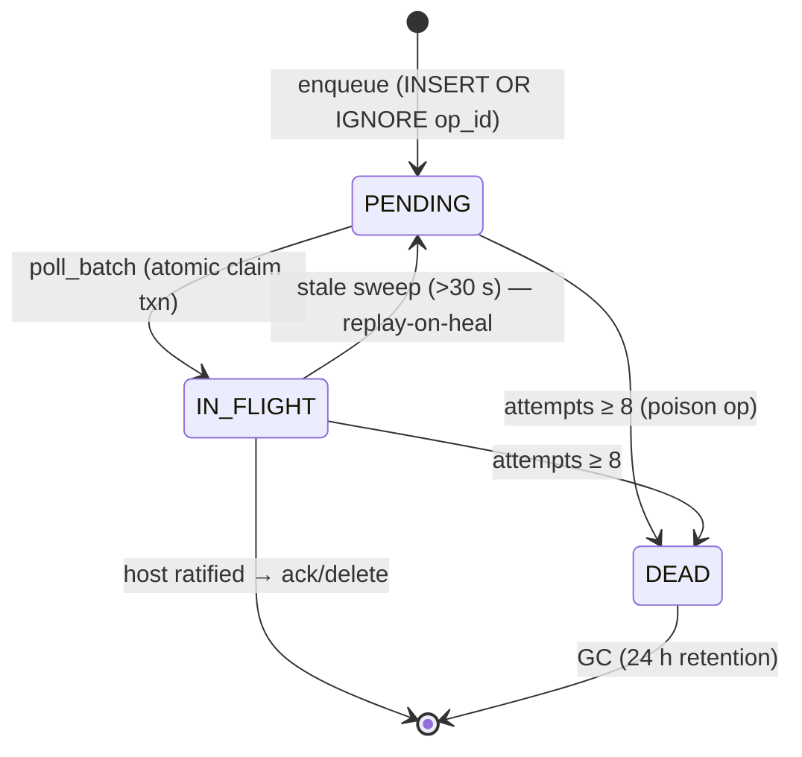

| Guarantee | Mechanism |
|---|---|
| Crash proof | WAL + `synchronous=NORMAL`; rows survive process death (tested) |
| No double-send | Claim marks `IN_FLIGHT` inside the read transaction |
| Poison safety | Corrupt blobs are **dead-lettered, never asserted** (panic-shield contract); capped retries stop infinite loops |
| Multi-room safety | Rows carry `session_code`; polls are session-scoped |
| Lock hygiene | Poisoned mutexes recovered via `into_inner()` |

Flush pacing: drain cycle every 1.5 s, batch ≤32, ack-on-successful-send, GC pass
every ~5 min (24 h retention).

---

## 10. Host Lifecycle

**Problem (P8):** host process death left rooms in eternal `DEGRADED`.

### 10.1 TTL Lease

The host's heartbeat writes `last_tick_pos_ms`, `last_tick_mono_ms` and extends
`host_lease_expires_at = now()+15 s` via the server-enforced RPC. The server —
not any client — decides who holds authority.

### 10.2 A+B Hybrid Succession

Pure determinism deadlocks when the lowest-id member never returns; pure
first-responder loses determinism entirely. The hybrid keeps both properties:

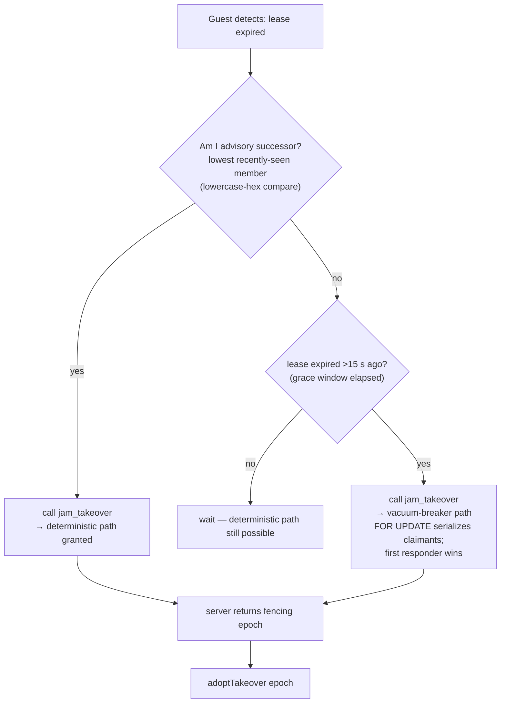

Server-side enforcement (`jam_takeover`, SECURITY DEFINER):

1. Caller authenticated (`auth.uid()`), member of `participant_ids`.
2. Lease genuinely expired (`FOR UPDATE` row lock).
3. Grant iff caller == lowest-recently-seen **or** grace elapsed.
4. Issues authoritative `host_epoch = MAX(host_epoch)+1000` — **the single
   source of epoch truth** (client-side epoch math was deliberately deleted).
5. Persists pivot trajectory stamps + stamps the new host's presence; fans out
   via `pg_notify('jam:<session>')`.

### 10.3 Self-Demotion

A host whose own heartbeat returns `DEMOTED` (someone else holds a valid lease):

```mermaid
flowchart LR
    A[heartbeat = DEMOTED] --> B[selfDemote:<br/>demotion latch set]
    B --> C[isHost() now false<br/>tick generator idles]
    B --> D[adoptForeignHost mirror update]
    B --> E[Command.Rehandshake<br/>→ performHandshake from row]
    B --> F[PLL/tick resets via regime mark]
```

`latestAppliedEpoch` floors ensure any stale packets from the zombie host are
rejected forever after.

---

## 11. The Death Pivot

The crown jewel. A naive successor would broadcast *its own* playhead — every
guest violently skips. Instead, the successor inherits the **dead host's
trajectory**:

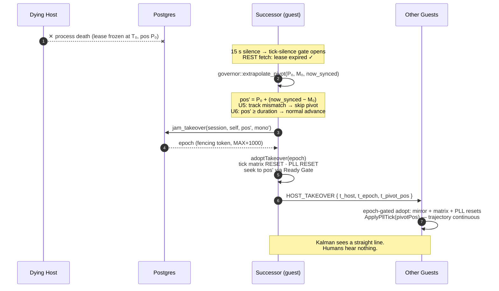

Because every device's clock already maps into the dead host's timeline (§5),
`pos'` lands on exactly where the room *should* be — the pivot is a continuation,
not a jump.

---

## 12. Event-Driven Readiness Gate

**Problem (P9):** seeking before Media3 reports `STATE_READY` lands the seek on
the *previous* item. The old code papered over this with `delay(300)`.

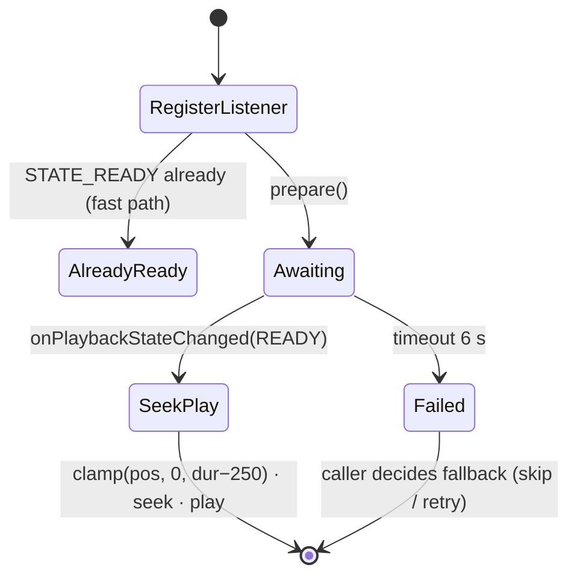

Pure Kotlin — deliberately **zero JNI**: ExoPlayer is Kotlin's domain; Rust does
math, not players. Both former sleep sites (`ApplyTrack`, `performHandshake`)
now suspend on real hardware readiness.

---

## 13. FGS-Tied Runtime

Distributed loops cannot live in a ViewModel — navigation kills them. They belong
to the only component Android legally permits to hold background network priority
during playback: the media **Foreground Service**.

| Loop | Cadence | Role |
|---|---|---|
| `heartbeatLoop` | 5 s | Host lease renewal; `DEMOTED` → self-demote + Rehandshake |
| `guestLeaseWatchLoop` | 2 s (gated) | Dead-man's switch + A+B succession attempt |
| `outboxFlushLoop` | 1.5 s + drain pacing | Journal drain, ack-on-send, periodic GC |
| `presencePulseLoop` | 5 s | Roster liveness |
| `clockSyncLoop` | 1.5 s | Handshake probes until lock |

Lifecycle contract:

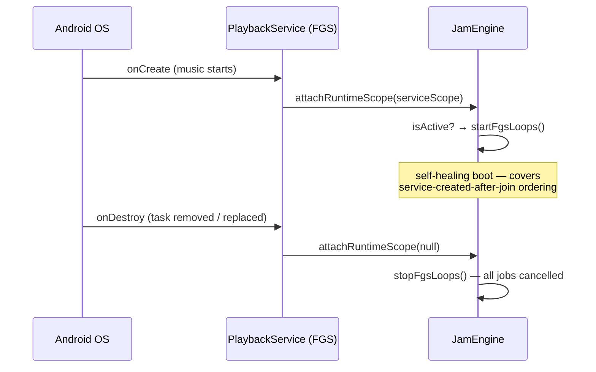

Dead-man's economics: while ticks flow (<15 s silence), the watch loop performs
**zero REST calls** — battery cost of resilience is paid only during actual
partitions.

---

## 14. End-to-End Journey

One master sequence — every subsystem in a single narrative:

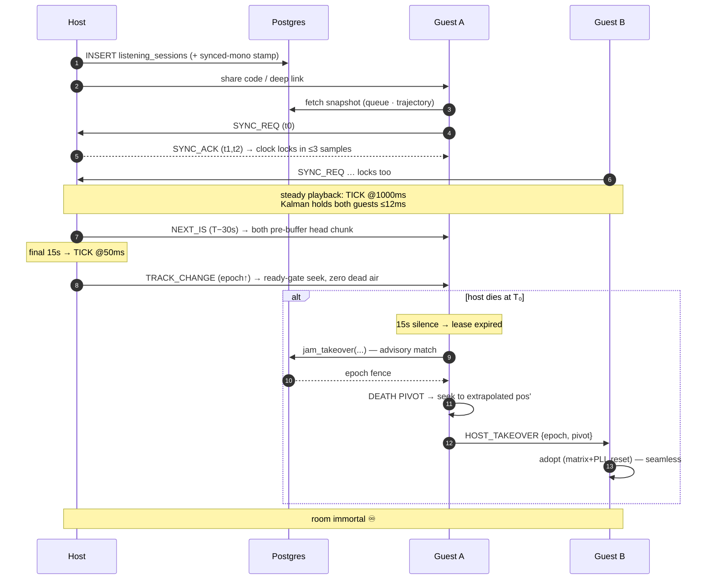

---

## 15. Data Model

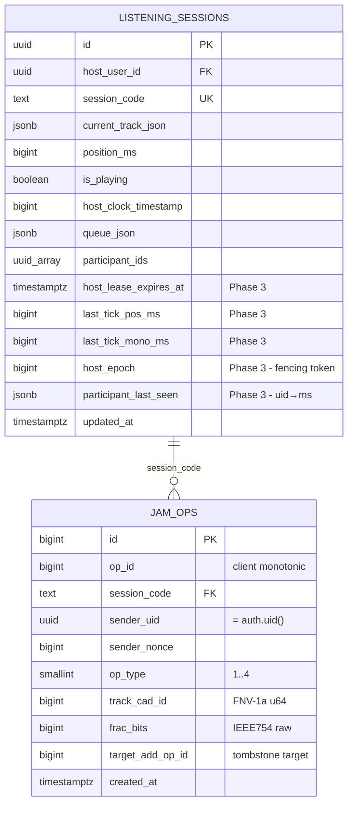

Native outbox (device-local SQLite, mirrors the CRDT envelope):

| Column | Type | Notes |
|---|---|---|
| `row_id` | INTEGER PK AUTOINC | |
| `op_id` | INTEGER UNIQUE | Idempotent enqueue |
| `session_code` | TEXT | Multi-room isolation |
| `op_data` | BLOB(48) | Field-wise LE serialization (no transmute) |
| `status` | INTEGER | 0 PENDING · 1 IN_FLIGHT · 3 DEAD |
| `attempts` | INTEGER | Cap 8 → dead-letter |
| `queued_at_ms` / `updated_at_ms` | INTEGER | Staleness sweep basis |

---

## 16. Security & Trust Model

| Vector | Enforcement | Layer |
|---|---|---|
| Queue mutation forgery | `jam_mutation` SECURITY DEFINER RPC: JWT identity + membership check before persistence; append-only journal, insert-own RLS | Postgres |
| Takeover forgery | `jam_takeover`: auth.uid() + membership + expiry verified server-side; epoch issued only by server | Postgres |
| Heartbeat spoofing | Server compares `auth.uid()` against stored `host_user_id` | Postgres |
| Late-join resurrection | Element-scoped tombstones shipped inside folds | Native CRDT |
| Wire corruption | FNV-1a-32 checksum span `[0..40)` incl. `frac_index` + pad-zero validation | Native CRDT |
| NaN poisoning | `is_finite()` rejection guards BTreeMap ordering | Native CRDT |
| **Ticks (accepted v1 risk)** | Broadcast remains unauthenticated; spoofed ticks bounded by epoch gates + Kalman outlier rejection (annoyance-level, not state-corrupting) | documented trade-off |
| Identity splitting | All subsystems mint CAD-IDs through the single canonical hasher | Repository |

---

## 17. Failure Playbook

| # | Failure | Detection | Recovery |
|---|---|---|---|
| 1 | Tick packet dropped | Seq gap in matrix | Linear-interpolation synthesis — PLL never sees the hole |
| 2 | WS socket death | `isRealtimeConnected` false | Outbox retains ops; Realtime reconnect triggers `Rehandshake` from DB row |
| 3 | Extended partition | Dead-man's switch (silence >15 s) | Lease fetch → succession attempt if eligible |
| 4 | Host process killed | Server lease expires (15 s) | A+B succession + Death Pivot — audio continues seamlessly |
| 5 | Host Doze-frozen | Lease lapses despite process alive | Same as #4; returning host re-handshakes as guest, may re-claim later |
| 6 | Guest resolve failure mid-song | Missing READY within gate timeout | Flagged to caller; next TRACK_CHANGE re-syncs; CRDT unaffected |
| 7 | Corrupt outbox row | Pad/checksum rejection on poll | Dead-lettered + counted — flush loop never stalls |
| 8 | Poison mutation op | Retry cap (8) hit | DEAD status; GC reclaims after 24 h |
| 9 | Fractional exhaustion | Relative-ULP latch | `needs_rebalance` → host compaction re-spacing |
| 10 | Zombie old host wakes | Its heartbeat returns `DEMOTED` | Self-demote pipeline + fencing epoch rejects its stale intents permanently |

---

## 18. Performance Budgets

| Metric | Budget | Achieved via |
|---|---|---|
| Inter-device clock offset | ≤ 50 ms typical | Cristian + best-sample EMA (RTT-filtered) |
| Steady-state drift | ≤ 12 ms hold band | Kalman lock band; speed scalar otherwise ±2% max |
| Macro-drift recovery | Instant (one tick) | Feed-forward hard seek, integrator wiped |
| Track-transition dead air | 0 ms target | `NEXT_IS` 30 s pre-buffer + 50 ms cadence + Ready Gate |
| Mutation latency (broadcast path) | < 50 ms | Direct WS broadcast, optimistic local apply |
| Mutation latency (RPC path) | 100–300 ms accepted | Correctness/auth traded consciously |
| Takeover convergence | ≤ 15 s worst case (= TTL window) | Lease arithmetic; pivot itself ≈ one seek |
| Tick processing | O(1) amortized per tick | Ring buffer + O(gap) synthesis only on gaps |
| CRDT apply | O(log n) | BTreeMap composite-key insert |
| Battery (steady guest) | ~0 REST | Tick-silence gating suppresses lease polling |

---

## 19. Constants Registry

| Constant | Value | Home | Meaning |
|---|---|---|---|
| `SIGNATURE_TIMESTAMP` equivalent era | pinned STS | resolver | Client-coupled Innertube posture (outside Jam scope) |
| Host TTL | 15 s | `jam_heartbeat` / `jam_takeover` | Lease window |
| Succession grace | 15 s past expiry | `jam_takeover` | Vacuum-breaker delay |
| Presence seen-window | 30 s | `jam_takeover` | "Recently seen" membership filter |
| Tick-silence threshold | 15 s | `guestLeaseWatchLoop` | Dead-man trigger |
| Lease-fetch min interval | 10 s | `guestLeaseWatchLoop` | REST anti-spam |
| Tick cadences | 1000 / 250 / 50 ms | `TickMatrix::host_interval_ms` | steady / burst / finale |
| DEGRADED threshold | 6 s tick silence | `refreshConnStatus` | UI chip state |
| Kalman micro band | ±150 ms | `kalman_pll` | Speed-vs-seek boundary |
| Kalman lock band | ±12 ms | `kalman_pll` | Hold-at-1.000× |
| Speed clamp | 0.98 – 1.02 | `kalman_pll` | Audibility envelope |
| `Q_pos / Q_vel / R` | 4.0 / 0.05 / 36.0 | `kalman_pll` | Filter noise model |
| Clock lock samples | ≥3 good | `jam_clock` | EMA activation |
| Max trusted RTT | 2000 ms | `jam_clock` | Sample rejection ceiling |
| Ring capacity | 2048 slots | `tick_matrix` | >10 min steady / ~30 s burst history |
| Outbox retry cap | 8 | `jam_outbox` | Poison-op dead-letter |
| Outbox staleness | 30 s | `replay_pending` | In-flight revert |
| Outbox GC retention | 24 h | `gc()` | Terminal-row reclaim |
| Ready-gate timeout | 6000 ms | `PlaybackReadyGate` | Resolve+prepare ceiling |
| Epoch jump | +1000 | `jam_takeover` | Fencing distance above any observed epoch |

---

## 20. Deployment Runbook

**Migrations (hand-applied, Supabase SQL Editor, in order):**

```text
1. supabase/sql/jam_rpc.sql     ← Phase 2: jam_ops journal + jam_mutation RPC
                                  + realtime publication for jam_ops
2. supabase/sql/jam_lease.sql   ← Phase 3: lease columns + heartbeat/takeover RPCs
                                  + realtime publication for listening_sessions
```

Both are idempotent-safe (`IF NOT EXISTS` / `CREATE OR REPLACE`). After applying
Phase 2, flip the client flush loop's send path from direct OP broadcast to the
`jam_mutation` RPC (flip point documented at the bottom of the file) — until
then the trusted-device broadcast model applies to mutations.

**Build:** Kotlin compiles in CI (`assembleDebug`); Rust cross-compiles via
cargo-ndk for `arm64-v8a` / `armeabi-v7a`. Run `cargo test -p streamify_core_rs --lib`
locally before pushing — 14/14 expected.

---

## 21. Testing Matrix

| Test lifecycle | Protects | Class of bug it kills |
|---|---|---|
| `jam_clock::clock_full_lifecycle` | P1 | Exact-θ recovery, asymmetric-transit math, artifact rejection, EMA jitter absorption |
| `tick_matrix::matrix_full_lifecycle` | P2 | Consecutive tracking, ordered gap synthesis, duplicate/replay drops, seq-wrap acceptance, pack round-trip, adaptive cadence, **takeover reset clears stream** |
| `kalman_pll::kalman_full_lifecycle` | P4 | Init-without-action, micro-band audibility ceiling, feed-forward seek targeting, pause/resume anti-windup |
| `jam_crdt::crdt_full_lifecycle` | P5/P6 | CAD-ID hex parity, clock-step-back ids, tamper rejection, late-Add suppression, **same-fraction convergence**, commutativity shuffle, reorder identity capture, ULP latch, NaN guard, serde round-trip, pad corruption |
| `jam_outbox::*` (5 suites) | P5 | Ordering, idempotent enqueue, no double-fetch, ack purge, stale sweep, session isolation, **WAL crash recovery**, corrupt-blob dead-letter, retry-cap, apply-and-enqueue combo |
| `jam_governor::*` (3 suites) | P8/P3.3 | Election matrix (healthy/expired/already-lowest/solo/mixed-case), advisory gating, pivot matrix (forward/boundary/past-end/skew/mismatch/unknown-duration) |

Style note: suites touching process-global state are consolidated into single
sequential lifecycles so cargo's parallel harness can never interleave them —
a lesson learned the hard way during Phase 1.

---

## 22. Roadmap

Remaining catalog items, in attack order:

| Item | Phase ref | Sketch |
|---|---|---|
| Suggestion pipeline (propose → host approve) | P10 | `OP_VOTE` enum slot already reserved; needs proposed-vs-committed queue split |
| Member governance (kick/block/co-host) | P11 | Co-host interacts with fencing epochs — design carefully |
| Rich invites (QR, waiting-room preview) | P12 | Pure UI + existing deep-link plumbing |
| Ambient presence avatars in player sheet | P13 | Data already flows via roster StateFlow |
| Reactions/chat | P14 | Secondary transport budget beside ticks |
| Room memory / stats export | P15 | `fold_to_snapshot` already yields replayable state |
| LAN mesh acceleration (sub-ms sync) | P16 | `PrecisionTimeProtocol` UDP PTP already exists unwired |
| Group DSP loudness coherence | P18 | `loudnessDb` captured per-stream today |

---

*Built on branch `jamv3-eng`. Physics: `84ebd60` · State: `1c28b6a` ·
Immortality: `28727fb` · Integration: `31829de`.*
