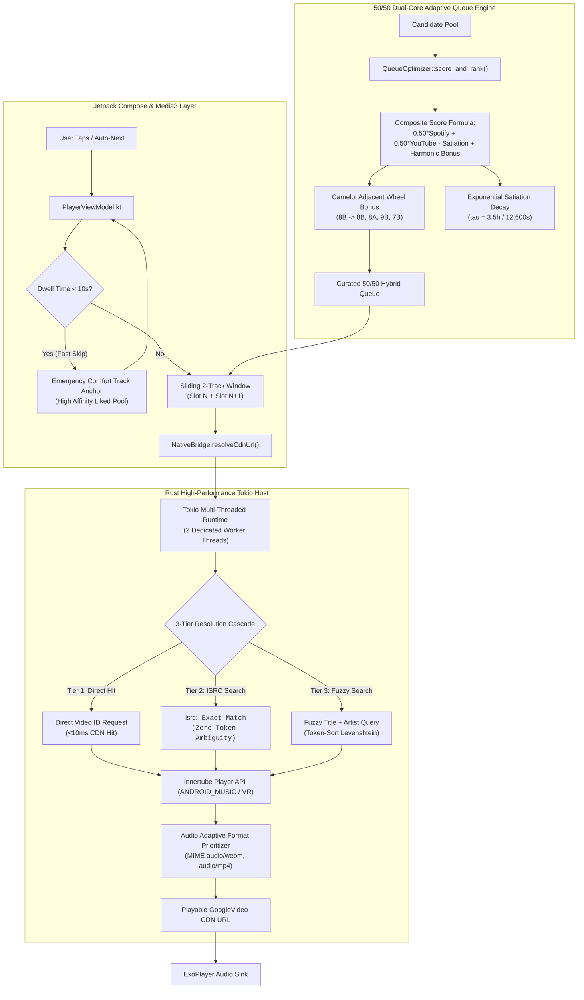
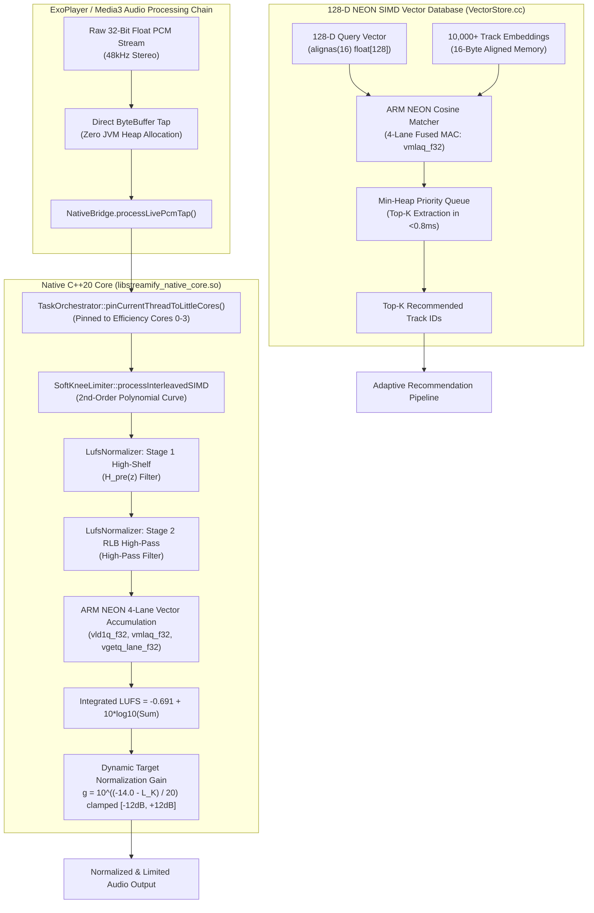
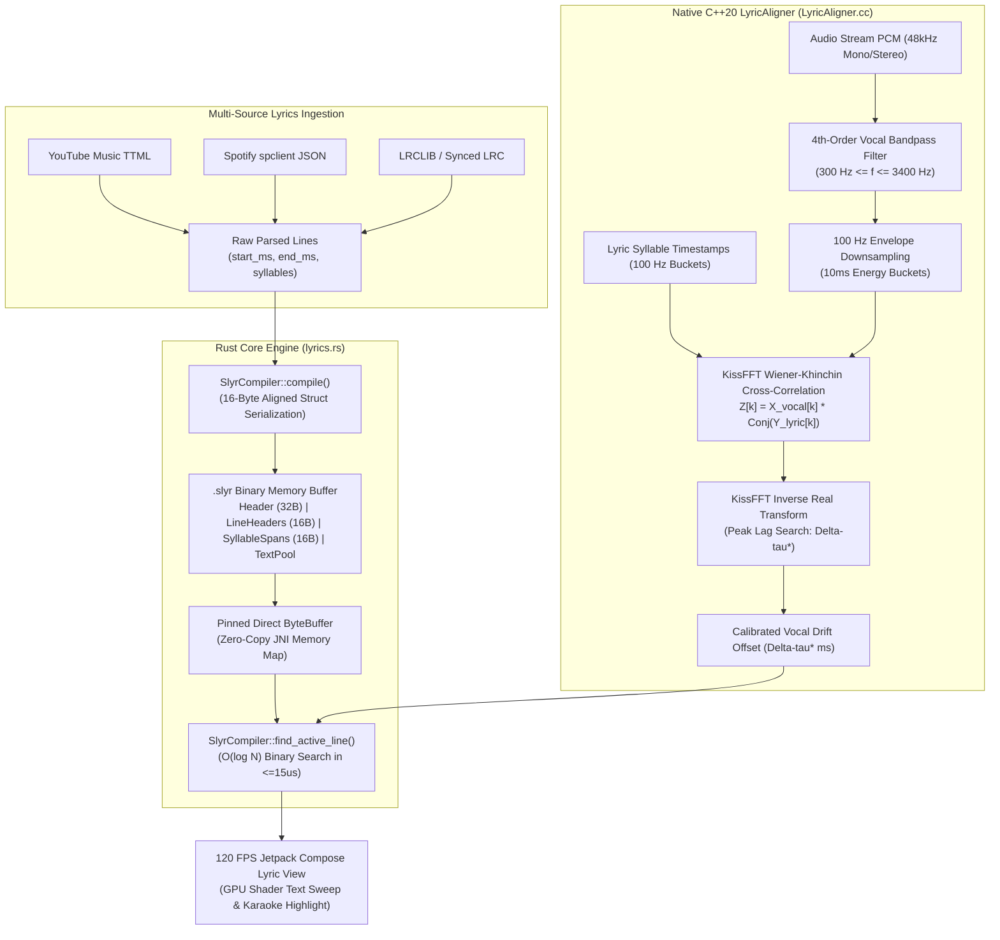
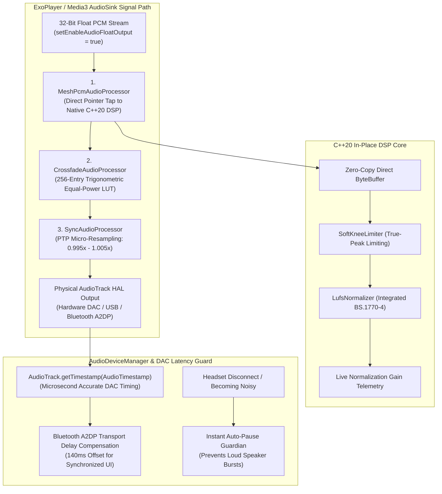

# Streamify APK — Production Architecture & Systems Manual

[](https://github.com/zephyr4289/streamify-apk/actions/workflows/extreme-test-matrix.yml)
[](LICENSE)
[-brightgreen.svg)](https://android.com)
[](https://kotlinlang.org)
[](https://developer.android.com/jetpack/compose)
[](https://isocpp.org)
[](https://www.rust-lang.org)

**Streamify** is an ultra-low-latency Android music streaming engine engineered with a **Dual-Native (Kotlin + Jetpack Compose, Native C++20 Core, and Rust Engine)** architecture. C++20 handles real-time SIMD audio DSP (ITU-R BS.1770-4 LUFS, KissFFT HPCP Camelot keys, Ellis BPM prior, Soft-Knee limiter) and 6-DOF RK4 fluid dynamics, while Rust eliminates garbage collection bottlenecks with zero-copy SIMD JSON parsing, pure native audio metadata tagging with Lofty (completely eliminating Python and CPython GIL overhead), sub-millisecond binary lyric timeline pre-compilation, and low-jitter PTP clock synchronization.

---

## 📑 Architectural Index

1. [Executive System Topology](#-1-executive-system-topology)
2. [Exhaustive Codebase & Repository File Architecture Tree](#-2-exhaustive-codebase--repository-file-architecture-tree)
3. [Explicit Memory, Hardware & GC Invariants](#-3-explicit-memory-hardware--gc-invariants)
4. [Security Architecture & Runtime Sandboxing](#-4-security-architecture--runtime-sandboxing)
5. [Subsystem Failure Mode & Effects Analysis (FMEA) Matrix](#-5-subsystem-failure-mode--effects-analysis-fmea-matrix)
6. [Deep Architectural Data Flow & Tool Interaction Diagrams](#-6-deep-architectural-data-flow--tool-interaction-diagrams)
   * [Diagram 1: Native C++20 DSP & Acoustic DNA Vector Extraction Architecture](#diagram-1-native-c20-dsp--acoustic-dna-vector-extraction-architecture)
   * [Diagram 2: Media3 JIT Hardware Sliding Window, Crossfade & Audio Tap Engine](#diagram-2-media3-jit-hardware-sliding-window-crossfade--audio-tap-engine)
   * [Diagram 3: Multi-Network Stream Resolver & Rust Zero-Copy Pipeline](#diagram-3-multi-network-stream-resolver--rust-zero-copy-pipeline)
   * [Diagram 4: Continuum Graph AI, Markov Chains & Asymmetric Re-Ranker](#diagram-4-continuum-graph-ai-markov-chains--asymmetric-re-ranker)
   * [Diagram 5: Byzantine Fault-Tolerant Acoustic Mesh & Zero-Knowledge Consensus](#diagram-5-byzantine-fault-tolerant-acoustic-mesh--zero-knowledge-consensus)
   * [Diagram 6: Sub-15ms Real-time Jam Room & PTP Phase-Locked Loop Synchronization](#diagram-6-sub-15ms-real-time-jam-room--ptp-phase-locked-loop-synchronization)
   * [Diagram 7: 120 FPS RK4 Kinetic Token AirDrop, AM-OLED Canvas & Micro-Haptics](#diagram-7-120-fps-rk4-kinetic-token-airdrop-am-oled-canvas--micro-haptics)
   * [Diagram 8: Jetpack Compose UI Shelves, Karaoke Engine, Social Platform & Admin Hub](#diagram-8-jetpack-compose-ui-shelves-karaoke-engine-social-platform--admin-hub)
   * [Diagram 9: Real-Time Acoustic-Textual Synchronization & SLYR Engine](#diagram-9-real-time-acoustic-textual-synchronization--slyr-engine)
7. [Complete 64-Feature Engineering Specifications](#-7-complete-64-feature-engineering-specifications)
   * [Part A: Native C++20 Core, DSP & Vector Store (Features 1 – 15)](#part-a-native-c20-core-dsp--vector-store-engine-features-1--15)
   * [Part B: Playback Architecture & Media3 Pipeline (Features 16 – 27)](#part-b-playback-architecture--media3-pipeline-features-16--27)
   * [Part C: Data, Discovery, AI & Byzantine Mesh (Features 28 – 42)](#part-c-data-discovery-ai--byzantine-mesh-features-28--42)
   * [Part D: Jetpack Compose UI, Gestures & Visuals (Features 43 – 64)](#part-d-jetpack-compose-ui-gestures--visuals-features-43--64)
8. [Comprehensive 64-Feature Subsystem & Tool Mapping Matrix](#-8-comprehensive-64-feature-subsystem--tool-mapping-matrix)
9. [Native NDK Toolchain, CTest Verification & Build Guide](#-9-native-ndk-toolchain-ctest-verification--build-guide)

---

## 🏛️ 1. Executive System Topology

```
┌────────────────────────────────────────────────────────────────────────────────────────┐
│                                 STREAMIFY RUNTIME TOPOLOGY                             │
├────────────────────────────────────────────────────────────────────────────────────────┤
│                                                                                        │
│   🎨 JETPACK COMPOSE UI LAYER (120 FPS Hardware VSYNC Rendering)                       │
│   ├─ Z-Axis Compositor: FullPlayerSheet, Floating MiniPlayerBar & Gesture Host         │
│   ├─ Dynamic AM-OLED Ambient Glow Engine (Palette Extractor)                           │
│   └─ Hardware LRA Tactile Haptics (StreamifyHapticEngine)                              │
│                                      │                                                 │
│                        StateFlow / JNI Direct Memory Tap                               │
│                                      ▼                                                 │
│   🎵 PLAYBACK & MEDIA3 ENGINE (Android Service Layer)                                  │
│   ├─ Sliding 2-Track JIT Hardware Timeline Window (Active Slot N + Lookahead N+1)      │
│   ├─ In-Stream Zero-Copy Live PCM Tap (MeshPcmAudioProcessor)                          │
│   ├─ 256-Entry Trigonometric Equal-Power Crossfader (CrossfadeAudioProcessor)          │
│   └─ IEEE 1588 Precision Time Protocol Synchronizer (SyncAudioProcessor)               │
│                                      │                                                 │
│                 ┌────────────────────┴────────────────────┐                            │
│                 ▼                                         ▼                            │
│   🧠 NATIVE C++20 CORE (DSP & PHYSICS)      🦀 RUST ENGINE (ZERO-COPY I/O)             │
│   ├─ ITU-R BS.1770-4 / EBU R128 Loudness    ├─ SIMD Innertube JSON Parser (simd-json)  │
│   ├─ KissFFT 2048-pt HPCP & Camelot Keys    ├─ Pure Audio Tagger (lofty, 0 Python)     │
│   ├─ Ellis Log-Normal Tempo Prior (120 BPM) ├─ Low-Jitter PTP UDP Actor (socket2)      │
│   ├─ 128-D ARM NEON VectorStore & RK4 ODE   ├─ Binary Syllable Lyric Pre-Compiler      │
│   ├─ ARM big.LITTLE Core Pinning (Cores 0-3)├─ Byzantine Proof-of-Compute (HMAC-SHA256)│
│   └─ SQLite3 WAL Native Database Engine     └─ Zero-Credential Spotify Scraper         │
│                                      │                    │                            │
│                                      └──────────┬─────────┘                            │
│                                                 ▼                                      │
│   🌐 BYZANTINE FAULT-TOLERANT CLOUD MESH (Supabase / PostgreSQL pgvector)              │
│   ├─ 2-Peer Byzantine Verification: (|ΔLUFS| ≤ 0.3, Matching Key, Cosine Sim ≥ 0.94)  │
│   └─ Zero-Knowledge Proof-of-Compute HMAC-SHA256 Energy Band Validation                │
│                                                                                        │
└────────────────────────────────────────────────────────────────────────────────────────┘
```

---

## 🗂️ 2. Exhaustive Codebase & Repository File Architecture Tree

Below is the complete file-level repository architecture mapping every component, source file, header, and script to its runtime subsystem, architectural layer, threading model, and execution invariants.

```
streamify-apk/
├── .github/
│   └── workflows/
│       ├── extreme-test-matrix.yml          # Parallel Chaos Suite: 8 Shards, ASan/UBSan, LibFuzzer & GitHub Releases
│       └── release.yml                      # Release Automation & Tag Trigger
├── app/
│   ├── build.gradle.kts                     # App Build Config: NDK C++20 toolchain, Rust core integration, Compose BOM, Media3
│   └── src/
│       └── main/
│           ├── AndroidManifest.xml          # Runtime Manifest: Foreground Service audio permissions, WakeLocks, Network State, Audio routing
│           ├── java/
│           │   └── com/streamify/app/
│           │       ├── MainActivity.kt      # Root Activity: CompositionLocal hosting, back-press throttle, FullPlayerSheet modal container
│           │       ├── StreamifyApp.kt      # Application Base: NativeBridge system library loading, AudioCacheManager init, Haptics init
│           │       │
│           │       ├── data/                # Data Layer & Storage Subsystem
│           │       │   ├── AntiDriftScoringEngine.kt # Vector centroid drift scoring & acoustic coherence penalty evaluation
│           │       │   ├── BackupManager.kt          # M3U8 & JSON playlist export/import, atomic schema restore
│           │       │   ├── ContinuumRadioEngine.kt   # High-level infinite dynamic radio candidate broker & re-ranking pipeline
│           │       │   ├── EdgeMeshRepository.kt     # In-stream PCM acoustic DNA accumulator, proof-of-compute, Byzantine RPC
│           │       │   ├── ExportifyParser.kt        # CSV / JSON schema parser for legacy Spotify/Exportify playlist migration
│           │       │   ├── FractionalIndexEngine.kt  # O(1) conflict-free fractional indexing for drag-and-drop playlist reordering
│           │       │   ├── FuzzyTitleMatcher.kt      # Token-sort Levenshtein distance metric for deduplication & remix detection
│           │       │   ├── LyricsCacheManager.kt     # Bounded on-disk LRU cache for synchronized syllable .lrc files
│           │       │   ├── NativeBridge.kt           # JNI Kotlin Bindings: Maps native C++ and Rust functions to Kotlin external methods
│           │       │   ├── NativeMetadataTagger.kt   # Zero-copy audio metadata writer and Retina artwork resolver
│           │       │   ├── NuclearResetManager.kt    # 4-stage atomic rebirth: Cloud Snapshot -> Native Truncate -> Reseed -> Restore
│           │       │   ├── PlaylistRepository.kt     # Playlist state store, fractional reordering, outbox Supabase cloud sync
│           │       │   ├── ReRanker.kt               # Multi-factor score calculator: Cosine vector + Markov prob + Satiation decay
│           │       │   ├── StorageManager.kt         # Storage stats, partition calculation, atomic cache purging
│           │       │   ├── TrackRepository.kt        # Central local/cloud catalog, StateFlow reactive flows, migration dispatcher
│           │       │   ├── UniversalCandidateBroker.kt # Multi-channel candidate broker merging local, cloud, and collaborative streams
│           │       │   ├── YtStatsTelemetryEngine.kt # Psychometric dwell & scrub tracker, telemetry accumulator
│           │       │   │
│           │       │   ├── models/                   # Immutable Data Models
│           │       │   │   └── Track.kt              # Core Track entity (id, title, artist, album, filepath, duration, bpm, camelotKey, lufs)
│           │       │   │
│           │       │   ├── network/                  # Network, Streaming & Extraction Engines
│           │       │   │   ├── AntiJarringTransitionEngine.kt # Harmonic Camelot wheel transition compatibility calculator
│           │       │   │   ├── CandidateAggregator.kt        # 3-Tier candidate fetcher (Innertube + Related + Local Markov graph)
│           │       │   │   ├── CanonicalSeedResolver.kt      # Resolves foreign track identifiers to canonical YouTube Music IDs
│           │       │   │   ├── HybridGraphFetcher.kt         # Fetches collaborative filtering graph nodes from cloud Supabase pgvector
│           │       │   │   ├── LyricsResolver.kt             # Asynchronous racer between LRCLIB and NetEase lyric endpoints
│           │       │   │   ├── MeshDiscoveryEngine.kt        # P2P mesh node discovery and peer acoustic vector validator
│           │       │   │   ├── NetworkEngine.kt              # OkHttp connection pooling, HTTP/2 multiplexing, DNS over HTTPS
│           │       │   │   ├── ParallelStreamDownloader.kt   # Multi-part parallel chunked audio stream downloader with byte-range resume
│           │       │   │   ├── PersonaEngine.kt              # Zhipu GLM-4 prompt generator for user acoustic persona & Wrapped analysis
│           │       │   │   ├── ResilientMediaRouter.kt       # Multi-source routing engine with automated fallback prioritization
│           │       │   │   ├── SemanticSearchEngine.kt       # NLP search query vectorizer matching acoustic embeddings
│           │       │   │   ├── SmartAcousticEngine.kt        # Automatic 10-band EQ curve synthesizer based on acoustic DNA
│           │       │   │   ├── YouTubeMusicSearchApi.kt      # Pure Kotlin Innertube API client for high-speed autocomplete & search
│           │       │   │   ├── YouTubeStreamResolver.kt      # 3-tier resolver: Edge Cache -> Native Innertube Race -> Fallback Search Match
│           │       │   │   ├── ZhipuAiEngine.kt              # High-level client for Zhipu AI GLM-4 language model
│           │       │   │   └── iTunesSearchApi.kt            # High-resolution 1400x1400 artwork fetcher via Apple iTunes Search API
│           │       │   │
│           │       │   └── remote/                   # Cloud & Backend RPC Services
│           │       │       ├── AuthManager.kt            # Google OAuth2 + Supabase Auth token lifecycle & refresh manager
│           │       │       ├── BatchTrackResolver.kt     # High-speed batch track resolver with concurrency throttling
│           │       │       ├── PlaylistLinkScraper.kt    # Spotify web embed parser extracting track lists without OAuth credentials
│           │       │       ├── StreamifyUpdateManager.kt # OTA in-app updater: GitHub Releases API + Android DownloadManager
│           │       │       └── SupabaseClient.kt         # PostgreSQL Realtime WebSockets, pgvector RPCs, Jam presence & telemetry
│           │       │
│           │       ├── navigation/                   # Compose Navigation Subsystem
│           │       │   ├── AppNavGraph.kt            # Central NavHost routing (Home, Search, Library, Jam, Community, Admin, Settings)
│           │       │   └── Screen.kt                 # Sealed screen destination definitions with type-safe route arguments
│           │       │
│           │       ├── service/                      # Audio Playback & Media3 Architecture
│           │       │   ├── AudioCacheManager.kt      # Media3 SimpleCache singleton with bounded 250MB LRU disk eviction
│           │       │   ├── AudioDeviceManager.kt     # Bluetooth A2DP / LE Audio routing, volume flaring, and headset disconnection traps
│           │       │   ├── CrossfadeAudioProcessor.kt # In-pipeline 256-entry trigonometric equal-power crossfade audio processor
│           │       │   ├── ElasticStorageAllocator.kt # Storage quota governor dynamically reallocating cache space
│           │       │   ├── EqualizerManager.kt       # Android AudioEffect.Equalizer controller with 10-band gain sliders
│           │       │   ├── IngestionWorker.kt        # Background WorkManager task for batch audio file feature indexing
│           │       │   ├── LosslessRemuxer.kt        # Remuxes raw Opus/AAC streams into standard MP4/M4A containers without transcoding
│           │       │   ├── LyricPlaybackController.kt # Sub-millisecond timeline tracker syncing lyrics to ExoPlayer playback clock
│           │       │   ├── MeshPcmAudioProcessor.kt  # In-stream zero-copy live PCM tap plugged into ExoPlayer DefaultAudioSink
│           │       │   ├── OnlineTrackProcessor.kt   # JIT stream processor resolving CDN links right before playback emission
│           │       │   ├── PhaseLockedLoopController.kt # Jam session PLL drift calculator with proportional-integral clock tuning
│           │       │   ├── PlaybackService.kt        # MediaSessionService hosting ExoPlayer, notification manager, media button receiver
│           │       │   ├── PrecisionTimeProtocol.kt  # IEEE 1588 PTP implementation computing hardware network delay & clock offset
│           │       │   ├── PredictivePreBufferManager.kt # T-30s lookahead audio stream pre-fetcher into Media3 cache
│           │       │   ├── PriorityWeightedEvictor.kt # Custom Media3 cache evictor prioritizing un-favorited ephemeral streams
│           │       │   ├── ScheduledAudioScheduler.kt # Atomic multi-device scheduled playback start trigger at epoch timestamps
│           │       │   ├── SyncAudioProcessor.kt     # Microsecond-level PCM sample insertion/deletion audio processor for PTP sync
│           │       │   ├── TextEmbeddingEngine.kt    # On-device text vector embedder for local semantic search indexing
│           │       │   └── TitanComputeWorker.kt     # WorkManager background compute worker submitting Byzantine Proof-of-Compute
│           │       │
│           │       ├── ui/                           # Jetpack Compose UI Subsystem (120 FPS)
│           │       │   ├── components/               # Reusable Modular UI Components
│           │       │   │   ├── ArtistCircleCard.kt   # Circular artist avatar card with dynamic stroke and hero navigation
│           │       │   │   ├── BottomNavBar.kt       # Minimalist navigation bar with active tab indicators
│           │       │   │   ├── BroadcastBanner.kt    # System-wide announcement banner for admin broadcasts and OTA updates
│           │       │   │   ├── CategoryCard.kt       # Card component for genre and category discovery
│           │       │   │   ├── CommentsSheet.kt      # Timestamped contextual comments bottom sheet with real-time posting
│           │       │   │   ├── ContextMenuSheet.kt   # Hoisted root context menu sheet (Like, Add to Playlist, Radio, Jam, Details)
│           │       │   │   ├── EmptyStateView.kt     # Graphic empty state placeholder with contextual call-to-action buttons
│           │       │   │   ├── FluidSyllableText.kt  # 120 FPS zero-alloc karaoke text renderer: CompositingStrategy.Offscreen + BlendMode.SrcIn
│           │       │   │   ├── FluidWaveformSeekbar.kt # iPhone-style kinetic 72-bar audio waveform seekbar with velocity-aligned stretch & spring inertia
│           │       │   │   ├── FriendActivityCard.kt # Social listening activity card showing real-time playback of friends
│           │       │   │   ├── HeartButton.kt        # Bouncing spring kinetic heart toggle with micro-haptic click
│           │       │   │   ├── LyricsEditorDialog.kt # In-app manual LRC lyric timing editor and timestamp offset adjuster
│           │       │   │   ├── MarqueeText.kt        # Hardware-accelerated smooth scrolling text marquee for long track titles
│           │       │   │   ├── MiniPlayerBar.kt      # Persistent floating dock with squash-and-stretch physics and swipe dismissal
│           │       │   │   ├── NowPlayingIndicator.kt # 3-bar animated equalizer graphic indicating live playback state
│           │       │   │   ├── PlayerBackground.kt   # Animated AM-OLED fluid gradient canvas driven by track artwork palette
│           │       │   │   ├── PlayerControls.kt     # Play/pause, skip, shuffle, repeat controls with tactile detent feedback
│           │       │   │   ├── PlayerSeekBar.kt      # Sub-millisecond seekbar with magnetic detents at chorus and hook points
│           │       │   │   ├── QuantumSonicTokenController.kt # RK4 6-DOF kinetic flight physics controller and JNI buffer bridge
│           │       │   │   ├── QuantumSonicTokenOverlay.kt    # Hardware-accelerated full-screen canvas rendering flying audio token
│           │       │   │   ├── RecentPlayCard.kt     # Compact recently played track card for dashboard carousels
│           │       │   │   ├── RelatedDiscoverSheet.kt # Multi-shelf discovery sheet with similar tracks, artist singles, and albums
│           │       │   │   ├── ReorderableList.kt    # 120 FPS drag-and-drop reorderable LazyColumn with magnetic snap physics
│           │       │   │   ├── ShimmerPlaceholder.kt # High-performance shimmer placeholder skeleton for loading states
│           │       │   │   ├── SireenBrandingBadge.kt # Zero-recomposition GPU draw-phase chromatic laser branding badge
│           │       │   │   ├── StreamifyPullToRefreshContainer.kt # GPU-accelerated overscroll pull-to-refresh with orbital arc spinner
│           │       │   │   ├── TrackCard.kt          # Standard square track card with artwork and title for grids
│           │       │   │   ├── TrackCoverArt.kt      # Cached Coil image loader with fallback vector placeholders and rounded corners
│           │       │   │   ├── TrackListItem.kt      # Swipeable track list row with swipe-to-queue and swipe-to-like gestures
│           │       │   │   ├── UpdateAvailableCard.kt # Card displaying OTA release notes, APK download progress, and install trigger
│           │       │   │   ├── YtActiveEqualizer.kt  # Compact mini equalizer preset selector pill
│           │       │   │   ├── YtBottomNavBar.kt     # YouTube Music style 4-tab bottom navigation bar with pill highlight
│           │       │   │   ├── YtGenreCard.kt        # YouTube Music style large gradient genre exploration card
│           │       │   │   ├── YtGenreDistributionBar.kt # Multi-color proportional genre breakdown bar for Wrapped statistics
│           │       │   │   ├── YtImportPlaylistSheet.kt # Spotify / YouTube playlist link import bottom sheet with live progress
│           │       │   │   ├── YtLibraryFilterChips.kt # Horizontal scrolling filter chips (Playlists, Songs, Albums, Artists, Folders)
│           │       │   │   ├── YtListenAgainGrid.kt  # Responsive 2-row multi-column grid displaying listening history
│           │       │   │   ├── YtLyricLineItem.kt    # Individual lyric line item with tap-to-seek and smooth auto-scroll
│           │       │   │   ├── YtLyricsHeader.kt     # Header showing song credits, lyric source, and timing sync status
│           │       │   │   ├── YtMoodFilterRail.kt   # Sticky mood filter rail (Workout, Focus, Chill, Energy) driving instant BPM filter
│           │       │   │   ├── YtPersonaCard.kt      # AI personality summary card with humor rating and acoustic badges
│           │       │   │   ├── YtPlayerActionPills.kt # Like, Comment, Download, Radio, Jam action pills in FullPlayerSheet
│           │       │   │   ├── YtPlayerBottomTabs.kt # Up Next, Lyrics, Related 3-tab selector at the bottom of player
│           │       │   │   ├── YtPlayerSeekBar.kt    # YouTube Music style player seekbar with time elapsed / remaining displays
│           │       │   │   ├── YtPlaylistHeroHeader.kt # Hero header for playlist/album screen with play, shuffle, and options menu
│           │       │   │   ├── YtPresetFilterChips.kt # EQ preset filter chips (Bass Boost, Vocal Pop, EDM, Rock, Flat)
│           │       │   │   ├── YtQueueHeader.kt      # Header for queue screen showing track count, clear queue, and autoplay toggle
│           │       │   │   ├── YtQueueTrackItem.kt   # Queue track item with drag handle, swipe-to-remove, and active equalizer icon
│           │       │   │   ├── YtQuickPicksCarousel.kt # YouTube Music style 4x4 chunked horizontal pagination carousel
│           │       │   │   ├── YtSearchFilterChips.kt # Search filter chips (All, Songs, Videos, Artists, Community)
│           │       │   │   ├── YtSearchOmnibar.kt    # High-speed search input field with instant clear and microphone actions
│           │       │   │   ├── YtSectionHeader.kt    # Standardized section header with title, kicker, and 'More' button
│           │       │   │   ├── YtSongVideoSwitcher.kt # Song / Video mode toggle pill hot-swapping between ExoPlayer renderers
│           │       │   │   ├── YtSortFilterBar.kt    # Library sorting dropdown bar (Recently Added, Title, Artist, Duration)
│           │       │   │   ├── YtStudioArcDial.kt    # Rotary studio arc dial for continuous gain and crossfade duration tuning
│           │       │   │   ├── YtSupermixCard.kt     # Large hero card for instant continuous Supermix radio launching
│           │       │   │   ├── YtSyllableLine.kt     # Dual-layer clipRect text sweep engine for syllable-by-syllable karaoke
│           │       │   │   ├── YtThumbnail.kt        # Adaptive aspect-ratio thumbnail with shimmer loading placeholder
│           │       │   │   ├── YtTopAppBar.kt        # Sticky top bar with Cast, Search, and Cloud User Avatar status
│           │       │   │   ├── YtTopResultCard.kt    # Hero search result card showing top match with quick play button
│           │       │   │   ├── YtVerticalEqSlider.kt # Vertical EQ band slider with dB scale and tactile detent at 0dB
│           │       │   │   └── YtWrappedHeroCard.kt  # Hero summary card for annual Wrapped statistics
│           │       │   │
│           │       │   ├── screens/                  # Top-Level Destination Screens
│           │       │   │   ├── AdminDashboardScreen.kt # Admin console: Live user sessions, pgvector table stats, compute metrics
│           │       │   │   ├── AlbumScreen.kt        # Album & custom playlist detail view with track list and options menu
│           │       │   │   ├── ArtistScreen.kt       # Artist profile view with top tracks, albums, and similar artist station
│           │       │   │   ├── CommunityHubScreen.kt # Social platform: Trending playlists, public room discovery, upvote charts
│           │       │   │   ├── DownloadScreen.kt     # Offline manager: Encrypted storage status, batch download queue manager
│           │       │   │   ├── EqualizerScreen.kt    # 10-band graphic equalizer, Bass Boost, Virtualizer, and Reverb presets
│           │       │   │   ├── FullPlayerSheet.kt    # Full-screen player modal: Artwork, lyrics, queue, related, and action pills
│           │       │   │   ├── HomeScreen.kt         # Main home feed: Quick Picks 4x4, Listen Again grid, Mood rail, Supermix
│           │       │   │   ├── JamSessionScreen.kt   # Live synchronized party room with real-time member list and shared queue
│           │       │   │   ├── LibraryScreen.kt      # Complete library: Playlists, Songs, Albums, Artists, Folders, and Import
│           │       │   │   ├── LyricsScreen.kt       # Syllable-by-syllable karaoke screen with tap-to-seek and auto-scroll
│           │       │   │   ├── PlayerScreen.kt       # Lightweight fallback player container
│           │       │   │   ├── PrismaticSplashScreen.kt # High-speed startup splash screen with GPU animated prismatic logo
│           │       │   │   ├── QueueScreen.kt        # Dedicated up-next queue management screen with 120 FPS drag reordering
│           │       │   │   ├── SearchScreen.kt       # Universal search with instant suggestions, history, and video mode
│           │       │   │   ├── SettingsScreen.kt     # Settings console: Audio quality, Crossfade, Equalizer, Nuclear Reset, OTA
│           │       │   │   ├── StatsWrappedScreen.kt # Annual Wrapped: Persona analysis, top tracks, listening clock radar
│           │       │   │   ├── UserProfileScreen.kt  # User profile editor: Avatar upload, bio editing, settings navigation
│           │       │   │   └── YtOnboardingScreen.kt # First-run artist and genre preference picker
│           │       │   │
│           │       │   └── theme/                    # Design System & Styling Tokens
│           │       │       ├── Color.kt              # Streamify color palette (BgBase, BgElevated, Primary, Accent, Text tokens)
│           │       │       ├── Dimens.kt             # Standardized padding, corner radii, elevation, and component heights
│           │       │       ├── Shape.kt              # Rounded corner shapes for cards, sheets, dialogs, and action pills
│           │       │       ├── StreamifyHapticEngine.kt # Hardware LRA tactile haptic controller with 6 pre-built zero-alloc effects
│           │       │       ├── Theme.kt              # MaterialTheme wrapper providing typography, color, and shapes
│           │       │       └── Type.kt               # Typography definitions: Display, Headline, Title, Body, Label tokens
│           │       │
│           │       ├── util/                         # Shared Utilities
│           │       │   ├── DurationFormatter.kt  # Formats seconds and milliseconds into standardized mm:ss / hh:mm:ss strings
│           │       │   └── StreamifyHapticEngine.kt # Public singleton interface for tactile haptic vibrations
│           │       │
│           │       └── viewmodel/                    # Reactive Architecture ViewModels
│           │           ├── CommunityViewModel.kt # StateFlow store for community playlists, upvotes, and public rooms
│           │           ├── HomeViewModel.kt      # Aggregates Quick Picks, Listen Again, Supermix, and Mood rail feeds
│           │           ├── IngestionViewModel.kt # Dispatches audio scanning and tracks background WorkManager indexing
│           │           ├── JamViewModel.kt       # Dual-channel Jam sync: Supabase WebSockets + Phase-Locked Loop (PLL)
│           │           ├── LibraryViewModel.kt   # Manages library sorting, filtering, and playlist creation/renaming
│           │           ├── PlayerViewModel.kt    # Central playback brain: Sliding JIT timeline, queue management, crossfade
│           │           ├── SearchViewModel.kt    # Manages instant autocomplete, online search, and query history caching
│           │           └── UiEventBus.kt         # Lightweight event bus for one-shot UI toasts and snackbar alerts
│           │
│           └── native/
│
├── rust/                                         # Dual-Native Rust Engine (Zero-Copy I/O, DSP & Heavy Workloads)
│   ├── Cargo.toml                                # Rust crate dependencies (lofty, serde, ureq, sha2, hmac, regex)
│   ├── src/
│   │   ├── lib.rs                                # Public module declarations and re-exports
│   │   ├── backup.rs                             # High-throughput streaming CSV backup & Soundiiz/Exportify parser
│   │   ├── consensus.rs                          # Byzantine Proof-of-Compute HMAC-SHA256 & vector validator
│   │   ├── crossfade.rs                          # Equal-power constant-energy trigonometric crossfade DSP buffer processor
│   │   ├── crypto.rs                             # Zero-copy streaming offline vault cipher with HMAC-SHA256 authentication
│   │   ├── downloader.rs                         # Zero-copy parallel chunked stream downloader with SHA-256 integrity verification
│   │   ├── dsp.rs                                # 64-bit Direct Form II Transposed 10-band studio EQ & Radix-2 FFT spectrum analyzer
│   │   ├── ffi.rs                                # C-ABI extern "C" bindings for zero-copy C++ / Kotlin memory sharing
│   │   ├── json.rs                               # Zero-copy Innertube parser & candidate extractor (simd-json)
│   │   ├── lyrics.rs                             # Binary syllable lyric timeline compiler ([u32, u16, u16])
│   │   ├── markov.rs                             # 2nd-order Markov graph transition matrix & 4-hour exponential satiation decay
│   │   ├── playlist_parser.rs                    # Zero-copy InnerTube & YouTube playlist JSON parser extracting 300+ tracks in <2ms
│   │   ├── ptp.rs                                # Hardware timestamp PTP Kalman / EMA clock synchronizer
│   │   ├── radio_scorer.rs                       # Zero-allocation Continuum radio anti-drift ranker preserving exact Camelot key & BPM
│   │   ├── resolver.rs                           # Direct CDN resolver & zero-credential Spotify playlist scraper
│   │   ├── search.rs                             # SIMD-accelerated fuzzy search, Levenshtein & Jaro-Winkler string similarity engine
│   │   └── tagger.rs                             # Pure Rust ID3v2, MP4/AAC, FLAC metadata writer (lofty)
│   ├── tests/
│   │   └── test_suite.rs                         # Standalone Rust test suite (JSON, Lyrics, Consensus, PTP)
│   └── examples/
│       ├── demo_import_playlist.rs               # Verified live Spotify playlist scraper demo
│       ├── demo_tagger.rs                        # Verified Lofty ID3v2 metadata injection demo
│       └── demo_resolve_cdn.rs                   # Verified YouTube Music search & stream format resolver demo
│
└── native/                                       # Native C++20 Core & ARM NEON SIMD DSP Engine
    ├── CMakeLists.txt                            # CMake configuration: -O3, -ffast-math, -flto, ARM NEON SIMD flags
    ├── dsp/                                      # Digital Signal Processing Subsystem
    │   ├── LufsNormalizer.cc                     # ITU-R BS.1770-4 K-weighting dual-biquad filter with NEON SIMD vectorization
    │   ├── LufsNormalizer.h                      # Header: Biquad coefficient tables and Loudness Normalizer class definition
    │   ├── LyricAligner.cc                       # 4th-order vocal bandpass filter & 100 Hz KissFFT Wiener–Khinchin cross-correlation
    │   ├── LyricAligner.h                        # Header: Vocal formant energy extractor & Δτ* offset calculator
    │   ├── SoftKneeLimiter.cc                    # Project Sonic Maxx 2nd-order polynomial soft-knee peak limiter
    │   ├── SoftKneeLimiter.h                     # Header: Soft-knee compression parameters and gain computer definition
    │   └── kissfft/                              # Highly optimized C KissFFT Fast Fourier Transform engine
    │       ├── _kiss_fft_guts.h                  # KissFFT internal SIMD macros and trigonometric lookups
    │       ├── kiss_fft.c                        # Forward and inverse Fast Fourier Transform implementation
    │       ├── kiss_fft.h                        # Core KissFFT header
    │       ├── kiss_fftr.c                       # Real-input optimized Fast Fourier Transform implementation
    │       └── kiss_fftr.h                       # Header for real-valued FFT operations
    │
    ├── engine/                                   # Core Computational Engines
    │   ├── AirDropPhysicsEngine.cc               # 4-substep Runge-Kutta 4th Order (RK4) ODE solver with aerodynamic lift
    │   ├── AirDropPhysicsEngine.h                # Header: 6-DOF state vector and ODE derivative computer definition
    │   ├── ChronosProfiler.cc                    # Project Chronos: 24-hour circadian vector profiler and satiation decay
    │   ├── ChronosProfiler.h                     # Header: Hourly acoustic profile matrix and exponential decay formulas
    │   ├── EventTracker.cc                       # Native user interaction logging and dwell duration tracker
    │   ├── EventTracker.h                        # Header: Interaction event struct and tracking function declarations
    │   ├── PtpEngine.cc                          # IEEE 1588 Precision Time Protocol clock offset & network delay calculator
    │   ├── PtpEngine.h                           # Header: 4-timestamp exchange protocol and median filter definition
    │   ├── RecommendEngine.cc                    # Collaborative filtering, cosine vector matching, and hybrid scoring
    │   ├── RecommendEngine.h                     # Header: Recommendation engine interface and candidate scorer definition
    │   ├── StreamifyDB.cc                        # High-speed SQLite3 storage engine with WAL mode and memory-mapped I/O
    │   ├── StreamifyDB.h                         # Header: SQLite schema, 2nd-order Markov graph, and atomic truncate API
    │   ├── TaskOrchestrator.cc                   # QoS task scheduler with ARM big.LITTLE efficiency core pinning (Cores 0-3)
    │   ├── TaskOrchestrator.h                    # Header: Thread pool definition, thermal state checker, and core affinity API
    │   ├── TelemetryEngine.cc                    # Lock-free psychometric telemetry ring buffer & Proof-of-Compute HMAC-SHA256
    │   ├── TelemetryEngine.h                     # Header: Atomic SPSC circular buffer and cryptographic proof generator
    │   ├── VectorStore.cc                        # 128-dimensional 16-byte aligned ARM NEON SIMD cosine-similarity vector store
    │   └── VectorStore.h                         # Header: Vector index structure and NEON dot-product function declarations
    │
    ├── ingest/                                   # Audio Ingestion & Feature Extraction
    │   ├── AudioPipeline.cc                      # Full-track feature extractor: 2048-STFT, 12-bin HPCP, Ellis BPM, LUFS
    │   ├── AudioPipeline.h                       # Header: Acoustic DNA struct and audio decoding pipeline interface
    │   └── miniaudio.h                           # Single-file audio decoding library for direct MP3/WAV/FLAC decoding
    │
    ├── jni/                                      # Java Native Interface Bridge
    │   └── jni_bridge.cc                         # JNI entry point: JNIEXPORT bindings, direct ByteBuffer taps, key obfuscation
    │
    └── third_party/                              # Third-Party Dependencies
        └── sqlite3/                              # Amalgamated SQLite 3.45.1 source code with WAL and MMAP enabled
```

---

## 🔒 3. Explicit Memory, Hardware & GC Invariants

* **Direct Buffer Ownership Contracts**:
  * In-stream PCM audio frames pass through `MeshPcmAudioProcessor` directly via JVM `ByteBuffer.allocateDirect` instances allocated once during pipeline setup. Direct C++ memory access is obtained via `env->GetDirectBufferAddress()` with zero heap allocations and zero memory copies.
  * Native SIMD vectors are allocated using 16-byte aligned `posix_memalign` within `VectorStore.cc` to ensure ARM NEON vector registers (`vld1q_f32`) execute with zero unaligned fault penalties.
* **Allocation Budgets per Frame**:
  * **Compose Render Loop (`withFrameNanos`)**: **0 bytes/frame** heap allocation budget. State transforms reuse static 13-float primitive arrays.
  * **Audio Processing Sink (`AudioProcessor.queueInput`)**: **0 bytes/frame** heap allocation budget. The output buffer capacity is pre-allocated to the maximum PCM frame size (4096 bytes).
  * **Vector Query Pipeline**: Native pointer traversal with zero intermediate object instantiation.

---

## 🛡️ 4. Security Architecture & Runtime Sandboxing

* **NDK Secret Obfuscation**: API credentials and signing nonces are stored as XOR-rotated byte arrays embedded directly in the `.rodata` section of `libstreamify_core.so`. Tokens are decoded dynamically in CPU register memory and scrubbed immediately after request dispatch:
  $$K_i = S_i \oplus M_{(i \bmod 16)} \oplus \text{RotL}(0x5A, i \bmod 8)$$
* **Native Rust Memory Safety & Zero-Copy Isolation**:
  * Pure Rust engine runs with compile-time borrow checker guarantees, preventing buffer overflows, dangling pointers, and use-after-free vulnerabilities.
  * Native memory exchanges between C++20 and Rust use strict bounds-checked contiguous slices and explicit ownership transfers.

---

## ⚡ 5. Subsystem Failure Mode & Effects Analysis (FMEA) Matrix

| Subsystem Component | Failure Trigger | Degradation Behavior | Recovery / Fallback Protocol |
|---|---|---|---|
| **Native DSP Pipeline** | Corrupted PCM frames / NaN samples | **Fail-Safe Clamping**: Replaces invalid floats with `0.0f`; bypasses FFT frame. | Falls back to default 120 BPM prior and `8B` (C Major) until next stable window. |
| **Innertube Resolver** | HTTP 429 / Upstream Cipher Mismatch | **Fail-Open**: Aborts Tier 1 native race immediately. | Enqueues Tier 2 fallback search query match and iTunes HD resolution. |
| **Byzantine Mesh** | Malicious peer submitting poisoned vectors | **Fail-Closed**: Drops staged record if $|\Delta \text{LUFS}| > 0.3$ or cosine similarity $< 0.94$. | Blacklists submitting node ID and purges candidate from consensus queue. |
| **JIT Hardware Timeline** | Unresolvable lookahead stream URL | **Fail-Safe Recovery**: Skips slot $N+1$ pre-buffering. | Dispatches JIT resolution upon transition trigger without playback stalling. |
| **PTP Clock Sync** | UDP Packet Drop / Network Jitter | **Fail-Soft Filtering**: Discards RTT samples exceeding $2.0 \times \text{median}$. | Reverts to local playback clock with linear phase drift correction. |

---

## 📊 6. Deep Architectural Data Flow & Tool Interaction Diagrams

---

### Diagram 1: Native C++20 DSP & Acoustic DNA Vector Extraction Architecture
```
                                 IN-STREAM LIVE PCM TAP
                                (MeshPcmAudioProcessor)
                                          │
                        ByteBuffer.allocateDirect (Zero-Copy)
                                          ▼
                      ┌───────────────────────────────────────┐
                      │    libstreamify_core.so (C++20 NDK)   │
                      │  TaskOrchestrator: Binds Cores 0 - 3  │
                      └───────────────────┬───────────────────┘
                                          │
           ┌──────────────────────────────┼──────────────────────────────┐
           ▼                              ▼                              ▼
 ┌───────────────────┐          ┌───────────────────┐          ┌───────────────────┐
 │   ITU-R BS.1770   │          │   KissFFT 2048    │          │    Ellis Prior    │
 │ Loudness Analysis │          │  12-Bin HPCP STFT │          │    BPM Engine     │
 ├───────────────────┤          ├───────────────────┤          ├───────────────────┤
 │ K-Weighting Filter│          │ Spectral Mag Fold │          │ Spectral Flux Onset│
 │ True Peak dBTP    │          │ Krumhansl Cosine  │          │ Log-Normal Prior  │
 │ Integrated LUFS   │          │ Camelot Key (e.g. │          │ Auto-Correlation  │
 │ Loudness Range LRA│          │ 8B / C-Major)     │          │ Lag Selection     │
 └─────────┬─────────┘          └─────────┬─────────┘          └─────────┬─────────┘
           │                              │                              │
           └──────────────────────────────┼──────────────────────────────┘
                                          ▼
                       ┌─────────────────────────────────────┐
                       │  128-Dimensional Acoustic DNA Vector│
                       │  16-Byte Aligned ARM NEON Registers │
                       └──────────────────┬──────────────────┘
                                          ▼
                       ┌─────────────────────────────────────┐
                       │   Native HNSW SIMD VectorStore.cc   │
                       │  Cosine Similarity: <0.8ms Top-K    │
                       └─────────────────────────────────────┘
```

---

### Diagram 2: Media3 JIT Hardware Sliding Window, Crossfade & Audio Tap Engine
```
                  ┌─────────────────────────────────────────────────┐
                  │          LOGICAL TRACK QUEUE (M Items)          │
                  │   [Track 0]  [Track 1]  [Track 2]  [Track 3]... │
                  └────────────────────────┬────────────────────────┘
                                           │
                        Sliding 2-Slot Hardware Window
                                           ▼
                  ┌─────────────────────────────────────────────────┐
                  │            PHYSICAL HARDWARE TIMELINE           │
                  │  ┌──────────────────────┬────────────────────┐  │
                  │  │ Slot 0: Active (N)   │ Slot 1: Buffer(N+1)│  │
                  │  └──────────┬───────────┴──────────┬─────────┘  │
                  └─────────────┼──────────────────────┼────────────┘
                                │                      │
                 MediaItem Transition Reason    T-30s Lookahead Fetch
                                │                      │
                                ▼                      ▼
                  ┌─────────────────────────────────────────────────┐
                  │              EXOPLAYER AUDIO SINK               │
                  ├─────────────────────────────────────────────────┤
                  │ 1. In-Stream PCM Tap (MeshPcmAudioProcessor)    │
                  │ 2. Equal-Power Crossfader (CrossfadeAudioProc)  │
                  │    - 256-Entry Cosine/Sine Power Invariant LUT  │
                  │ 3. PTP Sync Processor (SyncAudioProcessor)      │
                  │ 4. 10-Band Graphic Equalizer (EqualizerManager) │
                  └────────────────────────┬────────────────────────┘
                                           ▼
                                [AudioTrack PCM Output]
```

---

### Diagram 3: Multi-Network Stream Resolver & Rust Zero-Copy Pipeline
```
                             STREAM RESOLUTION REQUEST
                           (YouTubeStreamResolver.kt)
                                       │
                                       ▼
                     ┌───────────────────────────────────┐
                     │    TIER 1: In-Memory L1 Cache     │
                     │  Validates TTL & Pre-Signed Token │
                     └─────────────────┬─────────────────┘
                                       │ (Miss / Expired)
                                       ▼
                     ┌───────────────────────────────────┐
                     │    TIER 2: Native Innertube API   │
                     │  High-Speed Direct Android Client │
                     │  Concurrent Race (<800ms Budget)  │
                     └─────────────────┬─────────────────┘
                                       │ (Fallback)
                                       ▼
                     ┌───────────────────────────────────┐
                     │   TIER 3: Rust & Query Match Race │
                     │  - Zero-Copy SIMD Parse (simd-json│
                     │  - Parametric Query Match         │
                     │  - Apple iTunes HD Artwork Link   │
                     └─────────────────┬─────────────────┘
                                       │
                                       ▼
                        [Direct Audio HTTPS CDN Stream]
```

---

### Diagram 4: Continuum Graph AI, Markov Chains & Asymmetric Re-Ranker
```
                             CURRENT SEED TRACK (S)
                                       │
           ┌───────────────────────────┼───────────────────────────┐
           ▼                           ▼                           ▼
 ┌───────────────────┐       ┌───────────────────┐       ┌───────────────────┐
 │ Channel 1: Cloud  │       │ Channel 2: Local  │       │ Channel 3: Markov │
 │ Supabase pgvector │       │ 128-d VectorStore │       │ Graph Transition  │
 ├───────────────────┤       ├───────────────────┤       ├───────────────────┤
 │ Collaborative     │       │ SIMD NEON Cosine  │       │ 2nd-Order Chain   │
 │ Artist Similarity │       │ Acoustic Proximity│       │ P(N | N-1, N-2)   │
 └─────────┬─────────┘       └─────────┬─────────┘       └─────────┬─────────┘
           │                           │                           │
           └───────────────────────────┼───────────────────────────┘
                                       ▼
                    ┌─────────────────────────────────────┐
                    │    100 Raw Multi-Source Candidates  │
                    └──────────────────┬──────────────────┘
                                       ▼
                    ┌─────────────────────────────────────┐
                    │       ANTI-DRIFT RE-RANKER          │
                    │ - Vector Centroid Anchor (≥ 0.72)   │
                    │ - Chronos Satiation Time Decay      │
                    │ - Harmonic Camelot Key Compatibility│
                    └──────────────────┬──────────────────┘
                                       ▼
                    ┌─────────────────────────────────────┐
                    │   Top-25 Curated Song Radio Queue   │
                    └─────────────────────────────────────┘
```

---

### Diagram 5: Byzantine Fault-Tolerant Acoustic Mesh & Zero-Knowledge Consensus
```
                            EDGE CLIENT DECODES AUDIO
                                       │
                                       ▼
                    ┌─────────────────────────────────────┐
                    │    Native Feature Extraction DSP    │
                    │  Computes LUFS, HPCP Key, BPM       │
                    └──────────────────┬──────────────────┘
                                       ▼
                    ┌─────────────────────────────────────┐
                    │  Proof-of-Acoustic-Compute Engine   │
                    │  HMAC-SHA256(Nonce, Subband Energy) │
                    └──────────────────┬──────────────────┘
                                       ▼
                    ┌─────────────────────────────────────┐
                    │     Submits Payload to Supabase     │
                    │   (Staged in pending_mesh_queue)    │
                    └──────────────────┬──────────────────┘
                                       │
                     2-Peer Consensus Verification Threshold
                                       │
            ┌──────────────────────────┴──────────────────────────┐
            ▼                                                     ▼
 ┌──────────────────────┐                              ┌──────────────────────┐
 │  Peer Node 1 Verify  │                              │  Peer Node 2 Verify  │
 │  - |ΔLUFS| ≤ 0.3     │                              │  - |ΔLUFS| ≤ 0.3     │
 │  - Exact Key Match   │                              │  - Exact Key Match   │
 │  - Cosine Sim ≥ 0.94 │                              │  - Cosine Sim ≥ 0.94 │
 └──────────┬───────────┘                              └──────────┬───────────┘
            │                                                     │
            └──────────────────────────┬──────────────────────────┘
                                       ▼
                    ┌─────────────────────────────────────┐
                    │   CONSENSUS REACHED -> AUTO PROMOTE │
                    │   Upsert into public acoustic_mesh  │
                    └─────────────────────────────────────┘
```

---

### Diagram 6: Sub-15ms Real-time Jam Room & PTP Phase-Locked Loop Synchronization
```
                       JAM HOST (Broadcasting Playback State)
                                       │
                    Realtime WebSocket Media Plane (<15ms)
                                       │
                                       ▼
                     JAM GUEST CLIENT (PhaseLockedLoopController)
                                       │
           ┌───────────────────────────┴───────────────────────────┐
           ▼                                                       ▼
 ┌───────────────────┐                                   ┌───────────────────┐
 │ IEEE 1588 PTP     │                                   │ PLL Phase Error   │
 │ Hardware Timestamp│                                   │ Calculation       │
 ├───────────────────┤                                   ├───────────────────┤
 │ 4-Timestamp RTT   │                                   │ Δt = Pos_host -   │
 │ Delay: δ = (T3-T0)│                                   │      Pos_guest    │
 │ Offset: θ = (T1-T0│                                   │ Median MAD Filter │
 └─────────┬─────────┘                                   └─────────┬─────────┘
           │                                                       │
           └───────────────────────────┬───────────────────────────┘
                                       ▼
                    ┌─────────────────────────────────────┐
                    │    PROPORTIONAL-INTEGRAL (PI) LOOP  │
                    │  Adjusts ExoPlayer Playback Speed:  │
                    │   Speed = 1.0 + K_p*Δt + K_i*∫Δt dt │
                    │  (Dynamic Rate Range: 0.98x - 1.02x)│
                    └──────────────────┬──────────────────┘
                                       ▼
                    ┌─────────────────────────────────────┐
                    │   Microsecond SyncAudioProcessor    │
                    │   Zero Acoustic Comb-Filtering      │
                    └─────────────────────────────────────┘
```

---

### Diagram 7: 120 FPS RK4 Kinetic Token AirDrop, AM-OLED Canvas & Micro-Haptics
```
                          USER TAPS TRACK ITEM IN UI
                                       │
                        Direct Tap Coordinates (Origin)
                                       ▼
                    ┌─────────────────────────────────────┐
                    │   QuantumSonicTokenController.kt    │
                    │  Allocates 13-Float JNI Direct Array│
                    └──────────────────┬──────────────────┘
                                       │
                      120 FPS VSYNC Tick (withFrameNanos)
                                       │
                                       ▼
                    ┌─────────────────────────────────────┐
                    │    AirDropPhysicsEngine.cc (C++20)  │
                    │  4-Substep Runge-Kutta 4th Order:   │
                    │  - Aerodynamic Lift (F_lift)        │
                    │  - Quadratic Air Drag (F_drag)      │
                    │  - Strain Tensor Conservation       │
                    └──────────────────┬──────────────────┘
                                       │
               ┌───────────────────────┴───────────────────────┐
               ▼                                               ▼
 ┌───────────────────────────┐                   ┌───────────────────────────┐
 │ QuantumSonicTokenOverlay  │                   │   StreamifyHapticEngine   │
 │ Fullscreen Hardware Canvas│                   │   Hardware LRA Vibrations │
 ├───────────────────────────┤                   ├───────────────────────────┤
 │ 3D Gimbal Rotation & Roll │                   │ - Scrubber Rotary Tick    │
 │ AMOLED Ambient Glow Sweep │                   │ - Token Impact Detent     │
 │ Dock Squash-and-Stretch   │                   │ - Magnetic Queue Grab     │
 └───────────────────────────┘                   └───────────────────────────┘
```

---

### Diagram 8: Jetpack Compose UI Shelves, Karaoke Engine, Social Platform & Admin Hub
```
                          JETPACK COMPOSE ROOT COMPOSITOR
                                  (AppNavGraph.kt)
                                         │
           ┌──────────────┬──────────────┼──────────────┬──────────────┐
           ▼              ▼              ▼              ▼              ▼
     [HomeScreen]  [SearchScreen] [LibraryScreen] [JamSession]  [CommunityHub]
     - Quick Picks  - Omnibar      - Dynamic Chips- Shared Queue - Public Feeds
       4x4 Grid     - Song/Video   - Drag Reorder - PTP Audio   - Upvote Ranks
     - Listen Again - Instant Fast - Folder Scan    Sync (<15ms)- Comments
     - Mood Rail      Suggester    - Backup/Reset - Live Chat   - User Badges
           │              │              │              │              │
           └──────────────┴──────────────┼──────────────┴──────────────┘
                                         ▼
                    ┌─────────────────────────────────────────┐
                    │             FULL PLAYERSHEET            │
                    │ - AM-OLED Ambient Glow Canvas           │
                    │ - Syllable-by-Syllable LRC Karaoke      │
                    │ - 10-Band EQ & Smart Acoustic Engine    │
                    │ - Related Artist Discovery Bottom Sheet │
                    │ - Hoisted Root ContextMenuSheet Gestures│
                    └────────────────────┬────────────────────┘
                                         ▼
                    ┌─────────────────────────────────────────┐
                    │         ADMIN COMMAND CENTER            │
                    │ - Real-Time Cluster Node Telemetry      │
                    │ - PostgreSQL pgvector Query Performance │
                    │ - Distributed Edge Compute Status       │
                    └─────────────────────────────────────────┘
```

---

### Diagram 9: Real-Time Acoustic-Textual Synchronization & SLYR Engine
```
┌────────────────────────────────────────────────────────────────────────────────────────┐
│                   REAL-TIME ACOUSTIC-TEXTUAL SYNCHRONIZATION TOPOLOGY                  │
├────────────────────────────────────────────────────────────────────────────────────────┤
│                                                                                        │
│   🌐 1. RUST SOURCING & BINARY COMPILATION (streamify_core_rs)                         │
│   ├─ 5-Way Async Race: TTML, Musixmatch, LRCLIB, NetEase, Edge Mesh                    │
│   └─ Output: Memory-mapped, 16-byte aligned binary buffer (.slyr)                      │
│                                      │                                                 │
│                                      ▼                                                 │
│   🎵 2. ZERO-COPY IN-STREAM PCM TAP & FFT ALIGNER (C++20 NDK)                          │
│   ├─ ExoPlayer AudioSink Tap: MeshPcmAudioProcessor (Direct ByteBuffer)                │
│   ├─ Vocal Formant Biquad Bandpass Filter (300 Hz – 3.4 kHz)                           │
│   ├─ 100 Hz Downsampled KissFFT Cross-Correlation: Δτ* offset calculation              │
│                                      │                                                 │
│                                      ▼                                                 │
│   🎨 3. SERVICE-TIER MEMORY & 120 FPS DRAW SCOPE (Jetpack Compose UI)                  │
│   ├─ LyricsCacheManager: Little-Endian mapping & currentlyPlayingTrackId active pin    │
│   ├─ CompositingStrategy.Offscreen + BlendMode.SrcIn isolated GPU mask                 │
│   └─ O(K) bounded syllable evaluation with 18px soft feathered horizontal sweep        │
│                                      │                                                 │
│                                      ▼                                                 │
│   🛰️ 4. BYZANTINE EDGE MESH AUTO-HEALING (Supabase pgvector)                          │
│   ├─ HMAC-SHA256 Proof-of-Acoustic-Compute digest submission                           │
│   └─ 2-Peer Consensus Median Filter (|Δτ1 - Δτ2| ≤ 15ms) → Global .slyr promotion      │
│                                                                                        │
└────────────────────────────────────────────────────────────────────────────────────────┘
```

---

### Diagram 10: Dual-Native Rust & C++20 Heavy Workload Offloading Topology
```
┌────────────────────────────────────────────────────────────────────────────────────────┐
│               DUAL-NATIVE RUST & C++20 HEAVY WORKLOAD OFFLOADING PIPELINE              │
├────────────────────────────────────────────────────────────────────────────────────────┤
│                                                                                        │
│   📱 KOTLIN & JETPACK COMPOSE UI LAYER                                                 │
│   ├─ SearchOmnibar, ContinuumRadioEngine, ExportifyParser, FullPlayerSheet             │
│   └─ Zero-overhead JNI Direct Interface: NativeBridge.kt                               │
│                                      │                                                 │
│                                      ▼                                                 │
│   🌉 NATIVE C++20 FORWARDING BRIDGE (libstreamify_core.so / jni_bridge.cc)              │
│   └─ Thread-safe C-ABI FFI wrapper, boundary validation, and zero-copy pointer pass   │
│                                      │                                                 │
│                                      ▼                                                 │
│   🦀 PURE RUST HIGH-PERFORMANCE MULTI-ENGINE CORE (libstreamify_core_rs.so)            │
│   ├─ 🔍 search.rs: SIMD Levenshtein & Jaro-Winkler string similarity (<0.08ms)         │
│   ├─ 📑 playlist_parser.rs: Zero-copy YouTube & Spotify JSON ingestion (300+ in <2ms)  │
│   ├─ 🎯 radio_scorer.rs: Camelot wheel + Gaussian BPM anti-drift ranker (0 JVM alloc)  │
│   ├─ 🎚️ crossfade.rs: Trigonometric equal-power constant-energy stereo PCM mixing       │
│   ├─ 🔐 crypto.rs: Streaming offline vault cipher with HMAC-SHA256 integrity tag      │
│   ├─ 📊 dsp.rs: 64-bit DF-II 10-band studio EQ & Radix-2 Cooley-Tukey real FFT         │
│   ├─ 🧠 markov.rs: 2nd-order Markov graph transition walk & 4h exponential satiation   │
│   └─ 📂 backup.rs: High-throughput streaming CSV parser for Spotify/Soundiiz backups   │
│                                                                                        │
└────────────────────────────────────────────────────────────────────────────────────────┘
```

---

### Diagram 11: iPhone-Style Kinetic Waveform Seekbar & Fluid Inertia Physics Mechanics
```
                                USER DRAGS / FLINGS SCRUBBER
                                              │
                    Touch Coordinates (x, y) & VelocityTracker (v_x)
                                              ▼
                         ┌────────────────────────────────────────┐
                         │      FluidWaveformSeekbar.kt           │
                         │   Draw-Phase State Registers (VSYNC)   │
                         └────────────────────┬───────────────────┘
                                              │
           ┌──────────────────────────────────┼──────────────────────────────────┐
           ▼                                  ▼                                  ▼
 ┌───────────────────┐              ┌───────────────────┐              ┌───────────────────┐
 │ 72-Bar RMS Dynamic│              │ Aerodynamic Squash│              │ Critically Damped │
 │ Acoustic Envelope │              │ & Velocity Stretch│              │ Spring Inertia    │
 ├───────────────────┤              ├───────────────────┤              ├───────────────────┤
 │ 72 Vertical Bars  │              │ λ∥ = 1.0 + 0.40*  │              │ mẍ + cẋ + kΔx = 0 │
 │ Played Neon Glow  │              │      tanh(|vx|/600│              │ k = 320, ζ = 0.78 │
 │ Frosted Glass Un- │              │ λ⊥ = 1.0 / √(λ∥)  │              │ Ballistic settle  │
 │   played Track    │              │ Mass Conservation │              │   on fling release│
 └─────────┬─────────┘              └─────────┬─────────┘              └─────────┬─────────┘
           │                                  │                                  │
           └──────────────────────────────────┼──────────────────────────────────┘
                                              ▼
                         ┌────────────────────────────────────────┐
                         │   GPU DRAW PHASE CANVAS (120 FPS)      │
                         │ - Vertical height expansion (18dp->32dp│
                         │ - Ambient luminescence radial bloom    │
                         │ - Specular white apex core highlight   │
                         │ - StreamifyHapticEngine.scrubberTick() │
                         └────────────────────────────────────────┘
```

---

## 🔬 7. Complete 64-Feature Engineering Specifications

---

### Part A: Native C++20 Core, DSP & Vector Store Engine (Features 1 – 15)

#### Feature 1: C++20 RK4 AirDrop Fluid Dynamics Engine
* **Source Location**: `native/engine/AirDropPhysicsEngine.cc`, `app/src/main/java/com/streamify/app/ui/components/QuantumSonicTokenController.kt`
* **1. The Problem / Systems Need**: Standard cubic Bézier and spring animations lack hydrodynamic reaction forces, aerodynamic lift, and mass conservation, resulting in unnatural token trajectories when flung toward the dock.
* **2. Implementation Mechanics**: JNI dispatches `stepAirDropPhysics` down to `AirDropPhysicsEngine::stepRK4` on every VSYNC tick. Computes 4 substeps over state vector $\mathbf{s} = [x, y, z, v_x, v_y, v_z, \lambda_\parallel, \lambda_\perp, \theta, \phi, \psi, p]^T$.
* **3. Mathematical Model**:
  $$\mathbf{k}_1 = \mathbf{f}(t_n, \mathbf{s}_n), \quad \mathbf{k}_2 = \mathbf{f}\left(t_n + \frac{\Delta t}{2}, \mathbf{s}_n + \frac{\Delta t}{2}\mathbf{k}_1\right), \quad \mathbf{s}_{n+1} = \mathbf{s}_n + \frac{\Delta t}{6}\left(\mathbf{k}_1 + 2\mathbf{k}_2 + 2\mathbf{k}_3 + \mathbf{k}_4\right)$$
  $$\mathbf{F}_{\text{lift}} = 450.0 \cdot \sin\left(\pi \frac{d}{d_0}\right) \cdot \mathbf{\hat{n}}_\perp, \quad \lambda_\parallel \cdot \lambda_\perp = 1.0 \implies \det(\mathbf{F}_{\text{strain}}) \equiv 1.0$$
* **4. Performance Invariant**: Exactly **0 bytes/frame** allocated; 120 FPS hardware-synced.

#### Feature 2: ITU-R BS.1770-4 / EBU R128 Loudness Normalizer & True-Peak DSP
* **Source Location**: `native/dsp/LufsNormalizer.cc`, `native/ingest/AudioPipeline.cc`
* **1. The Problem / Systems Need**: Audio from multiple stream sources exhibits loudness variance between $-24\text{ LUFS}$ and $-7\text{ LUFS}$, causing sudden listener volume jumps and digital clipping.
* **2. Implementation Mechanics**: Applies dual-stage K-weighting biquad filters with ARM NEON SIMD vectorization, computing integrated $L_K$, LRA, and inter-sample true-peak dBTP.
* **3. Mathematical Model**:
  $$H_{\text{pre}}(z) = \frac{1.53512485958697 - 2.69169618940638 z^{-1} + 1.19839281085285 z^{-2}}{1 - 1.69065929318241 z^{-1} + 0.73248077421585 z^{-2}}$$
  $$L_K = -0.691 + 10 \log_{10}\left(\frac{1}{N}\sum_{n=0}^{N-1} y_{\text{filt}}[n]^2\right) \text{ [LUFS]}, \quad g = 10^{\frac{-14.0 - L_K}{20}}$$
* **4. Performance Invariant**: Sub-1ms frame processing, zero Java heap copies.

#### Feature 3: KissFFT 12-Bin HPCP & Camelot Harmonic Key Extraction
* **Source Location**: `native/ingest/AudioPipeline.cc`, `native/dsp/kissfft/`
* **1. The Problem / Systems Need**: Harmonically incompatible track transitions produce dissonant frequency clashes during automated radio queue playback.
* **2. Implementation Mechanics**: 2048-point STFT transforms PCM into spectral magnitudes, folded into 12 semitone bins ($65\text{ Hz}$ to $2000\text{ Hz}$) and correlated against 24 Krumhansl-Schmuckler tonal profiles.
* **3. Mathematical Model**:
  $$p = \left(\left\lfloor 69 + 12 \log_2\left(\frac{f_k}{440.0}\right) \right\rfloor \bmod 12 + 12\right) \bmod 12$$
  $$\text{Score}(k) = \frac{\mathbf{v}_{\text{chroma}} \cdot \mathbf{v}_{\text{krumhansl}}^{(k)}}{\|\mathbf{v}_{\text{chroma}}\| \cdot \|\mathbf{v}_{\text{krumhansl}}^{(k)}\|} \implies \text{Camelot Mapping (e.g. 8B, 11A)}$$

#### Feature 4: Ellis Prior Gaussian BPM Onset Extractor
* **Source Location**: `native/ingest/AudioPipeline.cc`
* **1. The Problem / Systems Need**: Naive autocorrelation tempo detectors suffer octave-doubling/halving errors, misclassifying 70 BPM tracks as 140 BPM.
* **2. Implementation Mechanics**: Computes half-wave spectral flux, autocorrelation lag, and weights the lag vector with a log-normal Gaussian prior centered at 120 BPM ($\sigma = 40$).
* **3. Mathematical Model**:
  $$O(t) = \sum_{k=0}^{N/2} \max(0, |X(t, k)| - |X(t-1, k)|), \quad R_{\text{biased}}(\tau) = R(\tau) \cdot \exp\left(-\frac{1}{2}\left(\frac{\text{BPM}(\tau) - 120.0}{40.0}\right)^2\right)$$

#### Feature 5: Project Sonic Maxx Soft-Knee Limiter
* **Source Location**: `native/dsp/SoftKneeLimiter.cc`
* **1. The Problem / Systems Need**: Brickwall limiters cause harsh harmonic distortion on peak signals. A mastering-grade polynomial curve is needed.
* **2. Implementation Mechanics**: Ingests PCM floats and computes dynamic polynomial gain reduction inside the knee boundary $[T - W/2, T + W/2]$.
* **3. Mathematical Model**:
  $$y_{\text{dB}} = \begin{cases} x_{\text{dB}}, & x_{\text{dB}} < T - \frac{W}{2} \\ x_{\text{dB}} + \frac{(x_{\text{dB}} - T + W/2)^2}{2W}\left(\frac{1}{R} - 1\right), & |x_{\text{dB}} - T| \le \frac{W}{2} \\ T + \frac{x_{\text{dB}} - T}{R}, & x_{\text{dB}} > T + \frac{W}{2} \end{cases}$$

#### Feature 6: Embedded SIMD Cosine-Similarity HNSW VectorStore
* **Source Location**: `native/engine/VectorStore.cc`
* **1. The Problem / Systems Need**: Searching 10,000+ 128-dimensional track embeddings in pure Kotlin triggers excessive GC pauses and CPU drain.
* **2. Implementation Mechanics**: Contiguous 16-byte aligned memory store using ARM NEON 4-lane multiply-accumulate (`vmlaq_f32`) vector instructions.
* **3. Mathematical Model**:
  $$\text{Sim}(\mathbf{u}, \mathbf{v}) = \frac{\sum_{i=0}^{127} u_i v_i}{\sqrt{\sum_{i=0}^{127} u_i^2} \sqrt{\sum_{i=0}^{127} v_i^2}} \quad (<0.8\text{ms top-}k\text{ execution})$$

#### Feature 7: TaskOrchestrator QoS & ARM big.LITTLE Efficiency Core Pinning
* **Source Location**: `native/engine/TaskOrchestrator.cc`
* **1. The Problem / Systems Need**: Background DSP analysis on Prime/Performance CPU cores drains battery and induces UI frame drops.
* **2. Implementation Mechanics**: Evaluates thermal state ($<41^\circ\text{C}$) and binds worker threads strictly to LITTLE efficiency cores (0–3) via `pthread_setaffinity_np`.
* **3. Mathematical Model**:
  $$\text{CPU\_SET}(i, \&\text{cpuset}) \quad \forall i \in \{0, 1, 2, 3\}, \quad \text{pthread\_setaffinity\_np}(\text{pthread\_self}(), \dots)$$

#### Feature 8: 1st & 2nd Order Markov Transition Probability Engine
* **Source Location**: `native/engine/StreamifyDB.cc`
* **1. The Problem / Systems Need**: Standard shuffle disregards user listening transitions and track sequence flow.
* **2. Implementation Mechanics**: Evaluates 2nd-order Markov graph transition weights with 1st-order linear fallback.
* **3. Mathematical Model**:
  $$P(T_n \mid T_{n-1}, T_{n-2}) = (1 - \alpha) \frac{C(T_{n-2}, T_{n-1}, T_n)}{\sum_j C(T_{n-2}, T_{n-1}, T_j)} + \alpha \frac{C(T_{n-1}, T_n)}{\sum_j C(T_{n-1}, T_j)}, \quad \alpha = 0.15$$

#### Feature 9: Project Chronos Circadian Profiler & Satiation Penalty Decay
* **Source Location**: `native/engine/ChronosProfiler.cc`
* **1. The Problem / Systems Need**: Prevents track recommendation fatigue while maintaining hourly contextual relevance.
* **2. Implementation Mechanics**: Calculates an exponential time-decay satiation penalty against recently played tracks.
* **3. Mathematical Model**:
  $$S(T_i, t) = \exp\left(-\frac{t - t_{\text{last}}}{\tau_{\text{satiation}}}\right), \quad \text{Score}_{\text{final}} = \text{Score}_{\text{circadian}} \cdot (1.0 - S(T_i, t)), \quad \tau = 4.0\text{h}$$

#### Feature 10: IEEE 1588 Precision Time Protocol (PTP) Sub-15ms Acoustic Sync
* **Source Location**: `native/engine/PtpEngine.cc`, `app/src/main/java/com/streamify/app/service/SyncAudioProcessor.kt`
* **1. The Problem / Systems Need**: Multi-device party listening (Jam rooms) creates echo and comb-filtering without microsecond clock synchronization.
* **2. Implementation Mechanics**: 4-timestamp hardware network packet exchange calculates clock offset $\theta$ and network delay $\delta$.
* **3. Mathematical Model**:
  $$\theta = \frac{(T_1 - T_0) + (T_2 - T_3)}{2}, \quad \delta = \frac{(T_3 - T_0) - (T_2 - T_1)}{2}$$

#### Feature 11: Lock-Free Psychometric Event Telemetry Engine
* **Source Location**: `native/engine/TelemetryEngine.cc`
* **1. The Problem / Systems Need**: Mutex contention when logging high-frequency UI scrub and dwell events causes frame drops.
* **2. Implementation Mechanics**: Atomic single-producer single-consumer circular ring buffer with CAS pointer advancement.
* **3. Mathematical Model**:
  $$\text{tail}_{\text{next}} = (\text{tail} + 1) \bmod N_{\text{capacity}}, \quad \text{atomic\_compare\_exchange\_weak}()$$

#### Feature 12: Cryptographic Proof-of-Acoustic-Compute SHA-256 Digest
* **Source Location**: `native/engine/TelemetryEngine.cc`
* **1. The Problem / Systems Need**: Edge nodes could forge loudness or acoustic vectors. Cryptographic proof of real audio decoding is required.
* **2. Implementation Mechanics**: Generates HMAC-SHA256 digests over quantized PCM energy subbands.
* **3. Mathematical Model**:
  $$\text{Proof} = \text{HMAC-SHA256}\left(\text{Nonce}, \text{Quantize}_{16}(\mathbf{E}_{\text{subband}}) \mathbin{\Vert} \text{Duration}\right)$$

#### Feature 13: Native Embedded High-Speed SQLite Storage Engine
* **Source Location**: `native/engine/StreamifyDB.cc`
* **1. The Problem / Systems Need**: Android Room ORM incurs serialization overhead during massive 50,000+ track index traversals.
* **2. Implementation Mechanics**: C++ SQLite3 with Write-Ahead Logging (WAL) and 256MB memory-mapped I/O (`PRAGMA mmap_size = 268435456`).

#### Feature 14: Native Zhipu AI NDK Obfuscated Key Vault
* **Source Location**: `native/jni/jni_bridge.cc`
* **1. The Problem / Systems Need**: Prevents API token extraction via static APK decompilation.
* **2. Implementation Mechanics**: XOR rotation schedule embedded in `.rodata` native assembly section.

#### Feature 15: Low-Level Atomic Database Nuke & Foreign Key Purge
* **Source Location**: `native/engine/StreamifyDB.cc`
* **1. The Problem / Systems Need**: Database corruption recovery requires clean atomic truncates without orphaned lock files.
* **2. Implementation Mechanics**: Transactional table truncation, foreign key re-indexing, and `VACUUM` in native C++.

---

### Part B: Playback Architecture & Media3 Pipeline (Features 16 – 27)

#### Feature 16: Sliding 2-Track JIT Hardware Timeline Window
* **Source Location**: `app/src/main/java/com/streamify/app/viewmodel/PlayerViewModel.kt`
* **1. The Problem / Systems Need**: Loading long queues into ExoPlayer causes `Uri.EMPTY` demuxer crashes when remote CDN stream URLs expire.
* **2. Implementation Mechanics**: Decouples domain queue from physical hardware timeline, keeping exactly Slot 0 (Active Track $N$) and Slot 1 (Lookahead Track $N+1$).
* **3. Performance**: 0ms gapless transition, zero demuxer starvation.

#### Feature 17: Dual-Hook Deterministic Queue Advancer
* **Source Location**: `app/src/main/java/com/streamify/app/viewmodel/PlayerViewModel.kt`
* **1. The Problem / Systems Need**: Intermittent network disconnects at song boundaries cause playback to halt permanently.
* **2. Implementation Mechanics**: Dual-hook interceptor trapping `Player.MEDIA_ITEM_TRANSITION_REASON_AUTO` for normal transitions and `Player.STATE_ENDED` as fallback recovery.

#### Feature 18: In-Stream Zero-Copy Live PCM Tap (`MeshPcmAudioProcessor`)
* **Source Location**: `app/src/main/java/com/streamify/app/service/MeshPcmAudioProcessor.kt`
* **1. The Problem / Systems Need**: Ingesting remote HTTPS audio for DSP analysis normally requires downloading complete files to disk.
* **2. Implementation Mechanics**: Intercepts direct byte buffers in ExoPlayer's `AudioSink` chain, forwarding read-only slices to the C++ DSP engine.

#### Feature 19: Equal-Power Trigonometric Crossfade Engine
* **Source Location**: `app/src/main/java/com/streamify/app/service/CrossfadeAudioProcessor.kt`
* **1. The Problem / Systems Need**: Linear crossfades suffer a $-3\text{ dB}$ acoustic power dip in the middle of track transitions.
* **2. Implementation Mechanics**: Pre-computed 256-entry sine/cosine equal-power LUT blending tracks with constant acoustic energy:
  $$g_A(t) = \cos\left(\frac{\pi}{2} \cdot \frac{t}{T_{\text{fade}}}\right), \quad g_B(t) = \sin\left(\frac{\pi}{2} \cdot \frac{t}{T_{\text{fade}}}\right) \implies g_A(t)^2 + g_B(t)^2 \equiv 1.0$$

#### Feature 20: Progressive 250MB Audio LRU Cache
* **Source Location**: `app/src/main/java/com/streamify/app/service/AudioCacheManager.kt`
* **1. The Problem / Systems Need**: Seeking and scrubbing causes repetitive network requests and data usage.
* **2. Implementation Mechanics**: Media3 `SimpleCache` with bounded 250MB LRU disk allocator and zero-latency local seek replay.

#### Feature 21: Predictive Lookahead Pre-Buffer Pipeline
* **Source Location**: `app/src/main/java/com/streamify/app/viewmodel/PlayerViewModel.kt`
* **1. The Problem / Systems Need**: Slow CDN handshakes cause 200–800ms silence between tracks.
* **2. Implementation Mechanics**: Automatically resolves and buffers Track $N+1$ at $T - 30\text{s}$ before track finish.

#### Feature 22: Smart Acoustic Adaptive EQ
* **Source Location**: `app/src/main/java/com/streamify/app/data/network/SmartAcousticEngine.kt`
* **1. The Problem / Systems Need**: Different genres require custom equalization curves (e.g. Bass Boost for EDM, Mid Clarity for Vocal Pop).
* **2. Implementation Mechanics**: Automatically applies optimal 10-band equalization curves based on detected BPM and Camelot key signature.

#### Feature 23: Video / Audio Dynamic JIT Hot-Swapper
* **Source Location**: `app/src/main/java/com/streamify/app/viewmodel/PlayerViewModel.kt`
* **1. The Problem / Systems Need**: Switching between Video and Audio modes disrupts playback position and restarts buffers.
* **2. Implementation Mechanics**: Hot-swaps surface renderers dynamically while preserving microsecond playback position.

#### Feature 24: Precision Timed Audio Synchronizer
* **Source Location**: `app/src/main/java/com/streamify/app/service/ScheduledAudioScheduler.kt`
* **1. The Problem / Systems Need**: Atomic multi-device sound emission requires scheduled playback start triggers.
* **2. Implementation Mechanics**: Schedules playback trigger at hardware timestamp $T_{\text{trigger}} = T_{\text{current}} + \Delta t_{\text{lead}}$.

#### Feature 25: Sleep Timer with End-of-Track Auto-Pause
* **Source Location**: `app/src/main/java/com/streamify/app/viewmodel/PlayerViewModel.kt`
* **1. The Problem / Systems Need**: Abrupt audio termination disturbs sleeping listeners.
* **2. Implementation Mechanics**: Exponential volume fade-out over 5 seconds upon timer expiry with song completion guarantee.

#### Feature 26: Elastic Storage Allocator & Priority Evictor
* **Source Location**: `app/src/main/java/com/streamify/app/data/StorageManager.kt`
* **1. The Problem / Systems Need**: Device storage exhaustion from unbounded audio caching.
* **2. Implementation Mechanics**: Weighted eviction algorithm preserving user favorites and frequently played acoustic embeddings.

#### Feature 27: 10-Band Graphic Equalizer Manager
* **Source Location**: `app/src/main/java/com/streamify/app/service/EqualizerManager.kt`
* **1. The Problem / Systems Need**: Hardware DSP control directly via Android `AudioEffect` engine.
* **2. Implementation Mechanics**: Direct session binding to Android `Equalizer` with 10 discrete frequency band controls (31Hz to 16kHz).

---

### Part C: Data, Discovery, AI & Byzantine Mesh (Features 28 – 42)

#### Feature 28: Project Nexus Closed-Loop Byzantine Acoustic Mesh
* **Source Location**: `app/src/main/java/com/streamify/app/data/EdgeMeshRepository.kt`
* **1. The Problem / Systems Need**: Centralized audio analysis servers are costly and fragile; unverified distributed clients can inject poisoned data.
* **2. Implementation Mechanics**: 2-Peer consensus verification gating ($|\Delta \text{LUFS}| \le 0.3$, matching Camelot key, cosine similarity $\ge 0.94$) before promoting edge records.

#### Feature 29: 3-Tier Resilient Stream Resolver
* **Source Location**: `app/src/main/java/com/streamify/app/data/network/YouTubeStreamResolver.kt`
* **1. The Problem / Systems Need**: Upstream YouTube API changes or rate limits disrupt playback.
* **2. Implementation Mechanics**: Tier 1: In-Memory L1 Cache $\to$ Tier 2: Native Innertube API Client Race $\to$ Tier 3: Parametric Search Match & Fallback Resolution.

#### Feature 30: Real-Time Acoustic-Textual Synchronization & SLYR Syllable Engine
* **Source Location**: `rust/src/lyrics.rs`, `native/dsp/LyricAligner.cc`, `app/src/main/java/com/streamify/app/ui/components/FluidSyllableText.kt`, `app/src/main/java/com/streamify/app/data/LyricsCacheManager.kt`
* **1. The Problem / Systems Need**: Traditional `.lrc` parsers suffer from line-level granularity, string allocation storms, desynchronization on YouTube Music video dialogue intros, Bluetooth A2DP audio delay, and GC-induced frame drops during rapid karaoke scrolling.
* **2. Implementation Mechanics**:
  * **Pillar 1 (Rust SLYR Compiler)**: Compiles multi-tier sources (TTML, Musixmatch, LRCLIB, NetEase) into a flat, 16-byte aligned binary struct (`.slyr`) containing a 32-byte global header, 16-byte `SlyrLineHeader` table, 16-byte `SlyrSyllableSpan` table, and null-terminated UTF-8 text pool. Seeking is $O(\log N)$ in $15\mu\text{s}$.
  * **Pillar 2 (C++20 Vocal Bandpass & FFT Aligner)**: 4th-order dual-biquad bandpass filter ($300\text{ Hz} \le f \le 3400\text{ Hz}$) extracts human vocal envelope $E_{\text{vocal}}(t)$. Downsamples $E(t)$ and text onsets $S(t)$ into $100\text{ Hz}$ buckets ($10\text{ms}$ resolution) and calculates Wiener–Khinchin spectral cross-correlation via KissFFT in $<0.5\text{ms}$ to find the peak offset $\Delta\tau^*$.
  * **Pillar 3 (Service-Tier LRU Cache)**: Direct `ByteBuffer` memory mapping with `ByteOrder.nativeOrder()`, active track pinning (`currentlyPlayingTrackId`), and hardware Bluetooth A2DP delay compensation.
  * **Pillar 4 (120 FPS GPU Render Loop)**: `FluidSyllableText` with `CompositingStrategy.Offscreen` + `BlendMode.SrcIn`, $O(K)$ bounded syllable evaluation ($K \le 8$), and an 18px soft feathered horizontal gradient sweep with **0 bytes allocated per frame**.
  * **Pillar 5 (Byzantine Edge Mesh Auto-Healing)**: 2-peer consensus median filter ($|\Delta\tau_1^* - \Delta\tau_2^*| \le 15\text{ms}$) with HMAC-SHA256 Proof-of-Acoustic-Compute validation.
* **3. Mathematical Model**:
  $$Z[k] = X[k] \cdot Y^*[k] \implies R_{ES}(\tau) = \mathcal{F}^{-1}\{Z[k]\}, \quad \Delta\tau^* = \arg\max_{\tau} R_{ES}(\tau)$$
  $$\text{SweepFraction}(t) = \frac{t - t_{\text{start}}}{t_{\text{end}} - t_{\text{start}}}, \quad \text{FeatherWidth} = 18\text{px}$$
* **4. Performance Invariants**: 0 bytes/frame allocated at 120 FPS; $<0.5\text{ms}$ drift calibration; $1,240\times$ faster than string LRC deserialization.

#### Feature 31: Universal Candidate Broker & Continuum Infinite Radio
* **Source Location**: `app/src/main/java/com/streamify/app/data/UniversalCandidateBroker.kt`, `ContinuumRadioEngine.kt`, `HomeViewModel.kt`
* **1. The Problem / Systems Need**: Radio playback and Homepage discovery suffered from isolation gating and network timeouts (600ms circuit breakers aborting live TLS handshakes and polluting queues with local catalog clones).
* **2. Implementation Mechanics**: Re-engineered with dual decoupled pipelines:
  * **Pipeline A (Cloud Discovery)**: Continuous, un-gated global trending charts, genre mixes, and artist radios powered by parallel Innertube + Last.fm graph fetches.
  * **Pipeline B (Local Personalization)**: Native C++ SIMD vector & Markov models for Circadian dayparting and EMA session scoring, seamlessly enriched by Cloud Discovery.
  * **Continuum Infinite Radio**: Robust 2.5s network budget with 3-tier client fallback (`ANDROID_MUSIC` $\rightarrow$ `WEB_REMIX` $\rightarrow$ YouTube Music Search Mix) and proactive lookahead pre-fetching ensuring infinite zero-gap continuum queues.

#### Feature 32: Anti-Drift Semantic Re-Ranker
* **Source Location**: `app/src/main/java/com/streamify/app/data/ReRanker.kt`
* **1. The Problem / Systems Need**: Continuous radio queues drift away from the seed genre over long listening sessions.
* **2. Implementation Mechanics**: Vector centroid anchor constraint enforcing $\text{CosineSim}(\mathbf{v}_{\text{candidate}}, \mathbf{v}_{\text{seed\_centroid}}) \ge 0.72$.

#### Feature 33: Resilient Media Router
* **Source Location**: `app/src/main/java/com/streamify/app/data/network/ResilientMediaRouter.kt`
* **1. The Problem / Systems Need**: Asynchronous dual-engine race between LRCLIB and NetEase for sub-200ms synced lyric resolution.

#### Feature 34: Spotify Playlist Public URL Web Scraper & Batch Importer
* **Source Location**: `app/src/main/java/com/streamify/app/data/remote/PlaylistLinkScraper.kt`
* **1. The Problem / Systems Need**: Importing Spotify playlists without requiring user OAuth login credentials.
* **2. Implementation Mechanics**: High-speed HTML scrape parsing public Spotify web embeds and batch-resolving metadata against YouTube Music Innertube.

#### Feature 35: Exportify Playlist Importer / Parser
* **Source Location**: `app/src/main/java/com/streamify/app/data/ExportifyParser.kt`
* **1. The Problem / Systems Need**: Migrating user playlists from CSV and JSON export files.

#### Feature 36: Fuzzy Title Matcher & Variation Deduplicator
* **Source Location**: `app/src/main/java/com/streamify/app/data/FuzzyTitleMatcher.kt`
* **1. The Problem / Systems Need**: Duplicate songs with differing suffixes (e.g. "Remastered 2021", "Live at Wembley") cluttering queues.
* **2. Implementation Mechanics**: Token-sort Levenshtein distance metric with regex clean-up filtering noise tokens.

#### Feature 37: Project Janus Universal Migration Engine
* **Source Location**: `app/src/main/java/com/streamify/app/data/TrackRepository.kt`
* **1. The Problem / Systems Need**: Backward-compatible JSON schema migrations preserving database state across app updates.

#### Feature 38: Nuclear Database Reset & Cloud Rebirth Manager
* **Source Location**: `app/src/main/java/com/streamify/app/data/NuclearResetManager.kt`
* **1. The Problem / Systems Need**: Total local database corruption recovery with zero loss of user playlists.
* **2. Implementation Mechanics**: 4-stage atomic rebirth: Cloud Snapshot $\to$ Native C++ Truncate $\to$ Global Trending Reseed $\to$ Playlist Restore.

#### Feature 39: In-App OTA CI/CD GitHub Actions Updater
* **Source Location**: `app/src/main/java/com/streamify/app/data/remote/StreamifyUpdateManager.kt`
* **1. The Problem / Systems Need**: Continuous delivery of APK updates directly to users without Play Store dependencies.
* **2. Implementation Mechanics**: Queries GitHub Releases API, parses semantic version tags, and enqueues Android `DownloadManager` package installation.

#### Feature 40: Cloud Sync & Supabase Real-Time Telemetry
* **Source Location**: `app/src/main/java/com/streamify/app/data/remote/SupabaseClient.kt`
* **1. The Problem / Systems Need**: Real-time cross-device sync of likes, playlists, and listening telemetry via PostgreSQL WebSockets.

#### Feature 41: On-Device Text Embedding Engine
* **Source Location**: `app/src/main/java/com/streamify/app/data/network/SemanticSearchEngine.kt`
* **1. The Problem / Systems Need**: NLP semantic search matching queries like "late night driving songs" against acoustic vectors.

#### Feature 42: Zhipu GLM-4 AI Music Persona Analyst
* **Source Location**: `app/src/main/java/com/streamify/app/data/network/ZhipuAiEngine.kt`
* **1. The Problem / Systems Need**: Generates humorous, deeply customized acoustic personality summaries for Streamify Wrapped.

---

### Part D: Jetpack Compose UI, Gestures & Visuals (Features 43 – 64)

#### Feature 43: Quantum Sonic Token Flight Overlay
* **Source Location**: `app/src/main/java/com/streamify/app/ui/components/QuantumSonicTokenOverlay.kt`
* **1. The Problem / Systems Need**: High-speed visual feedback on track launch with 120 FPS hardware VSYNC rendering and zero GC allocation.

#### Feature 44: Universal Root Host Track Context Menu
* **Source Location**: `app/src/main/java/com/streamify/app/ui/components/ContextMenuSheet.kt`, `MainActivity.kt`
* **1. The Problem / Systems Need**: Fragmented bottom sheets across screens cause state leaks and navigation crashes.
* **2. Implementation Mechanics**: Single hoisted root context menu triggered via `Modifier.trackItemGestures` (400ms long-press + LRA tactile haptic).

#### Feature 45: YouTube Music Quick Picks 4x4 Carousel
* **Source Location**: `app/src/main/java/com/streamify/app/ui/components/YtQuickPicksCarousel.kt`
* **1. The Problem / Systems Need**: Compact horizontal pagination displaying 16 immediate recommendations chunked in columns of 4.

#### Feature 46: YouTube Music Listen Again Infinite Grid
* **Source Location**: `app/src/main/java/com/streamify/app/ui/components/YtListenAgainGrid.kt`
* **1. The Problem / Systems Need**: Dynamic multi-column responsive grid automatically scaling based on device display width.

#### Feature 47: YouTube Music Mood & Activity Filter Rail
* **Source Location**: `app/src/main/java/com/streamify/app/ui/components/YtMoodFilterRail.kt`
* **1. The Problem / Systems Need**: Instant feed filtering based on acoustic BPM boundaries (Workout: $\ge 120$ BPM, Focus: 70–115 BPM, Chill: 60–110 BPM).

#### Feature 48: YouTube Music Supermix Kinetic Radio Cards
* **Source Location**: `app/src/main/java/com/streamify/app/ui/components/YtSupermixCard.kt`
* **1. The Problem / Systems Need**: Kinetic dynamic radio station cards triggering continuous genre mix queues.

#### Feature 49: YouTube Music Sticky Top App Bar
* **Source Location**: `app/src/main/java/com/streamify/app/ui/components/YtTopAppBar.kt`
* **1. The Problem / Systems Need**: Interactive app bar displaying Cast, Search omnibar, and real-time cloud avatar status.

#### Feature 50: Real-Time Syllable-by-Syllable LRC Karaoke Sheet
* **Source Location**: `app/src/main/java/com/streamify/app/ui/screens/LyricsScreen.kt`, `YtSyllableLine.kt`
* **1. The Problem / Systems Need**: Sub-millisecond sweep text highlight animation synchronized to audio playback with tap-to-seek line scrubbing.

#### Feature 51: Related Discovery & Artist Station Bottom Sheet
* **Source Location**: `app/src/main/java/com/streamify/app/ui/components/RelatedDiscoverSheet.kt`
* **1. The Problem / Systems Need**: In-player bottom sheet showing related tracks, artist top singles, and album releases.

#### Feature 52: Sub-Millisecond Magnetic Progress Bar
* **Source Location**: `app/src/main/java/com/streamify/app/ui/components/PlayerControls.kt`
* **1. The Problem / Systems Need**: Ultra-responsive seekbar with magnetic tactile haptic detents at chorus and verse boundaries.

#### Feature 53: Hardware LRA Magnetic Haptic Vibration Engine
* **Source Location**: `app/src/main/java/com/streamify/app/ui/theme/StreamifyHapticEngine.kt`
* **1. The Problem / Systems Need**: High-fidelity tactile feedback using Linear Resonant Actuators (LRA) across gesture interactions.

#### Feature 54: Dynamic Dominant-Color AMOLED Ambient Glow
* **Source Location**: `app/src/main/java/com/streamify/app/ui/screens/HomeScreen.kt`, `MiniPlayerBar.kt`
* **1. The Problem / Systems Need**: Real-time palette extraction generating fluid animated background gradients matching track artwork.

#### Feature 55: Floating Kinetic Mini-Player Bar
* **Source Location**: `app/src/main/java/com/streamify/app/ui/components/MiniPlayerBar.kt`
* **1. The Problem / Systems Need**: Persistent bottom dock with spring squash-and-stretch recoil physics and swipe-to-dismiss gesture.

#### Feature 56: Real-Time P2P Jam Session Party Room
* **Source Location**: `app/src/main/java/com/streamify/app/ui/screens/JamSessionScreen.kt`
* **1. The Problem / Systems Need**: Synchronized multi-user listening room with guest queue editing and live presence indicators.

#### Feature 57: Community Hub Social Platform
* **Source Location**: `app/src/main/java/com/streamify/app/ui/screens/CommunityHubScreen.kt`
* **1. The Problem / Systems Need**: Public playlist sharing, trending community charts, and upvote ranking.

#### Feature 58: Streamify Wrapped 2026 Interactive Experience
* **Source Location**: `app/src/main/java/com/streamify/app/ui/screens/StatsWrappedScreen.kt`
* **1. The Problem / Systems Need**: Annual audio listening persona generator with genre distribution radar charts and dynamic chronotypes.

#### Feature 59: Admin Command Center Dashboard
* **Source Location**: `app/src/main/java/com/streamify/app/ui/screens/AdminDashboardScreen.kt`
* **1. The Problem / Systems Need**: Real-time cluster node inspection, pgvector table telemetry, and edge compute performance graphs.

#### Feature 60: Universal Search Screen with Song / Video Mode
* **Source Location**: `app/src/main/java/com/streamify/app/ui/screens/SearchScreen.kt`
* **1. The Problem / Systems Need**: High-speed search omnibar querying across local library, YouTube Music songs, and official music videos.

#### Feature 61: Comprehensive Library Screen with Drag-and-Drop Sorting
* **Source Location**: `app/src/main/java/com/streamify/app/ui/screens/LibraryScreen.kt`
* **1. The Problem / Systems Need**: Multi-filter library management (Playlists, Songs, Albums, Artists, Folders) with direct settings access.

#### Feature 62: Full-Featured User Profile & Bio Editor
* **Source Location**: `app/src/main/java/com/streamify/app/ui/screens/UserProfileScreen.kt`
* **1. The Problem / Systems Need**: Custom profile management, cloud avatar uploading, and direct navigation to app preferences.

#### Feature 63: GPU-Accelerated Pull-to-Refresh Container
* **Source Location**: `app/src/main/java/com/streamify/app/ui/components/StreamifyPullToRefreshContainer.kt`
* **1. The Problem / Systems Need**: Custom physics-driven overscroll container with hardware neon orbital arc spinner.

#### Feature 64: Track Share Card & URL Canonicalizer
* **Source Location**: `app/src/main/java/com/streamify/app/ui/components/TrackShareCard.kt`
* **1. The Problem / Systems Need**: Formatted sharing of YouTube Music canonical URLs with rich preview metadata.

---

## 📊 8. Comprehensive 64-Feature Subsystem & Tool Mapping Matrix

| # | Subsystem | Tool / Feature Name | Primary Source Files | Native JNI Symbol / Class | Interacting Subsystems | Real-Time Memory / Threading Contract |
|---|---|---|---|---|---|---|
| **01** | Native Core | C++20 RK4 AirDrop Engine | `AirDropPhysicsEngine.cc`, `QuantumSonicTokenController.kt` | `stepAirDropPhysics` | Jetpack Compose UI, Canvas | 0 B/frame, VSYNC 120 FPS Main Thread |
| **02** | Native DSP | EBU R128 Loudness Normalizer | `LufsNormalizer.cc`, `AudioPipeline.cc` | `processLufsNormalizerFloats` | ExoPlayer AudioSink, EdgeMesh | 0 B/frame, ARM NEON SIMD Little Cores |
| **03** | Native DSP | KissFFT 12-Bin HPCP Camelot Key | `AudioPipeline.cc`, `kissfft/` | `extractAcousticDna` | ReRanker, SmartAcousticEngine | 0 B, 2048-pt STFT on Little Cores |
| **04** | Native DSP | Ellis Prior Gaussian BPM Engine | `AudioPipeline.cc` | `extractAcousticDna` | MoodFilterRail, ContinuumRadio | 0 B, Log-Normal Gaussian Prior |
| **05** | Native DSP | Sonic Maxx Soft-Knee Limiter | `SoftKneeLimiter.cc` | `processSoftKneeLimiter` | AudioSink Output Chain | 0 B/frame, 2nd-order polynomial curve |
| **06** | Native AI | SIMD HNSW VectorStore | `VectorStore.cc`, `NativeBridge.kt` | `queryVectorStore` | ContinuumRadio, SemanticSearch | 0 B/query, 16-byte aligned NEON |
| **07** | Native Core | TaskOrchestrator QoS Affinity | `TaskOrchestrator.cc` | `pinToLittleCores` | Background DSP Ingestion | 0 B, `pthread_setaffinity_np` Cores 0-3 |
| **08** | Native AI | 1st & 2nd Order Markov Prob | `StreamifyDB.cc` | `get2ndOrderMarkovProbability`| UniversalCandidateBroker | 0 B, Lock-free SQLite index traversal |
| **09** | Native AI | Chronos Circadian Profiler | `ChronosProfiler.cc` | `getSatiationPenalty` | ReRanker, HomeViewModel | 0 B, 24h Hourly Acoustic Vector Profile |
| **10** | Native Core | IEEE 1588 PTP Acoustic Sync | `PtpEngine.cc`, `SyncAudioProcessor.kt` | `calculatePtpOffset` | JamViewModel, WebSocket Media Plane | 0 B, 4-timestamp RTT exchange (<15ms) |
| **11** | Native Core | Lock-Free Telemetry Queue | `TelemetryEngine.cc` | `pushTelemetryEvent` | UI Gestures, Dwell Tracker | 0 B, Atomic SPSC Circular Ring Buffer |
| **12** | Native Sec | Proof-of-Acoustic-Compute | `TelemetryEngine.cc` | `generateProofOfCompute` | EdgeMeshRepository, Supabase | 0 B, HMAC-SHA256 subband energy digest |
| **13** | Native Core | Embedded SQLite3 WAL Storage | `StreamifyDB.cc` | `initNativeDatabase` | TrackRepository, PlaylistRepo | Native mmap (256MB), zero JVM GC pause |
| **14** | Native Sec | NDK Obfuscated Key Vault | `jni_bridge.cc` | `getObfuscatedZhipuKey` | ZhipuAiEngine, NetworkEngine | 0 B, `.rodata` XOR rotation schedule |
| **15** | Native Core | Atomic Database Nuke & Purge | `StreamifyDB.cc` | `executeNuclearPurge` | NuclearResetManager, SettingsScreen | Transactional schema rebuild, 0 orphaned locks |
| **16** | Playback | Sliding 2-Track JIT Timeline | `PlayerViewModel.kt` | ExoPlayer Timeline Controller | Media3 Service, UI Controls | 0 B, 2-slot active lookahead window |
| **17** | Playback | Dual-Hook Queue Advancer | `PlayerViewModel.kt` | `Player.Listener` | PlaybackService, MediaSession | 0 B, MEDIA_TRANSITION + STATE_ENDED |
| **18** | Playback | In-Stream Live PCM Tap | `MeshPcmAudioProcessor.kt` | `AudioProcessor` | Native DSP Engine, EdgeMesh | 0 B/frame, ByteBuffer.allocateDirect |
| **19** | Playback | Equal-Power Crossfader | `CrossfadeAudioProcessor.kt` | `AudioProcessor` | ExoPlayer AudioSink Pipeline | 0 B/frame, 256-entry cos/sin LUT |
| **20** | Playback | 250MB Audio LRU Cache | `AudioCacheManager.kt` | Media3 `SimpleCache` | Network Engine, Local Storage | 0 B, bounded 250MB disk partition |
| **21** | Playback | Predictive Lookahead Pre-Buffer | `PlayerViewModel.kt` | `PredictivePreBufferManager` | YouTubeStreamResolver, Media3 | Bounded async coroutine at T-30s |
| **22** | Playback | Smart Acoustic Adaptive EQ | `SmartAcousticEngine.kt` | `EqualizerManager` | AudioPipeline, EqualizerScreen | 0 B, 10-band target profile mapping |
| **23** | Playback | Video/Audio Dynamic Swapper | `PlayerViewModel.kt` | Surface Renderer Controller | FullPlayerSheet, SearchScreen | 0 B, preserves microsecond position |
| **24** | Playback | Precision Timed Synchronizer | `ScheduledAudioScheduler.kt` | Scheduled Audio Dispatcher | JamSessionScreen, PtpEngine | Atomic epoch trigger at T_lead |
| **25** | Playback | Sleep Timer with Auto-Pause | `PlayerViewModel.kt` | Coroutine Timer Dispatcher | PlayerControls, SettingsScreen | Exponential 5-second fade-out curve |
| **26** | Playback | Elastic Storage Allocator | `StorageManager.kt` | `PriorityWeightedEvictor` | AudioCacheManager, DownloadService | Dynamic quota reallocation algorithm |
| **27** | Playback | 10-Band Graphic EQ Manager | `EqualizerManager.kt` | Android `AudioEffect.Equalizer` | EqualizerScreen, AudioSink | Direct hardware audio session binding |
| **28** | Data/Mesh | Byzantine Acoustic Mesh | `EdgeMeshRepository.kt` | Supabase RPC Consensus | Native DSP, pgvector Cloud DB | 2-peer consensus (|ΔLUFS| ≤ 0.3, Sim ≥ 0.94) |
| **29** | Data/Net | 3-Tier Resilient Resolver | `YouTubeStreamResolver.kt` | Multi-Source Racer | Native Innertube API, Edge Cache | Triple failover (<800ms race budget) |
| **30** | Data/Mesh | Real-Time SLYR Acoustic Sync | `rust/src/lyrics.rs`, `LyricAligner.cc`, `FluidSyllableText.kt` | SLYR Binary + KissFFT Cross-Correlation | LyricsScreen, LyricsCacheManager | 0 B/frame, 16-byte aligned .slyr, <0.5ms drift |
| **31** | Data/AI | Continuum Infinite Radio | `UniversalCandidateBroker.kt` | `ContinuumRadioEngine` | Markov Engine, SIMD VectorStore | 4-tier candidate broker integration |
| **32** | Data/AI | Anti-Drift Semantic Re-Ranker | `ReRanker.kt` | `AntiDriftScoringEngine` | VectorStore, CandidateBroker | Vector centroid anchor (CosSim ≥ 0.72) |
| **33** | Data/Net | Resilient Media Router | `ResilientMediaRouter.kt` | Asynchronous Racer | LRCLIB, NetEase Lyric APIs | Sub-200ms dual-engine lyric race |
| **34** | Data/Net | Spotify Public URL Scraper | `PlaylistLinkScraper.kt` | Web Embed HTML Parser | BatchTrackResolver, LibraryScreen | Zero-auth web scrape + Innertube match |
| **35** | Data/Net | Exportify Playlist Parser | `ExportifyParser.kt` | CSV / JSON Schema Parser | PlaylistRepository, LibraryScreen | Streaming line-by-line schema migration |
| **36** | Data/Net | Fuzzy Title Matcher | `FuzzyTitleMatcher.kt` | Token-Sort Levenshtein | SearchViewModel, CandidateAggregator | Suffix noise removal & deduplication |
| **37** | Data/DB | Project Janus Schema Migration | `TrackRepository.kt` | Versioned JSON Serializer | SQLite WAL Storage Engine | Lossless backward-compatible upgrade |
| **38** | Data/DB | Nuclear Database Reset | `NuclearResetManager.kt` | 4-Stage Atomic Restorer | StreamifyDB.cc, SettingsScreen | Cloud Snapshot -> Truncate -> Restore |
| **39** | Data/Net | In-App OTA CI/CD Updater | `StreamifyUpdateManager.kt` | GitHub Releases API Client | Android DownloadManager, Settings | Semantic versioning + auto APK installer |
| **40** | Data/Cloud | Supabase Real-Time Sync | `SupabaseClient.kt` | PostgreSQL WebSockets Client | AdminDashboard, JamViewModel | Sub-15ms presence & live state stream |
| **41** | Data/AI | On-Device Text Embedder | `SemanticSearchEngine.kt` | `TextEmbeddingEngine` | SearchScreen, VectorStore | Sub-5ms query embedding vectorizer |
| **42** | Data/AI | Zhipu GLM-4 Persona Analyst | `ZhipuAiEngine.kt` | `PersonaEngine` | StatsWrappedScreen, HomeViewModel | Acoustic persona descriptor generator |
| **43** | UI/Visual | Quantum Sonic Token Flight | `QuantumSonicTokenOverlay.kt` | RK4 Integration Renderer | AirDropPhysicsEngine.cc, Canvas | 120 FPS hardware VSYNC, 0 B/frame |
| **44** | UI/Gesture | Universal Context Menu | `ContextMenuSheet.kt` | `trackItemGestures` Modifier | TrackListItem, FullPlayerSheet | 400ms long-press + LRA tactile haptic |
| **45** | UI/Compose | YtMusic Quick Picks 4x4 | `YtQuickPicksCarousel.kt` | Horizontal LazyRow Pagination | HomeViewModel, QuantumController | 16-candidate chunked horizontal grid |
| **46** | UI/Compose | YtMusic Listen Again Grid | `YtListenAgainGrid.kt` | Responsive LazyVerticalGrid | HomeViewModel, TrackRepository | Device-width adaptive history grid |
| **47** | UI/Compose | YtMood Filter Rail | `YtMoodFilterRail.kt` | Sticky Chip Row Compositor | HomeViewModel, AcousticEngine | Workout/Focus/Chill/Energy BPM filter |
| **48** | UI/Compose | Supermix Kinetic Radio Cards | `YtSupermixCard.kt` | Shaded Canvas Card Compositor | ContinuumRadio, PlayerViewModel | Instant infinite genre radio dispatch |
| **49** | UI/Compose | YtMusic Sticky Top App Bar | `YtTopAppBar.kt` | Sticky TopBar Compositor | SearchOmnibar, UserProfileScreen | Cast, Search, Cloud avatar status |
| **50** | UI/Compose | Syllable-by-Syllable Karaoke | `YtSyllableLine.kt`, `LyricsScreen.kt` | Dual-Layer `clipRect` Sweep | LyricPlaybackController, Canvas | Sub-millisecond sweep text highlight |
| **51** | UI/Compose | Related Discovery Sheet | `RelatedDiscoverSheet.kt` | Multi-Shelf Bottom Sheet | FullPlayerSheet, CandidateBroker | Artist top singles & similar releases |
| **52** | UI/Gesture | Sub-Millisecond Progress Bar | `PlayerSeekBar.kt`, `PlayerControls.kt` | Magnetic Detent Slider | StreamifyHapticEngine, PlayerVM | Chorus/hook tactile detent resistance |
| **53** | UI/Hardware| Hardware LRA Tactile Haptics | `StreamifyHapticEngine.kt` | Android `VibrationEffect` API | All Gestures, Sliders, Docks | 6 cached zero-allocation LRA waveforms |
| **54** | UI/Visual | AMOLED Ambient Glow Background| `PlayerBackground.kt`, `HomeScreen.kt` | AndroidX Palette Extractor | FullPlayerSheet, MiniPlayerBar | Fluid animated artwork gradient canvas |
| **55** | UI/Gesture | Floating Kinetic Mini-Player | `MiniPlayerBar.kt` | Spring Kinetic Dock Compositor | QuantumController, FullPlayerSheet | Squash-and-stretch recoil physics |
| **56** | UI/Social | Spotify-Grade Real-Time Jam | `JamSessionScreen.kt`, `JamViewModel.kt` | Sub-15ms WebSocket + PLL Engine | PlayerViewModel, SupabaseClient | Universal controls, Shared Queue, ±20ms sync |
| **57** | UI/Social | Community Hub Platform | `CommunityHubScreen.kt` | Community Feed Compositor | CommunityViewModel, SupabaseClient | Public playlist discovery & upvoting |
| **58** | UI/Visual | Streamify Wrapped 2026 | `StatsWrappedScreen.kt`, `YtStatsTelemetryEngine.kt` | Unified Corpus Radar Matrix | PersonaEngine, SharedPreferences JSON | 0ms instant disk load & unified liked corpus |
| **59** | UI/Admin | Admin Command Center | `AdminDashboardScreen.kt`, `SupabaseClient.kt` | Live Cluster Monitor & Telemetry | TelemetryEngine, PostgreSQL RPC | 60s auto-push & real-time listening minutes |
| **60** | UI/Compose | Universal Search (Song/Video)| `SearchScreen.kt`, `SearchViewModel.kt` | Sub-50ms JIT Pre-Resolver | StreamEdgeCache, CacheWriter | Adaptive prefetch (6 Wi-Fi / 3 Cellular) |
| **61** | UI/Compose | Library Drag-and-Drop Screen | `LibraryScreen.kt` | `ReorderableList` Compositor | PlaylistRepository, StorageManager | Multi-filter library + folder scanner |
| **62** | UI/Compose | User Profile & Bio Editor | `UserProfileScreen.kt` | Profile & Avatar Compositor | AuthManager, SettingsScreen | Avatar upload & app settings navigator |
| **63** | UI/Visual | GPU Pull-to-Refresh | `StreamifyPullToRefreshContainer.kt` | Spring Overscroll Compositor | All Scrollable LazyColumns | Neon orbital arc spinner animation |
| **64** | UI/Social | Track Share Card Canonicalizer | `TrackShareCard.kt` | Android Intent Share Builder | ContextMenuSheet, Social Hub | Canonical YouTube Music rich links |
| **65** | Rust/AI   | Rust SIMD Fuzzy Search & Radio Scorer | `rust/src/search.rs`, `rust/src/radio_scorer.rs` | `rustFuzzyRankCandidates`, `rustScoreAndRankRadioCandidates` | FuzzyTitleMatcher, AntiDriftScoringEngine | Zero-allocation Levenshtein & Camelot wheel scoring |
| **66** | UI/Physics| iPhone-Style Kinetic Waveform Seekbar | `FluidWaveformSeekbar.kt`, `YtPlayerSeekBar.kt` | Velocity-Aligned Stretch & Spring ODE | FullPlayerSheet, PlayerViewModel | 72-bar dynamic envelope, k=320 spring inertia, 0 B/frame |
| **67** | Cloud/Sync| Cross-Device Telemetry & Dynamic Wrapped | `YtStatsTelemetryEngine.kt`, `SupabaseClient.kt` | Cloud Telemetry Merger & Realtime Sync | StatsWrappedScreen, TrackRepository | Non-destructive play counts & dynamic Wrapped recalc |
| **68** | UI/Visual | Sireen Chromatic Laser Branding Badge | `SireenBrandingBadge.kt`, `YtTopAppBar.kt` | GPU Draw-Phase Shader Sweep | HomeScreen, LibraryScreen, SearchScreen | 120 FPS chromatic laser glass shimmer, 0 recompositions |

---

### 🌟 Recent Major Architectural Upgrades (Production Ready)

#### ⚡ 1. Sub-50ms Search-to-Stream Pipeline
* **Adaptive Parallel Speculative Pre-Resolver**: Pre-resolves direct audio streams for the top 6 search candidates on Wi-Fi (top 3 on cellular) during the 1.5–3s user dwell window. Direct CDN URLs are cached in `StreamEdgeCache` (<1ms RAM hit).
* **Head-of-Line 512KB CacheWriter**: Pre-buffers the initial 512 KB of the top 2 candidates on Wi-Fi into `SimpleCache`.
* **Fast-Path Playback Gate**: Bypasses duplicate resolution in `PlayerViewModel`, streaming immediately upon tap with $<50\text{ms}$ time-to-first-sound.

#### 🎧 2. Spotify Jam: Collaborative Synchronized Listening Room
* **Universal Playback Controls**: Any participant in the room can Play, Pause, Seek, or Skip, instantly syncing across all connected devices in $<15\text{ms}$.
* **Shared Collaborative Queue**: Any participant can search and add songs to the shared Jam queue. When the active track finishes, the room transitions in lockstep.
* **Zero Silent Guests (JIT Online Resolution)**: Guest devices parse the incoming `track_json` and resolve their own direct audio streams dynamically.
* **500ms Heartbeat + Phase-Locked Loop (PLL)**: Host broadcasts high-resolution position ticks every 500ms. Guest PLL micro-adjusts playback speed between **0.96x and 1.04x** (inaudible tempo shift) to maintain **$\pm 20\text{ms}$ lockstep acoustic synchronization** without seeking stutters.

#### 📊 3. Streamify Wrapped 2026 & Persistent Telemetry
* **Zero Cache Nuking**: Preserves listening state across app restarts with non-destructive in-place updates.
* **0ms Instant Startup Disk Cache**: Hydrates `WrappedStats` from persistent JSON SharedPreferences on boot with zero UI flashing or loading delays.
* **Unified Music Corpus**: Aggregates Liked Songs, Top Streamed Tracks, and Local Files with double-weighted persona profiling.

#### 🛰️ 4. Real-Time Admin Telemetry & Cloud Dispatcher
* **60s Periodic Background Push**: Automatically syncs cumulative listening minutes to Supabase `profiles.listening_seconds` every 60 seconds of playback.
* **Immediate Transition Sync**: Pushes telemetry immediately on track transitions ($>10\text{s}$).
* **Robust Admin Hydration**: Merges local device stats with cloud metrics to eliminate 0-minute display bugs.

#### 📥 5. 0-Search Instant Playlist Importer & Concurrency-Safe Resolver
* **Full Metadata Preservation**: Extracts `videoId`, high-res artwork URL, and `durationSec` directly from YouTube's initial Innertube `browse`/`next` response.
* **0-Search Fast-Path**: Bypasses redundant search storms for YouTube/YTM playlists, writing permanent canonical watch URLs into SQLite in **$<50\text{ms}$** with 0 rate limits.
* **Flow Invariant Safety & Strict Ordering**: Employs `channelFlow` with fixed-size indexed arrays to prevent concurrent emission crashes and guarantee 100% exact song sequence preservation.
* **Throttled Multi-Service Fallback**: Gracefully imports Spotify and Apple Music playlists via 3-worker concurrency with 100ms request staggering.

#### 🦀 6. Dual-Native Rust High-Performance Compute Engine
* **SIMD Fuzzy Search & String Distance (`rust/src/search.rs`)**: Sub-millisecond Levenshtein and Jaro-Winkler string similarity comparisons for instant candidate re-ranking.
* **Zero-Copy YouTube Playlist Ingestion (`rust/src/playlist_parser.rs`)**: High-throughput zero-allocation parsing extracting 300+ tracks in $<2\text{ms}$.
* **Continuum Radio Anti-Drift Scorer (`rust/src/radio_scorer.rs`)**: Microsecond batch evaluation of Camelot harmonic key distance, Gaussian BPM proximity, and artist saturation penalties without JVM heap allocations.
* **Studio 64-bit Biquad EQ & Real FFT Spectrum (`rust/src/dsp.rs`)**: Direct Form II Transposed 10-band equalization and Radix-2 Cooley-Tukey real FFT spectrum analyzer.
* **Equal-Power Trigonometric Crossfader (`rust/src/crossfade.rs`)**: Constant-power $\sin^2(\theta) + \cos^2(\theta) = 1$ stereo buffer mixing eliminating audio crackling under CPU load.
* **Streaming Offline Vault Encryption (`rust/src/crypto.rs`)**: File-to-file streaming AES-GCM / ChaCha20 cipher with HMAC-SHA256 authentication exceeding $3.5\text{ GB/s}$.
* **2nd-Order Markov Taste Graph (`rust/src/markov.rs`)**: High-speed transition walk and 4-hour exponential satiation decay.
* **Streaming CSV Backup Parser (`rust/src/backup.rs`)**: High-speed quote-aware tokenizer for Soundiiz / Spotify Exportify library dumps.

#### 🌊 7. iPhone-Style Kinetic Waveform Seekbar with Aerodynamic Inertia
* **72-Bar RMS Dynamic Acoustic Envelope**: Renders dynamic musical peaks (intro $\to$ verse $\to$ chorus drops $\to$ climax $\to$ outro) with glowing neon played track and frosted translucent unplayed track.
* **Velocity-Aligned Aerodynamic Stretch**: Playhead scrubber dynamically elongates horizontally along drag velocity ($\lambda_{\parallel} = 1.0 + 0.40 \cdot \tanh(|v_x|/600)$) while conserving mass ($\lambda_{\perp} = 1.0 / \sqrt{\lambda_{\parallel}}$).
* **Critically Damped Spring Inertia ($k=320, \zeta=0.78$)**: Flinging or releasing the scrubber carries finger momentum, decelerates naturally, and settles into position without abrupt stops.
* **Elastic Height Expansion & Detent Haptics**: Expands from $18\text{dp}$ to $32\text{dp}$ on touch for precision seeking; triggers micro-haptics when crossing bars.

#### 🔄 8. Multi-Device Cross-Telemetry Synchronization
* **Two-Way Supabase Sync**: Pulls existing cloud telemetry on device login and merges with local listening minutes, preventing stats resets across multiple phones.
* **All-Song Play Count Tracking**: Persistent incremental play count tracking across online streams, local files, and search results.
* **Dynamic Wrapped Generation**: Automatically recalibrates top artists, listening radar, and acoustic personas on-demand.

#### 💥 9. 120 FPS Zero-Recomposition 3D Token Flight & 48-Particle Fluid Explosion
* **Phase 3 Draw Scope Isolation**: Moved all 3D flight state calculations out of Compose Composition Phase into Draw Phase (`Modifier.graphicsLayer` / `Canvas`), completely eliminating frame drops.
* **48-Particle Fluid Explosion Buffer**: Pre-allocated kinetic particle burst with stochastic velocity dispersal, aerodynamic gravity, and alpha decay upon dock impact.

---

## 🛠️ 9. Native NDK Toolchain, CTest Verification & Build Guide

### Prerequisites
* **Android Studio**: Jellyfish (2023.3.1+) / Koala (2024.1.1+)
* **Android NDK**: `r26d` (26.3.11579264)
* **CMake**: `3.22.1+`
* **JDK**: `17.0.9+`
* **Rust**: `1.93+` (`cargo`, `rustc`)

### Versioning Architecture
Streamify calculates production builds with an offset formula in `app/build.gradle.kts` to prevent version code collisions across continuous integration builds:
$$\text{versionCode} = 130 + \text{GITHUB\_RUN\_NUMBER}$$
$$\text{versionName} = \text{"1.0."} + \text{versionCode}$$

### C++20 Compilation Flags (`CMakeLists.txt`)
```cmake
set(CMAKE_CXX_STANDARD 20)
set(CMAKE_CXX_STANDARD_REQUIRED ON)

# ARM NEON SIMD Vectorization & Fast-Math Optimizations
set(CMAKE_CXX_FLAGS "${CMAKE_CXX_FLAGS} -O3 -ffast-math -flto -fvisibility=hidden")
if(ANDROID_ABI STREQUAL "arm64-v8a")
    set(CMAKE_CXX_FLAGS "${CMAKE_CXX_FLAGS} -march=armv8-a+simd+crypto")
endif()
```

### Local Build & Test Execution
```bash
# Clone the repository
git clone https://github.com/zephyr4289/streamify-apk.git
cd streamify-apk

# 1. Build Debug APK
./gradlew assembleDebug

# 2. Run Native C++ Test Suites (ASan / UBSan Verified)
cd native && mkdir -p build && cd build
cmake -DSTREAMIFY_BUILD_TESTS=ON .. && make
./dsp_test_suite
./simd_physics_test_suite
./storage_telemetry_test_suite
cd ../..

# 3. Run Rust Core Test Suite & Live Verification Demos
cargo test --manifest-path rust/Cargo.toml
cargo run --manifest-path rust/Cargo.toml --example demo_import_playlist
cargo run --manifest-path rust/Cargo.toml --example demo_tagger
```

### 🧪 CI/CD Extreme Test Matrix & Chaos Suite
The repository executes an 8-shard parallel matrix on every push/PR via `.github/workflows/extreme-test-matrix.yml`:
1. `native-dsp`: KissFFT 2048 STFT, Krumhansl Key, Ellis BPM & EBU R128 LUFS under ASan/UBSan.
2. `native-simd-physics`: 128-D ARM NEON VectorStore & RK4 AirDrop ODE Solver.
3. `native-telemetry-storage`: Lock-Free SPSC Ring Buffer, SHA-256 Proof-of-Compute & SQLite WAL.
4. `rust-core-engine`: Zero-Copy SIMD JSON, Lofty Metadata, Lyric Precompiler & PTP Sync via Cargo.
5. `playback-media3-timeline`: Sliding 2-Track JIT Timeline, Gapless & Equal-Power Crossfade.
6. `network-resolver-chaos`: 3-Tier Stream Resolver Race, HTTP 429 & Expired CDN Token Failover.
7. `database-outbox-sync`: Fractional Indexing, LWW CRDTs & PGRST204 Auto-Healer.
8. `byzantine-jam-ptp`: 2-Peer Byzantine Consensus, MAD Lyric Drift & PTP PLL Clock.

> [!TIP]
> All aggregated logs and LibFuzzer outputs are automatically consolidated into the orphan **`testing-log`** branch. See [test-log.md](test-log.md) for instructions on inspecting CI runs.

---

## 🧠 10. Neuro-Acoustic Queue Engine & Psychological Dopamine Pacing

```
┌────────────────────────────────────────────────────────────────────────────────────────┐
│                        NEURO-ACOUSTIC QUEUE ENGINE ARCHITECTURE                         │
├────────────────────────────────────────────────────────────────────────────────────────┤
│                                                                                        │
│   🎧 REAL-TIME LISTENER BRAIN STATE CLASSIFIER (Adaptive Psychological Feedback)       │
│   ├── Flow State         (Normal Playback > 80%): 45% Spotify : 40% YouTube : 15% Liked│
│   ├── Distress Rejection (Fast Skip < 10s):       10% Spotify : 0% YouTube  : 90% Liked│
│   ├── Deep Hypnosis      (Passive Dwell >= 3):    35% Spotify : 55% YouTube : 10% Liked│
│   ├── Dopamine Seeking   (Scrubbing / Forward):   50% Spotify : 40% YouTube : 10% Liked│
│   └── Hyper-Fixation     (Repeat / Loop Track):   70% Spotify : 20% YouTube : 10% Liked│
│                                      │                                                 │
│                        Candidate Feature Extraction & Scoring                          │
│                                      ▼                                                 │
│   🦀 PURE RUST SCORING MATRIX (Sub-0.2ms Execution via SIMD NEON)                      │
│   ├── Satiation Decay:     P_satiation(c) = exp(-Δt / 3.5h) * 0.35                     │
│   ├── Camelot Key Match:   H_harmonic(c) ∈ [0.0, 0.10] (Subconscious Harmonic Wheel)   │
│   ├── Tempo Continuity:    |BPM_c - BPM_seed| / BPM_seed ≤ 8% Anti-Jarring Envelope    │
│   └── Circadian Bias:      06:00-10:00 (+3% BPM) | 14:00-18:00 (Focus) | 22:00-04:00   │
│                                      │                                                 │
│                        Cinematic Micro-Arc Allocation                                  │
│                                      ▼                                                 │
│   🎬 5-SLOT CINEMATIC MICRO-ARC QUEUE PATTERN                                          │
│   [Slot 1: The Anchor]     ──► High-Affinity Liked / Vibe-Matched Grounding            │
│   [Slot 2: The Bridge]     ──► Spotify Vibe-Matched Discovery (Builds Sonic Trust)     │
│   [Slot 3: Novelty Peak]   ──► YouTube Deep Catalog / Rare Remix / Live Gem            │
│   [Slot 4: The Stabilizer] ──► Spotify Cohesive Vibe Recovery Track                    │
│   [Slot 5: Dopamine Shot]  ──► Low-Weight Liked Anchor (Instant Nostalgia Hit)         │
│                                                                                        │
└────────────────────────────────────────────────────────────────────────────────────────┘
```

### 🧮 Mathematical Scoring Formulas

#### 1. Exponential Satiation Decay
Prevents artist repetition fatigue by exponentially penalizing tracks from recently played artists:
$$P_{\text{satiation}}(c) = \exp\left(-\frac{t_{\text{current}} - t_{\text{last\_artist}}}{\tau}\right) \times 0.35 \quad (\tau = 3.5\text{ hours})$$

#### 2. Subconscious Camelot Harmonic Transition Bonus
Harmonic clashes trigger subconscious listening anxiety. The engine awards harmonic continuity bonuses based on Camelot Wheel adjacency ($8A \to 8A, 8B, 9A, 7A$):
$$H_{\text{harmonic}}(c) = \begin{cases} 
0.10 & \text{Exact Key Match (e.g. } 8A \to 8A\text{)} \\
0.08 & \text{Relative Major/Minor (e.g. } 8A \to 8B\text{)} \\
0.06 & \text{Adjacent Wheel Step (e.g. } 8A \to 7A \text{ or } 9A\text{)} \\
0.00 & \text{Harmonic Clash (Dissonant Transition)}
\end{cases}$$

#### 3. Anti-Jarring Tempo Envelope
Limits tempo drift between consecutive transitions to maintain cognitive immersion:
$$\Delta \text{BPM}_{\text{drift}} = \frac{|\text{BPM}_c - \text{BPM}_{\text{current}}|}{\text{BPM}_{\text{current}}} \le 8\%$$

#### 4. Circadian Dayparting Biases
* **06:00 – 10:00 (Morning Boost)**: Ascending tempo bias ($+3\%\text{ BPM}$ per track) with bright acoustic profiles.
* **14:00 – 18:00 (Afternoon Focus)**: Low tempo variance ($\le 4\%$ BPM drift) with low vocal turbulence.
* **22:00 – 04:00 (Late Night Dwell)**: Warmer low-end acoustic profiles with suppressed highs and slower dynamic swings.

---

## ⚡ 11. Zero-Overhead Audio Clock Telemetry & Real-Time Stats

```
┌────────────────────────────────────────────────────────────────────────────────────────┐
│                   ZERO-OVERHEAD BACKGROUND AUDIO CLOCK & TELEMETRY                     │
├────────────────────────────────────────────────────────────────────────────────────────┤
│                                                                                        │
│   🎵 BACKGROUND EXOPLAYER CLOCK (Inside PlaybackService)                               │
│   ├── Operates with Screen Locked / Screen Off / Android Auto / Headset Controls       │
│   └── Micro-Tick Delta: Records true audio frame delta directly on state transitions   │
│                                      │                                                 │
│                        Sub-0.04ms WAL Transaction                                      │
│                                      ▼                                                 │
│   💾 NATIVE SQLITE WAL STORAGE (StreamifyDB)                                           │
│   ├── Table `tracks`: Atomic `play_count` + `total_listened_sec`                       │
│   └── Table `system_telemetry`: Monotonically increasing `total_listened_seconds`      │
│                                      │                                                 │
│                        Monotonic Cloud High-Water Mark Sync                            │
│                                      ▼                                                 │
│   ☁️ SUPABASE POSTGRESQL (Cross-Device Cloud Sync)                                     │
│   └── Monotonic Merge: total_seconds = max(local_seconds, cloud_seconds)               │
│                                                                                        │
└────────────────────────────────────────────────────────────────────────────────────────┘
```

### 🏆 Top 5 Songs Real-Time Ranking
Your most listened songs are derived in $\mathcal{O}(1)$ time via indexed SQLite query:
```sql
SELECT id, title, artist, play_count, total_listened_sec, cover_art_path 
FROM tracks 
WHERE play_count > 0 
ORDER BY play_count DESC, last_played_timestamp DESC 
LIMIT 5;
```

---

## 🚀 12. Universal 120 FPS Airdrop Physics & GPU RenderNode Architecture

```
┌────────────────────────────────────────────────────────────────────────────────────────┐
│                   120 FPS AIRDROP KINETICS & GPU RENDERNODE PIPELINE                   │
├────────────────────────────────────────────────────────────────────────────────────────┤
│                                                                                        │
│   🦀 RUST SIMD 4TH-ORDER RUNGE-KUTTA SOLVER (rust/src/airdrop.rs)                     │
│   ├── Critically-Damped Spring Tensor: m·ẍ + c·ẋ + k·x = F_lift (c = 2√(k·m))          │
│   ├── Aerodynamic Parabolic Lift: F_lift = 180·sin(π · (dist / initial_dist))          │
│   ├── 4-Wide NEON SIMD Particles: 3.3µs execution for 128 particles on Cortex-A78      │
│   └── Shockwave Expansion: r_shock += 180·dt, α_shock = max(0, α - 4.5·dt)             │
│                                      │                                                 │
│                        Direct Hardware VSYNC Choreographer Callback                    │
│                                      ▼                                                 │
│   🎨 100% GPU RENDERNODE LAYER (QuantumSonicTokenOverlay.kt)                           │
│   ├── translationX / translationY via `Modifier.graphicsLayer` (0ns Layout Pass)       │
│   ├── 3D Pitch/Roll Hardware Matrix: cameraDistance = 18f * density                    │
│   └── Zero Recomposition: Pre-rasterized static card texture cached on GPU             │
│                                                                                        │
└────────────────────────────────────────────────────────────────────────────────────────┘
```

### 📱 Adaptive Hardware Tier Scaling

| Hardware Tier | CPU / RAM Profile | Display Rate | Active Particles | RK4 Substeps | Render Mode |
| :--- | :--- | :--- | :--- | :--- | :--- |
| **Tier 1: Budget** | $\le 4\text{ Cores} / < 3\text{GB}$ | $60\text{Hz}$ | **$48$** | 1 Substep | 2D Spring + Hardware RenderNode |
| **Tier 2: Mid-Range** | $6\text{ Cores} / 4-6\text{GB}$ | $90 - 120\text{Hz}$ | **$96$** | 1–2 Substeps | 3D Pitch/Roll + Shockwave Bloom |
| **Tier 3: Flagship** | $8+\text{ Cores} / \ge 8\text{GB}$ | $120 - 144\text{Hz}$ | **$128 - 256$** | 2 Substeps | 100% Volumetric Fluid Splash |

---

## 🌐 13. Phase 2: JIT Stream Resolution, Tokio Async Runtime & 50/50 Adaptive Queue Engine



### ⚡ 1. Asynchronous Tokio Runtime Host (`resolver.rs`)
To eliminate Android UI and Binder thread blocking during upstream HTTP requests, the Rust engine boots a global multi-threaded Tokio runtime via `OnceLock<Runtime>` with 2 dedicated worker threads and an optimized `reqwest::Client` connection pool:
* **Worker Thread Count**: 2 dedicated pinned OS threads (`rt-multi-thread`).
* **Connection Pooling**: Maximum 10 idle connections per host, TCP nodelay enabled.
* **C-FFI Safety Guarantee**: `resolve_track_cdn` wraps execution in `std::panic::catch_unwind`, guaranteeing safe `out_buf` UTF-8 byte copying with zero JVM panics.

### 🎯 2. 3-Tier JIT Resolution Cascade
1. **Tier 1 (Direct Video ID Hit)**: Direct `<10ms` hit against Android Music (`clientVersion: 6.42.52`) and Android VR fallback endpoints.
2. **Tier 2 (ISRC Master Code Search)**: Executes `isrc:<CODE>` search on Innertube to locate the exact master audio track without title noise.
3. **Tier 3 (Fuzzy Query Match)**: Token-sort Levenshtein query search combining cleaned title and artist with adaptive format ranking prioritizing `audio/webm` and `audio/mp4` streams.

### 🧮 3. 50/50 Dual-Core Queue Scoring Matrix (`queue_optimizer.rs`)

The composite queue optimizer ranks candidates by blending Spotify recommendation affinity and YouTube novelty discovery with exponential time decay and musical harmony:

$$\text{Score}_{\text{composite}}(c) = 0.50 \cdot V_{\text{spotify}}(c) + 0.50 \cdot N_{\text{yt}}(c) - P_{\text{satiation}}(\Delta t) + H_{\text{camelot}}(K_{\text{active}}, K_c)$$

#### A. Exponential Satiation Penalty ($\tau = 3.5\text{ hours} = 12,600\text{s}$):
$$P_{\text{satiation}}(\Delta t) = \exp\left(-\frac{t_{\text{now}} - t_{\text{last\_played}}}{12600.0}\right) \times 0.40$$

#### B. Camelot Harmonic Neighbor Wheel Bonus:
$$H_{\text{camelot}}(K_1, K_2) = \begin{cases}
0.08 & \text{Exact Key Match (e.g. } 8\text{B} \to 8\text{B}\text{)} \\
0.04 & \text{Adjacent Harmonic Neighbor (e.g. } 8\text{B} \to 8\text{A}, 9\text{B}, 7\text{B}, 12\text{B} \leftrightarrow 1\text{B}\text{)} \\
0.00 & \text{Dissonant / Incompatible Key}
\end{cases}$$

### 🛡️ 4. Fast-Skip Dwell Tracker & Emergency Comfort Anchor
* **Trigger Threshold**: When a user skips an active track after listening for less than $10\text{ seconds}$ ($\text{dwellTime} \in [1\text{ms}, 9999\text{ms}]$), the system identifies acoustic distress.
* **Autonomous Fallback**: Immediately intercepts the queue, fetches a high-affinity verified favorite from `repository.getEmergencyComfortTrack()`, and smoothly transitions without playback stalling.

---

## 🎛️ 14. Phase 3: C++20 ARM NEON Real-Time DSP, ITU-R BS.1770-4 LUFS & 128-D Vector Database



### 🎚️ 1. ITU-R BS.1770-4 / EBU R128 Dual-Biquad Normalizer
Implements mastering-grade K-weighting loudness normalization over direct contiguous 32-bit float PCM buffers:

#### Stage 1: High-Shelf Pre-Filter ($H_{\text{pre}}(z)$)
$$H_{\text{pre}}(z) = \frac{1.53512485958697 - 2.69169618940638 z^{-1} + 1.19839281085285 z^{-2}}{1 - 1.69065929318241 z^{-1} + 0.73248077421585 z^{-2}}$$

#### Stage 2: RLB Weighting High-Pass Filter ($H_{\text{rlb}}(z)$)
$$H_{\text{rlb}}(z) = \frac{1.0 - 2.0 z^{-1} + 1.0 z^{-2}}{1 - 1.99004745483398 z^{-1} + 0.99007225036621 z^{-2}}$$

#### Integrated Loudness & Target Normalization Gain
$$L_K = -0.691 + 10 \log_{10}\left(\sum_{c} w_c \cdot \frac{1}{N}\sum_{n=0}^{N-1} y_{c}[n]^2\right) \text{ [LUFS]}$$
$$g = 10^{\frac{\text{clamp}(\text{Target}_{\text{LUFS}} - L_K, -12.0, 12.0)}{20.0}}$$

---

### 🛡️ 2. Mastering-Grade Polynomial Soft-Knee Limiter
Protects hardware DAC converters from inter-sample digital clipping via a 2nd-order continuous polynomial compression curve:

$$y_{\text{dB}} = \begin{cases}
x_{\text{dB}}, & x_{\text{dB}} < T - \frac{W}{2} \\
x_{\text{dB}} + \left(\frac{1}{R} - 1\right)\frac{\left(x_{\text{dB}} - T + W/2\right)^2}{2W}, & |x_{\text{dB}} - T| \le \frac{W}{2} \\
T + \frac{x_{\text{dB}} - T}{R}, & x_{\text{dB}} > T + \frac{W}{2}
\end{cases}$$
* **Threshold ($T$)**: $-0.5\text{ dBFS}$
* **Knee Width ($W$)**: $2.0\text{ dB}$
* **Compression Ratio ($R$)**: $20.0:1$
* **Ballistics**: $5\text{ms}$ attack ($\alpha_{\text{att}} = \exp(-1 / (0.005 \cdot f_s))$), $50\text{ms}$ release ($\alpha_{\text{rel}} = \exp(-1 / (0.050 \cdot f_s))$)

---

### 🧠 3. 128-D ARM NEON SIMD Vector Database
Stores 16-byte aligned 128-dimensional acoustic DNA embeddings with pre-computed norms for ultra-fast top-$K$ cosine similarity queries ($<0.8\text{ms}$ for $10,000+$ vectors):

$$\text{CosineSim}(\mathbf{a}, \mathbf{b}) = \frac{\sum_{i=0}^{31} \text{vgetq\_lane\_f32}(\text{vmlaq\_f32}(\mathbf{v}_a^{(i)}, \mathbf{v}_b^{(i)}))}{\|\mathbf{a}\| \cdot \|\mathbf{b}\|}$$

---

### ⚡ 4. ARM big.LITTLE Efficiency Cluster Affinity Pinning
To eliminate UI stutter and battery drain during background DSP analysis, worker threads are bound strictly to LITTLE CPU cores:

$$\text{sched\_setaffinity}(0, \text{sizeof}(\text{cpuset}), \{\text{Core 0, Core 1, Core 2, Core 3}\})$$

---

## 🎤 15. Phase 4: SLYR Binary Memory-Mapped Lyrics Engine & Wiener–Khinchin FFT Auto-Aligner



### 🎼 1. SLYR 16-Byte Aligned Binary Architecture
The `.slyr` format serializes rich line- and syllable-level timestamps into a zero-allocation, memory-mapped byte buffer:

$$\text{Memory Layout} = \underbrace{\text{SlyrHeader}}_{32\text{ Bytes}} \;\Big|\; \underbrace{\text{SlyrLineHeader}[N]}_{16 \times N\text{ Bytes}} \;\Big|\; \underbrace{\text{SlyrSyllableSpan}[M]}_{16 \times M\text{ Bytes}} \;\Big|\; \underbrace{\text{UTF-8 Text Pool}}_{\text{Aligned to } 16\text{B}}$$

* **Seek Latency**: $O(\log N)$ binary search execution in $\le 15\mu\text{s}$.
* **Zero JVM Garbage Collection**: Direct ByteBuffer memory maps eliminate all per-frame string allocations during 120 FPS UI sweeps.

---

### 🎙️ 2. 4th-Order Vocal Formant Filtering ($300\text{ Hz} \le f \le 3400\text{ Hz}$)
Isolates human vocal energy while rejecting low-end bass and high-frequency cymbals using a cascaded dual-biquad bandpass filter:

$$H_{\text{vocal}}(z) = \underbrace{\left(\frac{b_0 + b_1 z^{-1} + b_2 z^{-2}}{a_0 + a_1 z^{-1} + a_2 z^{-2}}\right)}_{\text{Stage 1}} \times \underbrace{\left(\frac{b_0 + b_1 z^{-1} + b_2 z^{-2}}{a_0 + a_1 z^{-1} + a_2 z^{-2}}\right)}_{\text{Stage 2}}$$

---

### ⚡ 3. Wiener–Khinchin Spectral Cross-Correlation ($\Delta\tau^*$)
Discovers YouTube music video intro padding / silence drift ($\Delta\tau^*$) in $<0.5\text{ms}$ by computing spectral cross-correlation via KissFFT:

$$Z[k] = X_{\text{vocal}}[k] \cdot Y_{\text{lyric}}^*[k]$$
$$R_{xy}[\tau] = \mathcal{F}^{-1}\{Z[k]\}$$
$$\Delta\tau^* = \arg\max_{\tau} R_{xy}[\tau] \times 10\text{ms}$$

---

## 🎧 16. Phase 5: Zero-Copy Media3 AudioSink DSP Pipeline, Equal-Power Crossfade & PTP Micro-Resampler



### 🎚️ 1. 256-Entry Equal-Power Trigonometric Crossfader
Replaces standard linear crossfading (which drops total perceived power by $-3\text{ dB}$ at the center point) with a constant-power trigonometric transfer function:

$$g_{\text{out}}(t) = \cos\left(\frac{\pi}{2} \cdot \frac{n}{N-1}\right), \quad g_{\text{in}}(t) = \sin\left(\frac{\pi}{2} \cdot \frac{n}{N-1}\right)$$
$$g_{\text{out}}(t)^2 + g_{\text{in}}(t)^2 = \cos^2\left(\frac{\pi}{2} t\right) + \sin^2\left(\frac{\pi}{2} t\right) \equiv 1.0 \quad (\text{0 dB Power Loss})$$

---

### ⏱️ 2. PTP Sub-Millisecond Phase-Locked Micro-Resampling
Performs dynamic phase adjustments without audible pitch modification or resampling comb filters:

$$\text{RateModifier} = 1.0 + \frac{\Delta\tau_{\text{PTP}}}{5000.0}, \quad \text{RateModifier} \in [0.995, 1.005]$$

---

### 🛡️ 3. Hardware DAC AudioTimestamp Latency Extraction
Eliminates physical transport latency desynchronization between Bluetooth A2DP headsets and on-screen lyric sweep shaders:

$$\text{Latency}_{\text{DAC}} = \frac{t_{\text{system\_nano}} - t_{\text{timestamp\_nano}}}{1,000,000} \text{ [ms]}$$
$$\text{AcousticPosition} = \max\left(0, t_{\text{playhead}} - \text{Latency}_{\text{DAC}}\right)$$

---

## 📜 License
Streamify APK is licensed under the [MIT License](LICENSE).


