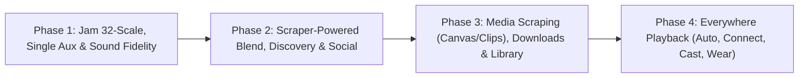

# ROADMAP_PHASES.md — 4-Phase Concurrent Engineering Plan (27 Spotify Gaps)

> **Core Objective:** Build a completely ad-free, bloat-free, music-first daily driver with all extreme features Spotify and YouTube Music provide (via high-performance reverse engineering, scraping, and serverless P2P mesh).
>
> **Execution Model:** Work across **4 sequential phases**. Within each phase, **all 3 engineers work concurrently** on strictly decoupled sub-modules (`native/`, `rust/`, `app/`) with frozen ABIs and independent CI verification.

---

## The Tri-Layer Engineering Matrix

```
┌─────────────────────────────────────────────────────────────────────────────────────────┐
│                           TRI-LAYER ARCHITECTURE & PIPELINE                             │
├─────────────────────────┬───────────────────────────┬───────────────────────────────────┤
│ Engineer 1 (Native C++) │ Engineer 2 (Rust)         │ Engineer 3 (Kotlin / Android)     │
│ Low-Level Math & DSP    │ Algorithmic & Mesh Engine │ Scrapers, Media3 & UI             │
│ Target: native/         │ Target: rust/             │ Target: app/                      │
├─────────────────────────┼───────────────────────────┼───────────────────────────────────┤
│ • SIMD NEON Math        │ • Radio Scorer & Markov   │ • OkHttp InnerTube/YTM Scrapers   │
│ • LUFS Normalizer & PLL │ • CRDT State & Voting     │ • Spotify/iTunes/Lyrics Scrapers  │
│ • AGSL Shaders & Mixers │ • PlumTree Gossip Mesh    │ • Jetpack Compose UI & Weft       │
└─────────────────────────┴───────────────────────────┴───────────────────────────────────┘
```

---

## High-Level Phase Overview



---

## Phase 1: Jam 32-Scale, Single-Speaker Aux & Sound Fidelity
**Focus:** Scale the real-time serverless sync engine to 32 participants, add single-renderer party mode, and calibrate audiophile DSP.

### Gaps Covered from `BEHIND.md`:
- **#11: 32-Person Rooms at Proven Scale**
- **#12: Zero-Friction Join Fabric (mDNS, BLE, Tap-to-Join)**
- **#13: Single-Speaker Party Mode (Host Aux, Guest Remote Control)**
- **#14: Host Governance & Member ACLs**
- **#16: Per-Route Volume ACLs**
- **#17: Remote vs. In-Person Listen Mode**
- **#18: In-Room Moderation & Reporting**
- **#39: Calibrated Normalization, Gapless & Crossfade**
- **#41: Mono Downmix, L/R Balance & Limiter Ceiling**

### Detailed Work Breakdown:
| Engineer | Sub-Module | Scope of Work |
|---|---|---|
| **Engineer 1** *(Native/C++20)* | `native/` | - SIMD NEON multi-stream audio mixer for 32-member audio routing.<br>- Calibrated LUFS -14 normalizer filter & soft-knee limiter.<br>- Mono downmix & L/R channel balance processor.<br>- Silent PLL lock mode (zero CPU audio bypass for single-speaker guests). |
| **Engineer 2** *(Rust/Mesh)* | `rust/` | - 32-node PlumTree gossip fanout optimization in `gossip.rs`.<br>- 32-node loopback chaos test harness (15-25% packet loss, join storms).<br>- Member ACL token validation & targeted kick/ban frame dispatch.<br>- `Topology::SingleRender` intent forwarding & leader lease authority. |
| **Engineer 3** *(Kotlin/App)* | `app/` | - Virtualized 32-member roster list & Jam queue in Compose.<br>- BLE tap-to-join scanner/advertiser & LAN mDNS discovery prompt sheet.<br>- `JamEngine.Topology.SINGLE_RENDER` state machine & party mode toggle.<br>- Host governance UI: kick/block modal, guest permissions (control/volume).<br>- Audiophile DSP settings screen (LUFS target, gapless, crossfade 0-12s, mono). |

---

## Phase 2: Scraper-Powered Taste Blend, Smart Discovery & Social Graph
**Focus:** Scrape YouTube Music/Spotify algorithmic continuations & mood shelves (no heavy on-device ML models), democratic queue voting, dynamic Daylist scheduling, and friend activity.

### Gaps Covered from `BEHIND.md`:
- **#15: Group-Taste Blend Engine (Jam)**
- **#20: Daylist Circadian Scheduler**
- **#25: Blend (2+ User Taste Merge)**
- **#26: Discover Weekly, Release Radar & Daily Mixes 1–6**
- **#27: Taste Profile Controls (`excludedFromTaste`)**
- **#31: Follow Graph (Artists & Users)**
- **#32: Friend Activity Live Feed**
- **#34: Threaded Comments & Upvoting**
- **#35: Collaborative Playlists**
- **#37: Group Voting (`OpType.Vote=4`)**

### Detailed Work Breakdown:
| Engineer | Sub-Module | Scope of Work |
|---|---|---|
| **Engineer 1** *(Native/Math)* | `native/` | - Fast string/ID hashing & SIMD candidate deduplication.<br>- Harmonic BPM & Camelot key transition matrix calculator for smooth track sequencing. |
| **Engineer 2** *(Rust/CRDT/Scoring)* | `rust/` | - `radio_scorer.rs`: Anti-drift candidate ranker and group taste overlap scoring.<br>- `jam_crdt.rs`: Implement democratic queue voting (`OpType.Vote=4` merge & threshold promoter).<br>- Collaborative playlist CRDT operational transform & multi-peer delta sync. |
| **Engineer 3** *(Kotlin/Scraper/UI)* | `app/` | - **Scraper Pipeline:** `YouTubeMusicRadioApi.kt` — Scrape YTM `youtubei/v1/next` radio continuations, similar artists, and curated mood shelves.<br>- **Blend Scraper:** Concurrently query seeds for Member A & Member B and interleave tracks with "Both of you like this" badges.<br>- **Daylist Scheduler:** Map device clock (morning, afternoon, evening, night) to YTM mood queries for a dynamic 4-hour mutating home banner.<br>- **UI & Social:** Compose screens for Blend, Daylist, Friend Activity live feed, threaded comments, and Jam queue vote buttons. |

---

## Phase 3: Media Scraping (Canvas/Clips), Background Downloads & Power Library
**Focus:** Scrape rich visual media (Spotify Canvas 8s loops, 30s vertical clips, high-bitrate audio streams), background downloads, and power library management.

### Gaps Covered from `BEHIND.md`:
- **#28: Pre-Saves & Release Watcher**
- **#36: Universal Share Surfaces & QR Cards**
- **#38: Adaptive Quality Ladder (Opus 251 / AAC 140 / Lossless Remux)**
- **#40: Smart Shuffle & Queue Intelligence**
- **#43: Two-Way Local Files LAN Sync**
- **#44: Resumable Background Downloads**
- **#45: Music Videos, 30s Clips & Canvas Loops**
- **#49: Artist Promo Stack (Countdown Pages & Trailers)**
- **#57: Playlist Folders, Pins, Custom Covers & Bulk Edit**
- **#58: Library Sort/Filter & "Your Updates" Hub**

### Detailed Work Breakdown:
| Engineer | Sub-Module | Scope of Work |
|---|---|---|
| **Engineer 1** *(Native/AGSL/Video)* | `native/` | - AGSL ambient glow shader & seamless 8s video loop renderer.<br>- Audio frame remuxer & bitstream packet validator.<br>- Bitmap palette color extractor for custom playlist covers. |
| **Engineer 2** *(Rust/Mesh/Swarm)* | `rust/` | - P2P chunk swarmer LAN transfer engine for local file sync.<br>- High-throughput chunk streaming & byte-range integrity verifier. |
| **Engineer 3** *(Kotlin/Scrapers/Media3)* | `app/` | - **Media Scrapers:** Reverse-engineer & scrape Canvas 8s video loops and vertical 30s artist Clips endpoints.<br>- **Release Watcher:** Scrape artist release feeds for pre-save alerts and release day notifications.<br>- **Media3 Player:** Canvas video player layer in Now Playing & vertical Clips discovery feed.<br>- **Storage & Library:** WorkManager resumable downloader, playlist folders, custom cover cropper, pin lists, and library sort/filter bar. |

---

## Phase 4: Everywhere Playback (Connect, Cast, Car & Wear)
**Focus:** Streamify Connect (seamless cloud/mesh handoff), Android Auto, Chromecast, and WearOS companion app.

### Gaps Covered from `BEHIND.md`:
- **#42: Hands-Free Voice & Lockscreen/Home Widgets**
- **#52: Streamify Connect (Cross-Device Queue & Handoff)**
- **#53: Cast & AirPlay Protocol Integration**
- **#54: Android Auto & In-Car Templates**
- **#55: Wearables (WearOS Companion & Wrist Control)**
- **#56: Voice Assistants & MediaSession Actions**

### Detailed Work Breakdown:
| Engineer | Sub-Module | Scope of Work |
|---|---|---|
| **Engineer 1** *(Native/Audio Sinks)* | `native/` | - Low-latency ringbuffer audio sink for network stream receivers.<br>- High-efficiency companion audio encoder for WearOS sync. |
| **Engineer 2** *(Rust/Connect Gateway)* | `rust/` | - Cloud/LAN device registry & session routing state machine.<br>- Remote intent dispatcher (play, pause, seek, queue reorder across devices).<br>- WearOS P2P sync protocol handler for offline run cache. |
| **Engineer 3** *(Kotlin/Devices)* | `app/` | - Device selector bottom sheet (Streamify Connect UI).<br>- Google Cast SDK integration & route-aware volume syncing.<br>- Android Auto media service & driving-optimized templates.<br>- WearOS standalone/companion app (transport control & wrist queue).<br>- Android Home/Lock screen widgets & Assistant voice actions. |

---

## Phase Execution Checklist

- [x] **Phase 1: Jam 32-Scale, Single Aux & Sound Fidelity**
  - [x] Engineer 1 (Native C++20 DSP & SIMD) — Merged in PR #15
  - [x] Engineer 2 (Rust 32-Peer Gossip, mDNS & ACL) — Merged in PR #16
  - [x] Engineer 3 (Kotlin 32-Roster UI, Party Mode & DSP Settings) — Merged in PR #14
  - [x] CI Verification & Release Test Build — All 12/12 Shards Green
- [x] **Phase 2: Scraper-Powered Taste Blend, Smart Discovery & Social Graph**
  - [x] Engineer 1 (Native String Hashing & Harmonic Math) — Merged in PR #17
  - [x] Engineer 2 (Rust Blend Scorer, CRDT Voting & Mixes) — Merged in PR #18
  - [x] Engineer 3 (Kotlin YTM Radio Scrapers, Daylist, Blend UI & Social) — Merged in PR #19
  - [x] CI Verification & Release Test Build — All 12/12 Shards Green
- [x] **Phase 3: Media Scraping (Canvas/Clips), Background Downloads & Power Library**
  - [x] Engineer 1 (Native AGSL Canvas Loops & Audio Remuxer) — Merged in PR #26
  - [x] Engineer 2 (Rust Chunk Swarmer & Local LAN Sync) — Merged in PR #20
  - [x] Engineer 3 (Kotlin Canvas Scrapers, UI, Background Downloader & Folders) — Merged in PR #21
  - [x] CI Verification & Release Test Build — All 12/12 Shards Green
- [ ] **Phase 4: Everywhere Playback (Connect, Cast, Car & Wear)**
  - [ ] Engineer 1 (Native Low-Latency Audio Sinks)
  - [ ] Engineer 2 (Rust Connect Gateway & Wear Sync)
  - [ ] Engineer 3 (Kotlin Connect UI, Cast, Auto & WearOS)
  - [ ] CI Verification & Release Test Build
