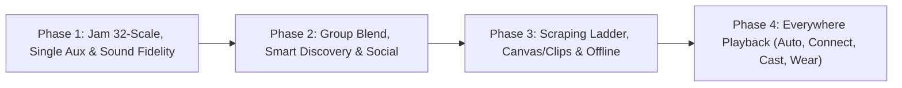

# ROADMAP_PHASES.md — 4-Phase Concurrent Engineering Plan (27 Spotify Gaps)

> **Core Objective:** Build a completely ad-free, bloat-free, music-first daily driver with all extreme features Spotify and YouTube Music provide (via high-performance reverse engineering and serverless P2P mesh).
>
> **Execution Model:** Work across **4 sequential phases**. Within each phase, **all 3 engineers work concurrently** on strictly decoupled sub-modules (`native/`, `rust/`, `app/`) with frozen ABIs and independent CI verification.

---

## The Tri-Layer Engineering Matrix

```
┌─────────────────────────────────────────────────────────────────────────────┐
│                      TRI-LAYER SPECIALIZATION MATRIX                        │
├───────────────────────┬─────────────────────────┬───────────────────────────┤
│ Engineer 1 (Native)   │ Engineer 2 (Rust)       │ Engineer 3 (Kotlin/App)   │
│ C++20 / DSP / Shaders │ Mesh / Scrapers / CRDT  │ Compose / Media3 / UI     │
│ Target: native/       │ Target: rust/           │ Target: app/              │
└───────────────────────┴─────────────────────────┴───────────────────────────┘
```

---

## High-Level Phase Overview



---

## Phase 1: Jam 32-Scale, Single-Speaker Aux & Sound Fidelity
**Focus:** Scale the real-time serverless sync engine to 32 participants, add single-renderer party mode, and calibrate audiophile DSP.

### Gaps Covered from `BEHIND.md`:
- **#11: 32-Person Rooms at Proven Scale**
- **#12: Zero-Friction Join Fabric (mDNS, BLE, Tap-to-Join)**
- **#13: Single-Speaker Party Mode (Host Aux, Guest Remote Control)**
- **#14: Host Governance & Member ACLs**
- **#16: Per-Route Volume ACLs**
- **#17: Remote vs. In-Person Listen Mode**
- **#18: In-Room Moderation & Reporting**
- **#39: Calibrated Normalization, Gapless & Crossfade**
- **#41: Mono Downmix, L/R Balance & Limiter Ceiling**

### Detailed Work Breakdown:
| Engineer | Sub-Module | Scope of Work |
|---|---|---|
| **Engineer 1** *(Native/C++20)* | `native/` | - SIMD NEON multi-stream audio mixer for 32-member audio routing.<br>- Calibrated LUFS -14 normalizer filter & soft-knee limiter.<br>- Mono downmix & L/R channel balance processor.<br>- Silent PLL lock mode (zero CPU audio bypass for single-speaker guests). |
| **Engineer 2** *(Rust/Mesh)* | `rust/` | - 32-node PlumTree gossip fanout optimization in `gossip.rs`.<br>- 32-node loopback chaos test harness (15-25% packet loss, join storms).<br>- LAN mDNS/NSD broadcast service & UDP Beacon `0x09` discovery.<br>- Member ACL token validation & targeted kick/ban frame dispatch.<br>- `Topology::SingleRender` intent forwarding & leader lease authority. |
| **Engineer 3** *(Kotlin/App)* | `app/` | - Virtualized 32-member roster list & Jam queue in Compose.<br>- BLE tap-to-join scanner/advertiser & LAN auto-prompt join sheet.<br>- `JamEngine.Topology.SINGLE_RENDER` state machine & party mode toggle.<br>- Host governance UI: kick/block modal, guest permissions (control/volume).<br>- Audiophile DSP settings screen (LUFS target, gapless, crossfade 0-12s, mono). |

---

## Phase 2: Group Taste Blend, Smart Discovery & Social Graph
**Focus:** Multi-user taste merging, democratic queue voting, dynamic Daylist scheduling, and friend activity.

### Gaps Covered from `BEHIND.md`:
- **#15: Group-Taste Blend Engine (Jam)**
- **#20: Daylist Circadian Scheduler**
- **#25: Blend (2+ User Taste Merge)**
- **#26: Discover Weekly, Release Radar & Daily Mixes 1–6**
- **#27: Taste Profile Controls (`excludedFromTaste`)**
- **#31: Follow Graph (Artists & Users)**
- **#32: Friend Activity Live Feed**
- **#34: Threaded Comments & Upvoting**
- **#35: Collaborative Playlists**
- **#37: Group Voting (`OpType.Vote=4`)**

### Detailed Work Breakdown:
| Engineer | Sub-Module | Scope of Work |
|---|---|---|
| **Engineer 1** *(Native/Math)* | `native/` | - 128-D vector cosine similarity & taste union SIMD kernel.<br>- Fast harmonic key & BPM transition matrix calculator.<br>- Circadian curve math for Daypart recommendation weighting. |
| **Engineer 2** *(Rust/CRDT/Recs)* | `rust/` | - Multi-user taste vector aggregator & co-occurrence graph scorer in `radio_scorer.rs`.<br>- CRDT democratic queue voting engine (`OpType.Vote=4` merge & threshold promotion).<br>- Scheduled recommendation pipeline for Daily Mixes 1-6 & Weekly/Radar.<br>- Collaborative playlist CRDT operational transform & delta sync. |
| **Engineer 3** *(Kotlin/App)* | `app/` | - Blend playlist UI & "X friends like this" badges in Jam queue.<br>- Dynamic Daylist home banner & time-of-day morphing shelf.<br>- Friend Activity real-time feed with one-tap listen/join.<br>- Threaded comments UI with timestamp anchors and upvoting.<br>- Collaborative playlist role management (`viewer`, `editor`, `admin`).<br>- Taste exclusion toggles in Settings & Playlist options. |

---

## Phase 3: Deep Scraping Ladder, Canvas Loops & Power Library
**Focus:** Rich media scraping (Canvas loops, 30s vertical clips, high-bitrate ladders), background downloads, and power library management.

### Gaps Covered from `BEHIND.md`:
- **#28: Pre-Saves & Release Watcher**
- **#36: Universal Share Surfaces & QR Cards**
- **#38: Adaptive Quality Ladder (Opus 251 / AAC 140 / Lossless Remux)**
- **#40: Smart Shuffle & Queue Intelligence**
- **#43: Two-Way Local Files LAN Sync**
- **#44: Resumable Background Downloads**
- **#45: Music Videos, 30s Clips & Canvas Loops**
- **#49: Artist Promo Stack (Countdown Pages & Trailers)**
- **#57: Playlist Folders, Pins, Custom Covers & Bulk Edit**
- **#58: Library Sort/Filter & "Your Updates" Hub**

### Detailed Work Breakdown:
| Engineer | Sub-Module | Scope of Work |
|---|---|---|
| **Engineer 1** *(Native/AGSL/Video)* | `native/` | - AGSL ambient glow shader & seamless 8s video loop renderer.<br>- Audio frame remuxer & bitstream packet validator.<br>- Bitmap palette color extractor for custom playlist covers. |
| **Engineer 2** *(Rust/Scrapers/Swarm)* | `rust/` | - Reverse-engineered Canvas & 30s vertical Clips scrapers.<br>- InnerTube multi-client audio format resolver with fallback ladder (Opus251/AAC140).<br>- P2P chunk swarmer LAN transfer engine for local file sync.<br>- Artist release poller & pre-save notification watcher. |
| **Engineer 3** *(Kotlin/Media3/Storage)* | `app/` | - Video Canvas player layer in Now Playing screen.<br>- Vertical 30s Clips discovery feed.<br>- WorkManager resumable chunk background downloader.<br>- Playlist folders, pinned items, custom cover cropper, and bulk queue editor.<br>- Library multi-criteria sort/filter bar & "Your Updates" release hub.<br>- Smart Shuffle interleave injector & QR Code share card generator. |

---

## Phase 4: Everywhere Playback (Connect, Cast, Car & Wear)
**Focus:** Streamify Connect (seamless cloud/mesh handoff), Android Auto, Chromecast, and WearOS companion app.

### Gaps Covered from `BEHIND.md`:
- **#42: Hands-Free Voice & Lockscreen/Home Widgets**
- **#52: Streamify Connect (Cross-Device Queue & Handoff)**
- **#53: Cast & AirPlay Protocol Integration**
- **#54: Android Auto & In-Car Templates**
- **#55: Wearables (WearOS Companion & Wrist Control)**
- **#56: Voice Assistants & MediaSession Actions**

### Detailed Work Breakdown:
| Engineer | Sub-Module | Scope of Work |
|---|---|---|
| **Engineer 1** *(Native/Audio Sinks)* | `native/` | - Low-latency ringbuffer audio sink for network stream receivers.<br>- High-efficiency companion audio encoder for WearOS sync. |
| **Engineer 2** *(Rust/Connect Gateway)* | `rust/` | - Cloud/LAN device registry & session routing state machine.<br>- Remote intent dispatcher (play, pause, seek, queue reorder across devices).<br>- WearOS P2P sync protocol handler for offline run cache. |
| **Engineer 3** *(Kotlin/Devices)* | `app/` | - Device selector bottom sheet (Streamify Connect UI).<br>- Google Cast SDK integration & route-aware volume syncing.<br>- Android Auto media service & driving-optimized templates.<br>- WearOS standalone/companion app (transport control & wrist queue).<br>- Android Home/Lock screen widgets & Assistant voice actions. |

---

## Phase Execution Checklist

- [ ] **Phase 1: Jam 32-Scale, Single Aux & Sound Fidelity**
  - [ ] Engineer 1 (Native C++20 DSP & SIMD)
  - [ ] Engineer 2 (Rust 32-Peer Gossip, mDNS & ACL)
  - [ ] Engineer 3 (Kotlin 32-Roster UI, Party Mode & DSP Settings)
  - [ ] CI Verification & Release Test Build
- [ ] **Phase 2: Group Taste Blend, Smart Discovery & Social Graph**
  - [ ] Engineer 1 (Native Cosine Similarity & Harmonic Math)
  - [ ] Engineer 2 (Rust Blend Scorer, CRDT Voting & Mixes)
  - [ ] Engineer 3 (Kotlin Blend UI, Daylist & Friend Activity)
  - [ ] CI Verification & Release Test Build
- [ ] **Phase 3: Deep Scraping Ladder, Canvas Loops & Power Library**
  - [ ] Engineer 1 (Native AGSL Canvas Loops & Audio Remuxer)
  - [ ] Engineer 2 (Rust Canvas/Clips Scrapers & Chunk Swarmer)
  - [ ] Engineer 3 (Kotlin Canvas UI, Background Downloader & Folders)
  - [ ] CI Verification & Release Test Build
- [ ] **Phase 4: Everywhere Playback (Connect, Cast, Car & Wear)**
  - [ ] Engineer 1 (Native Low-Latency Audio Sinks)
  - [ ] Engineer 2 (Rust Connect Gateway & Wear Sync)
  - [ ] Engineer 3 (Kotlin Connect UI, Cast, Auto & WearOS)
  - [ ] CI Verification & Release Test Build
