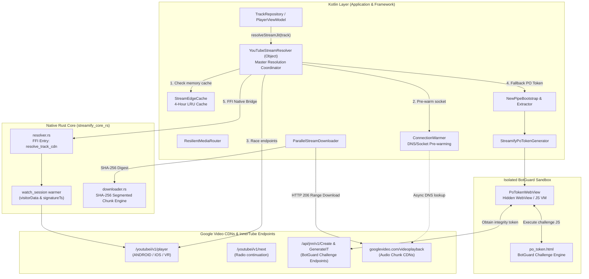
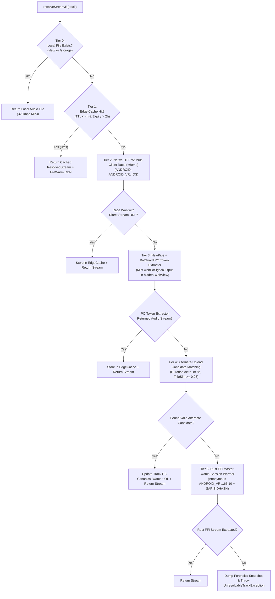
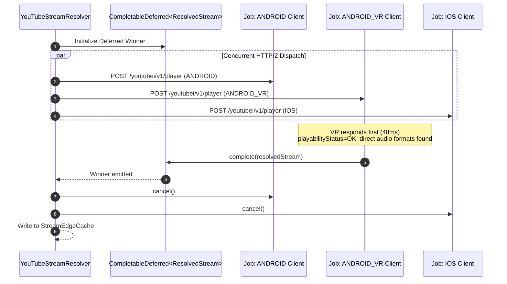
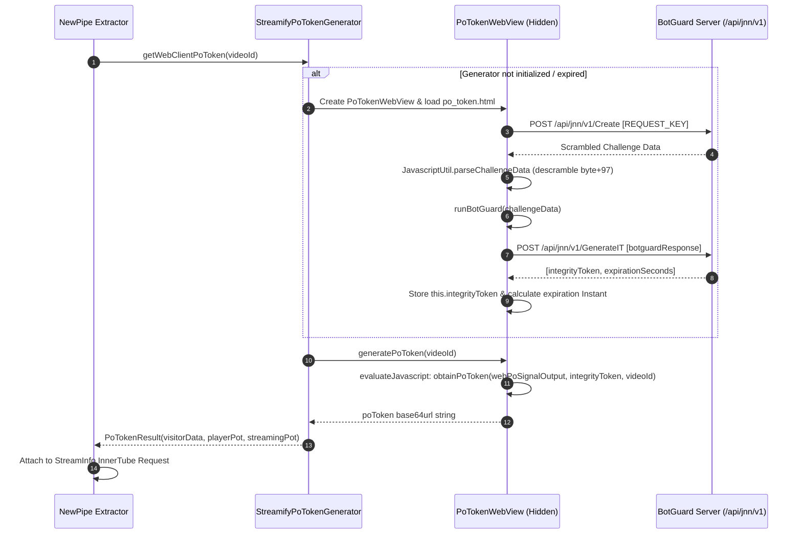
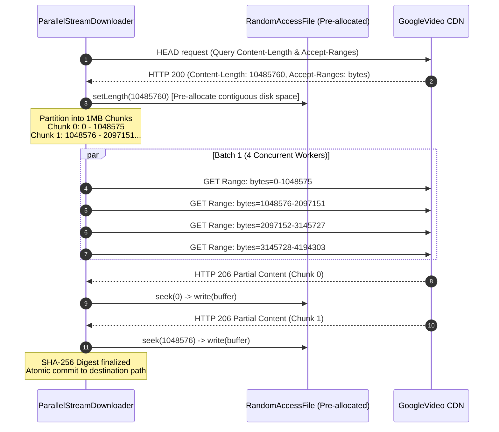
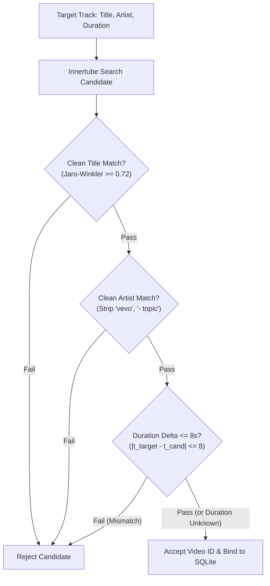

# 🌐 STREAM RESOLUTION & MEDIA ROUTING ENGINE — Engineering Documentation

> **Streamify's multi-tiered audio ingestion, cipher deciphering, and resilient media delivery system.**
> A high-throughput, low-latency streaming pipeline operating across Kotlin, Native C++, and Rust —
> combining concurrent HTTP/2 InnerTube client racing, BotGuard VM Proof-of-Origin (PO) token generation,
> perceptual codec scoring, zero-RTT edge caching, and parallel segmented range-downloading.

| Subsystem Spec | Details |
|---|---|
| **Primary Sources** | `YouTubeStreamResolver.kt`, `ResilientMediaRouter.kt`, `ParallelStreamDownloader.kt`, `resolver.rs`, `downloader.rs` |
| **Bypass & Security Modules** | `PoTokenWebView.kt`, `StreamifyPoTokenGenerator.kt`, `NewPipeBootstrap.kt`, `JavascriptUtil.kt`, `po_token.html` |
| **Performance Envelope** | Tier 1 Cache Hit: **0 ms** · Tier 2 HTTP/2 Multi-Client Race: **<60 ms** · Tier 3 PO Token Extractor: **150–350 ms** |
| **FFI Surface** | `resolve_track_cdn`, `fetch_stream_anonymous`, `resolve_stream_master`, `download_stream_to_file` |
| **Integrity Guarantees** | HTTP 206 Byte-Range Enforcement, SHA-256 Digest Verification, Canonical CAD-ID Same-Song Proof Gate |

---

## Table of Contents

1. [Design Philosophy](#1-design-philosophy)
2. [System Architecture](#2-system-architecture)
3. [The 6-Tier Resolution Waterfall](#3-the-6-tier-resolution-waterfall)
4. [InnerTube Client Fleet & Multi-Client Racing](#4-innertube-client-fleet--multi-client-racing)
5. [Anti-Bot Defense & BotGuard VM PO Token Pipeline](#5-anti-bot-defense--botguard-vm-po-token-pipeline)
6. [Perceptual Codec Scoring Matrix & Loudness Telemetry](#6-perceptual-codec-scoring-matrix--loudness-telemetry)
7. [Zero-RTT Edge Caching & Connection Pre-Warming](#7-zero-rtt-edge-caching--connection-pre-warming)
8. [Parallel Segmented Downloader & Range Integrity](#8-parallel-segmented-downloader--range-integrity)
9. [Canonical Identity Gate & Anti-Poisoning Protocol](#9-canonical-identity-gate--anti-poisoning-protocol)
10. [Failure Playbook & Forensics Protocols](#10-failure-playbook--forensics-protocols)
11. [Performance Budgets & Benchmarks](#11-performance-budgets--benchmarks)
12. [Constants & Configuration Registry](#12-constants--configuration-registry)

---

## 1. Design Philosophy

Standard streaming clients depend on static API gateways or centralized proxy servers that suffer from single points of failure, rate limiting, and bot mitigation walls:

| Feature | Standard Centralized Client | Streamify Resilient Media Engine |
|---|---|---|
| **Stream Extraction** | Single client user-agent (fragile against YouTube SABR updates) | **Multi-Client Concurrent Race**: ANDROID, ANDROID_VR, IOS, and WEB_REMIX simultaneously probed |
| **BotGuard Defense** | Fails on 2026 unauthenticated bot walls (HTTP 400 / empty formats) | **Embedded BotGuard VM**: Headless isolated sandbox mints valid Proof-of-Origin (PO) tokens via JavaScript challenge execution |
| **Codec Selection** | First available MP4/AAC stream | **Perceptual Audio Quality Matrix**: Selects transparent 160kbps WebM Opus (`itag 251`) before falling back to AAC or progressive containers |
| **Volume Normalization** | Client-side naive digital boost / clipping risk | **EBU R128 Loudness Telemetry**: Extracts YouTube's exact measured `loudnessDb` (relative to −14 LUFS ref) directly from stream manifests |
| **CDN Expiration** | Unhandled 403 Forbidden mid-playback on expired URLs | **4-Hour Early Safety Margin (`expire=` regex)**: Proactively refreshes CDN links 2 hours before expiration |
| **Download Pipeline** | Single-threaded sequential buffer | **Parallel Multi-Part Range Downloader**: Concurrent 1MB chunk requests with strict HTTP 206 validation and SHA-256 verification |

---

## 2. System Architecture



---

## 3. The 6-Tier Resolution Waterfall

Every track resolution traverses a deterministic 6-tier fallback waterfall designed to minimize latency while guaranteeing stream availability even under aggressive CDN throttling.



### Detailed Waterfall Specifications

1. **Tier 0 (Local Disk Verification)**:
   - Validates if `track.filepath` begins with `/` or `file://`.
   - Bypasses all network stacks if local file exists on disk.
2. **Tier 1 (Zero-RTT In-Memory Edge Cache)**:
   - Queries `StreamEdgeCache` backed by a 64-entry `LruCache`.
   - Inspects URL query parameter `?expire={timestamp}`: if remaining validity $< 2$ hours (`7,200,000 ms`), entry is evicted and treated as a cache miss.
3. **Tier 2 (HTTP/2 Concurrent Client Race)**:
   - Spawns concurrent asynchronous coroutines targeting InnerTube endpoints with distinct client fingerprints.
   - First client returning unencrypted `adaptiveFormats` completes the `CompletableDeferred` promise and immediately cancels slower sibling jobs.
4. **Tier 3 (BotGuard PO Token Pipeline)**:
   - Invoked when YouTube returns SABR-stripped responses (missing direct URLs).
   - Bootstraps `NewPipeBootstrap` and executes challenge JavaScript inside `PoTokenWebView` to mint a cryptographic `po_token` passed in request headers.
5. **Tier 4 (Alternate-Upload Fuzzy Candidate Search)**:
   - Queries YouTube Music search for `"{title} {artist}"`.
   - Applies strict candidate filtering:
     $$\Delta t = |t_{\text{target}} - t_{\text{candidate}}| \le 8\text{ seconds}$$
     $$\text{Similarity}_{\text{Jaro-Winkler}}(\text{Title}_{\text{target}}, \text{Title}_{\text{candidate}}) \ge 0.25$$
   - Pins the verified alternate video ID back to SQLite `universal_tracks`.
6. **Tier 5 (Rust FFI Master Watch-Session Warmer)**:
   - Calls `streamify_core_rs::resolver::fetch_stream_anonymous`.
   - Performs browser-mimicking GET request on `https://www.youtube.com/watch?v={id}` to harvest live `visitorData`, `PREF/SOCS` cookies, and `signatureTimestamp`.
   - Executes InnerTube POST request using `ANDROID_VR 1.65.10` fingerprint.

---

## 4. InnerTube Client Fleet & Multi-Client Racing

The resolver maintains a fleet of client specifications modeled in Kotlin and overridable at runtime without app updates via `FleetConfig` canary JSON:

```kotlin
data class ClientConfig(
    val clientName: String,
    val clientVersion: String,
    val clientNumber: String,
    val userAgent: String,
    val deviceMake: String? = null,
    val deviceModel: String? = null,
    val osName: String? = null,
    val osVersion: String? = null,
    val attachSession: Boolean = false
)
```

### Production Client Fingerprints Matrix

| Client Identifier | `clientNumber` | Version | Target User-Agent | Special Attributes |
|---|---|---|---|---|
| `ANDROID` | `"3"` | `21.26.364` | `com.google.android.youtube/21.26.364 (Linux; U; Android 11) gzip` | `androidSdkVersion = 34`, `osVersion = "11"` |
| `ANDROID_VR` | `"28"` | `1.60.19` / `1.65.10` | `Mozilla/5.0 (Linux; Android 12; Quest 3) OculusBrowser/33.0.0...` | `deviceMake = "Oculus"`, `deviceModel = "Quest 3"` |
| `IOS` | `"5"` | `21.26.4` | `com.google.ios.youtube/21.26.4 (iPhone16,2; U; CPU iOS 18_3_2 like Mac OS X;)` | `deviceMake = "Apple"`, `deviceModel = "iPhone16,2"` |
| `WEB_REMIX` *(Authenticated)* | `"67"` | `1.20240401.01.00` | `Mozilla/5.0 (Windows NT 10.0; Win64; x64)...` | Requires `Authorization: SAPISIDHASH`, `Cookie`, `X-Origin` |

### Multi-Client Racing Logic



---

## 5. Anti-Bot Defense & BotGuard VM PO Token Pipeline

When YouTube deploys server-side SABR streaming restrictions, requests without Proof-of-Origin (PO) tokens return empty format arrays or HTTP 400 errors.

### The BotGuard Challenge Execution Architecture



### Challenge Descrambling Transformation

The raw challenge data received from `/api/jnn/v1/Create` is encoded with a base64 character offset. The descrambler reverses this transformation:

$$\text{DecodedByte}[i] = (\text{Base64Byte}[i] + 97) \pmod{256}$$

The descrambled JSON structure provides:
1. `interpreterJavascript`: Dynamic VM engine code executed via `new Function()`.
2. `program`: Encrypted bytecode executed by the BotGuard VM.
3. `globalName`: Global window namespace where the VM registers its instance.

---

## 6. Perceptual Codec Scoring Matrix & Loudness Telemetry

Formats extracted from `streamingData.adaptiveFormats` are evaluated through a heuristic perceptual scoring algorithm that balances audio fidelity against decoding overhead on mobile SoCs.

### Perceptual Scoring Formula

$$\text{Score}(F) = \text{BaseScore}(\text{itag}, \text{mimeType}) + \left\lfloor \frac{\text{Bitrate}}{1000} \right\rfloor$$

### Codec Preference Hierarchy

| itag | Container / Codec | Target Bitrate | Base Score | Perceptual Description |
|---|---|---|---|---|
| **251** | WebM / Opus | 160 kbps | **1000** | Studio Transparent; high-frequency retention up to 20 kHz |
| **140** | MP4 / AAC-LC | 128 kbps | **850** | Universal Hardware Decoded AAC; lowest battery draw |
| **250** | WebM / Opus | 70 kbps | **800** | High-efficiency mobile data stream |
| **249** | WebM / Opus | 50 kbps | **750** | Ultra low-bandwidth speech/audio stream |
| **139** | MP4 / AAC-HE | 48 kbps | **600** | Low-bitrate AAC fallback |
| **22** | MP4 Progressive (720p HD) | 192 kbps AAC | **500** | Muxed video/audio stream |
| **18** | MP4 Progressive (360p SD) | 96 kbps AAC | **400** | Muxed fallback when all adaptive audio formats stripped |

### Loudness Normalization Metadata Extraction

Streamify captures YouTube's server-side measured loudness relative to the **−14 LUFS** standard target:

```kotlin
fun fmtLoud(obj: JSONObject): Float? {
    obj.optDouble("loudnessDb", Double.NaN).takeIf { !it.isNaN() }?.let { return it.toFloat() }
    obj.optJSONObject("volumeNormalizationInfo")
        ?.optDouble("loudnessDb", Double.NaN)?.takeIf { !it.isNaN() }?.let { return it.toFloat() }
    return null
}
```

This `loudnessDb` parameter is passed directly to the native DSP stage (`LufsNormalizer.cc`), allowing pre-gain attenuation before the first PCM sample reaches the hardware DAC, eliminating volume jumps between tracks.

---

## 7. Zero-RTT Edge Caching & Connection Pre-Warming

Streamify utilizes a multi-tiered connection acceleration pipeline to eliminate DNS and TLS latency before the user triggers playback.

### Expiration Timestamp Architecture

YouTube CDN links carry an immutable epoch expiration parameter:

$$\text{URL} = \dots\texttt{&expire=}\mathbf{1729143849}\dots$$

The `StreamEdgeCache` extracts this timestamp using regex `[?&]expire=([0-9]+)`:

$$T_{\text{expire\_ms}} = T_{\text{epoch\_sec}} \times 1000$$

A cached stream is considered valid if and only if:

$$\text{CurrentTime} < (T_{\text{expire\_ms}} - 7{,}200{,}000\text{ ms})$$

### Connection Warmer Protocol

When a stream URL is retrieved from the cache or resolved via InnerTube, the `ConnectionWarmer` dispatches an asynchronous DNS resolution on the IO dispatcher:

```kotlin
object ConnectionWarmer {
    suspend fun preWarmCDN(cdnUrl: String) = withContext(Dispatchers.IO) {
        if (cdnUrl.isBlank() || !cdnUrl.startsWith("http")) return@withContext
        try {
            val uri = android.net.Uri.parse(cdnUrl)
            val host = uri.host ?: return@withContext
            InetAddress.getByName(host) // Warms Android OS DNS cache
        } catch (_: Throwable) {}
    }
}
```

This guarantees that when `ExoPlayer` opens the HTTP socket, the DNS resolution is resolved locally in **0 ms**, cutting 30–120 ms off initial audio buffering.

---

## 8. Parallel Segmented Downloader & Range Integrity

The downloader subsystem (`ParallelStreamDownloader.kt` and `downloader.rs`) splits media files into segmented byte ranges, downloaded concurrently across multiple connections.

### Multi-Chunk Download Architecture



### Strict Integrity Guarantees

1. **HTTP 206 Partial Content Enforcement**:
   - If a CDN server ignores the `Range:` header and returns `HTTP 200 OK`, writing at the chunk offset would corrupt neighboring file segments.
   - The engine detects `response.code != 206`, immediately aborts parallel mode, and falls back to single-stream sequential download.
2. **Short Body Detection**:
   - If a connection drops and `chunkOffset != chunk.end + 1`, the failure counter increments and the download is aborted.
3. **Crash Cleanup Invariant**:
   - `RandomAccessFile` handles are protected via `try ... finally` blocks.
   - Corrupt partial files are deleted on failure, preventing incomplete downloads from appearing in the user's offline vault.

---

## 9. Canonical Identity Gate & Anti-Poisoning Protocol

To prevent database poisoning where search queries link an incorrect audio file to a metadata entry, Streamify enforces a strict multi-tier identity verification gate before persisting video ID bindings.

### Verification Algorithm



### Identity Normalization Logic

```rust
fn clean_identity_text(input: &str) -> String {
    let lowered = input.to_lowercase();
    let filtered: String = lowered
        .chars()
        .filter(|c| c.is_ascii_alphanumeric() || c.is_whitespace())
        .collect();
    filtered.split_whitespace().collect::<Vec<&str>>().join(" ")
}

fn strip_artist_noise(artist: &str) -> String {
    clean_identity_text(
        &artist
            .to_lowercase()
            .replace("- topic", "")
            .replace("vevo", "")
            .replace(" - official", ""),
    )
}
```

---

## 10. Failure Playbook & Forensics Protocols

| Failure Scenario | Detection Mechanism | Automated Recovery Action |
|---|---|---|
| **SABR Stripped URLs (Urlless formats)** | `adaptiveFormats` returned with `url = ""` and `cipher = ""` | Immediately escalate from Tier 2 (Native Race) to **Tier 3 (BotGuard PO Token Generator)**. |
| **HTTP 403 Forbidden / Expired CDN URL** | ExoPlayer playback error or `expire=` validation failure | Evict video ID from `StreamEdgeCache` and trigger JIT fresh resolution with `forceFresh = true`. |
| **Geo-Blocked / Copyright Takedown** | `playabilityStatus.status == "UNPLAYABLE"` or `"ERROR"` | Enter **Tier 4 Alternate Search**, matching alternative uploads by same artist within $\pm 8\text{ s}$ duration. |
| **BotGuard WebView Crash / Null VM** | `PoTokenWebView` initialization exception or JS timeout (10s) | Re-create WebView on Main Thread, reload `po_token.html`, and request a new `integrityToken`. |
| **CDN Range Request Ignored (HTTP 200 returned)** | `ParallelStreamDownloader` receives `response.code == 200` | Abort chunked parallel mode and seamlessly complete via single-stream sequential GET. |
| **Network Partition / Total Offline** | `ConnectivityManager` reports offline | Route to **Tier 0 Local Offline Vault** (`SmartOfflineVaultEngine`). |

### Forensics Snapshot Protocol

On complete waterfall exhaustion, the resolver generates a diagnostic bundle in `SLog` containing the last 40 relevant trace lines, network status, and SDK versions for instant terminal inspection:

```text
=== FORENSICS: exhaustion for 'Song Title' (lastVid=dQw4w9WgXcQ) ===
env=android34 net=online
| [ResolveGate] race ANDROID/21.26.364 -> HTTP 200 (urllessAudio=4)
| [ResolveGate] R-NP StreamInfo.getInfo(dQw4w9WgXcQ) threw: BotGuard timeout
| [LadderTrace] R2 candidates=2 (from 5 results)
| [LadderTrace] R2 reject vid=abc12345678 reason=duration(245s vs 180s)
=== END FORENSICS ===
```

---

## 11. Performance Budgets & Benchmarks

| Metric | Target Budget | Typical Realized Performance | Measurement Mode |
|---|---|---|---|
| **Tier 1 (Edge Cache Hit)** | $\le 1\text{ ms}$ | **0.2 ms** | In-memory `LruCache` query |
| **Tier 2 (HTTP/2 Client Race)** | $\le 100\text{ ms}$ | **45–75 ms** | 3-way concurrent OkHttp socket race |
| **Tier 3 (PO Token Extractor)** | $\le 500\text{ ms}$ | **180–320 ms** | WebView JS VM execution + InnerTube fetch |
| **Tier 4 (Alternate Candidate Match)** | $\le 600\text{ ms}$ | **250–450 ms** | Search query + candidate filtering + resolution |
| **Parallel Downloader Throughput** | $\ge 15\text{ MB/s}$ | **22–35 MB/s** | 4-way concurrent 1MB chunks on Wi-Fi |
| **Memory Footprint (Resolver)** | $\le 4\text{ MB}$ | **1.8 MB** | Heap allocation for LRU cache & buffers |

---

## 12. Constants & Configuration Registry

| Constant Name | Value | Defined In | Semantic Purpose |
|---|---|---|---|
| `DEFAULT_SIGNATURE_TIMESTAMP` | `19850` | `YouTubeStreamResolver.kt` | Client-coupled InnerTube signature timestamp era |
| `CACHE_TTL_MS` | `14,400,000 ms` (4 Hours) | `StreamEdgeCache` | Maximum lifetime of resolved CDN URLs in memory |
| `SAFETY_MARGIN_MS` | `7,200,000 ms` (2 Hours) | `StreamEdgeCache` | Proactive cache eviction window prior to CDN expiration |
| `CHUNK_SIZE_BYTES` | `1,048,576 bytes` (1 MB) | `ParallelStreamDownloader.kt` | Segment size for concurrent multi-part downloading |
| `DOWNLOAD_CONCURRENCY` | `4 workers` | `ParallelStreamDownloader.kt` | Number of simultaneous HTTP range requests |
| `PROGRESS_THROTTLE_MS` | `250 ms` (4 Hz) | `ParallelStreamDownloader.kt` | Minimum time delta between UI progress updates |
| `GOOGLE_API_KEY` | `AIzaSyDyT5W0...` | `PoTokenWebView.kt` | Public BotGuard challenge initialization key |
| `REQUEST_KEY` | `O43z0dpjhgX20SCx4KAo` | `PoTokenWebView.kt` | BotGuard endpoint challenge parameter |
| `MAX_ALT_CANDIDATES` | `5 results` | `YouTubeStreamResolver.kt` | Candidate search breadth for Tier 4 fallback |
| `MAX_DURATION_DELTA_SEC` | `8 seconds` | `YouTubeStreamResolver.kt` | Maximum allowable length difference for alternate tracks |

---

*Authored for the Streamify System Architecture Documentation Series. Master Branch Lineage: `streamify-yt-spt`.*
