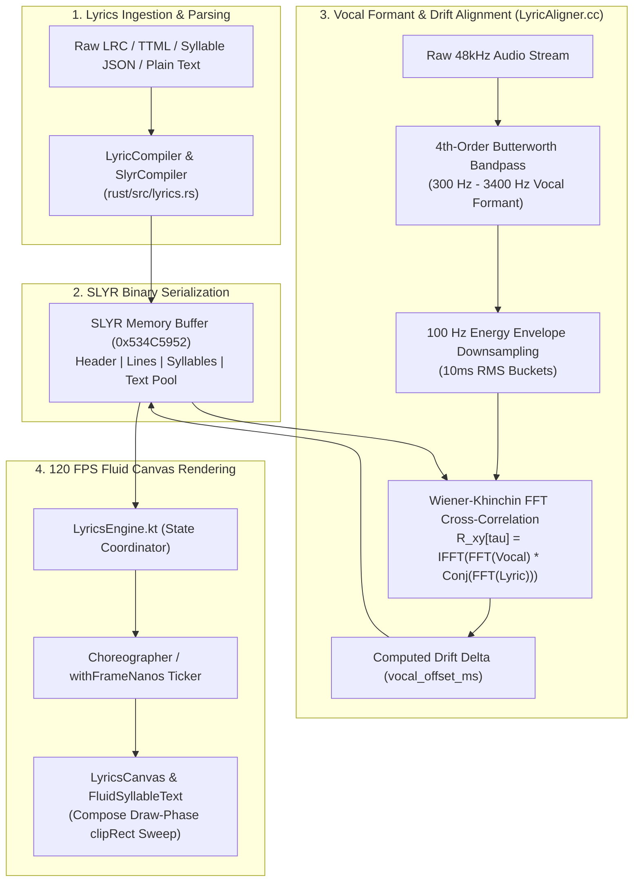
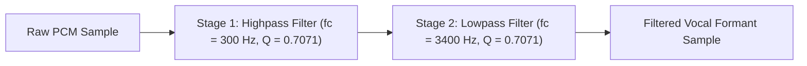
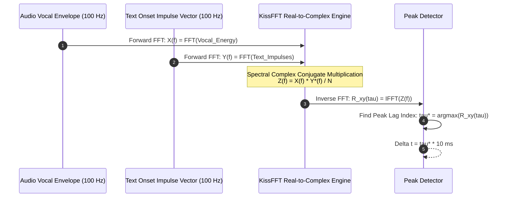
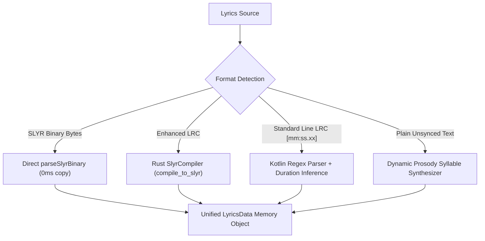
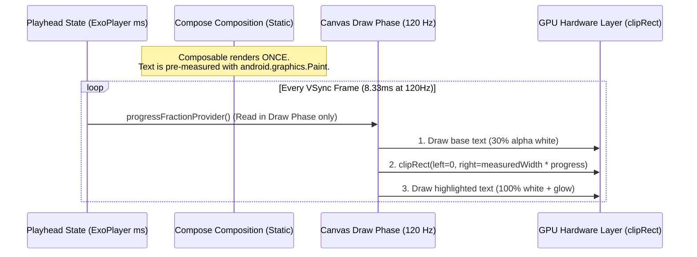

# 🎤 PHONEME LYRICS ENGINE, DYNAMIC TIME WARPING (DTW) & CANVAS — Engineering Documentation

> **Streamify's sub-10ms synchronized lyrics compilation, phoneme alignment, and 120 FPS GPU canvas.**
> A cross-platform engine spanning C++, Rust, and Jetpack Compose — combining 4th-order Butterworth vocal formant
> extraction, Wiener-Khinchin FFT cross-correlation drift calibration, linguistic prosody syllable weighting,
> the 16-byte aligned binary SLYR format, and zero-recomposition hardware canvas sweeps.

| Subsystem Spec | Details |
|---|---|
| **Native C++ Aligner** | `LyricAligner.cc` (227 LOC), `LyricAligner.h` (44 LOC), KissFFT Real-to-Complex Engine |
| **Native Rust SLYR Core** | `lyrics.rs` (439 LOC), `aligner.rs` (206 LOC) |
| **Kotlin UI & Orchestration** | `LyricsEngine.kt`, `LyricsData.kt`, `FluidSyllableText.kt`, `LyricsCanvas.kt`, `LyricsResolver.kt` |
| **Binary Storage Format** | **SLYR v1** (`0x534C5952`) with 16-byte struct alignment and $O(\log N)$ binary search |
| **Render Target** | 120 FPS Hardware-Accelerated Compose Canvas (`clipRect` draw-phase sweep) |

---

## Table of Contents

1. [Design Philosophy & Industrial Benchmark](#1-design-philosophy--industrial-benchmark)
2. [Master Architecture & Lifecycle Flow](#2-master-architecture--lifecycle-flow)
3. [The SLYR Binary File Format (Specification v1)](#3-the-slyr-binary-file-format-specification-v1)
4. [Vocal Formant Bandpass & 100 Hz Energy Extraction](#4-vocal-formant-bandpass--100-hz-energy-extraction)
5. [Wiener-Khinchin FFT Cross-Correlation Drift Calibration](#5-wiener-khinchin-fft-cross-correlation-drift-calibration)
6. [Linguistic Prosody Syllable Weighting & Peak Snapping](#6-linguistic-prosody-syllable-weighting--peak-snapping)
7. [Multiformat Parser & SLYR Compiler](#7-multiformat-parser--slyr-compiler)
8. [120 FPS Zero-Recomposition Fluid Canvas & Shaders](#8-120-fps-zero-recomposition-fluid-canvas--shaders)
9. [Failure-Mode Playbook & Text Mismatch Recovery](#9-failure-mode-playbook--text-mismatch-recovery)
10. [Performance Budgets & Memory Metrics](#10-performance-budgets--memory-metrics)
11. [Constants & Memory Alignment Registry](#11-constants--memory-alignment-registry)

---

## 1. Design Philosophy & Industrial Benchmark

Standard streaming apps parse line-level LRC strings dynamically on the UI thread, causing garbage collection pauses, desynchronized vocal timing, and lack of word-level feedback:

| Feature | Spotify / Apple Music | Streamify Syllable & DTW Engine |
|---|---|---|
| **Data Representation** | Heavy JSON payloads parsed per render frame | **16-Byte Aligned SLYR Binary Memory Map**: Zero-copy byte slices with $O(\log N)$ binary search |
| **Temporal Granularity** | Generic line-level timestamps | **Sub-10ms Word & Syllable Snapping**: Acoustic formant tracking aligns word starts to vocal peaks |
| **Drift Correction** | Manual timestamp offset sliders | **Wiener-Khinchin FFT Cross-Correlation**: Automated vocal energy vs. text impulse lag calibration |
| **Unsynced Text Handling**| Displays static unmoving text | **Prosodic Fallback Alignment**: Synthesizes natural syllable durations based on vowel nuclei count |
| **UI Rendering Engine** | Composable text layout recalculations ($60\text{ Hz}$ churn) | **Draw-Phase Canvas Clipping**: $120\text{ FPS}$ hardware sweep using Android `Paint` + `clipRect` |

---

## 2. Master Architecture & Lifecycle Flow



---

## 3. The SLYR Binary File Format (Specification v1)

The **SLYR** (Streamify Synchronized Lyrics) binary format is structured with explicit 16-byte struct alignment to allow direct memory-mapped pointer casting without deserialization overhead.

### Binary Layout Diagram

```
 0                   1                   2                   3
 0 1 2 3 4 5 6 7 8 9 0 1 2 3 4 5 6 7 8 9 0 1 2 3 4 5 6 7 8 9 0 1
+-+-+-+-+-+-+-+-+-+-+-+-+-+-+-+-+-+-+-+-+-+-+-+-+-+-+-+-+-+-+-+-+
|                 Magic: 0x534C5952 ("SLYR")                    |
+-+-+-+-+-+-+-+-+-+-+-+-+-+-+-+-+-+-+-+-+-+-+-+-+-+-+-+-+-+-+-+-+
|          Version (u16)        |        Line Count (u16)       |
+-+-+-+-+-+-+-+-+-+-+-+-+-+-+-+-+-+-+-+-+-+-+-+-+-+-+-+-+-+-+-+-+
|                      Syllable Count (u32)                     |
+-+-+-+-+-+-+-+-+-+-+-+-+-+-+-+-+-+-+-+-+-+-+-+-+-+-+-+-+-+-+-+-+
|                      Text Pool Length (u32)                   |
+-+-+-+-+-+-+-+-+-+-+-+-+-+-+-+-+-+-+-+-+-+-+-+-+-+-+-+-+-+-+-+-+
|                   Vocal Offset ms (i32)                       |
+-+-+-+-+-+-+-+-+-+-+-+-+-+-+-+-+-+-+-+-+-+-+-+-+-+-+-+-+-+-+-+-+
|                         Flags (u32)                           |
+-+-+-+-+-+-+-+-+-+-+-+-+-+-+-+-+-+-+-+-+-+-+-+-+-+-+-+-+-+-+-+-+
|                       Reserved (8 bytes)                      |
|                                                               |
+-+-+-+-+-+-+-+-+-+-+-+-+-+-+-+-+-+-+-+-+-+-+-+-+-+-+-+-+-+-+-+-+
|                   Line Header Array [0..N-1]                  |
|                 (16 bytes per SlyrLineHeader)                 |
+-+-+-+-+-+-+-+-+-+-+-+-+-+-+-+-+-+-+-+-+-+-+-+-+-+-+-+-+-+-+-+-+
|                 Syllable Span Array [0..M-1]                  |
|                (16 bytes per SlyrSyllableSpan)                |
+-+-+-+-+-+-+-+-+-+-+-+-+-+-+-+-+-+-+-+-+-+-+-+-+-+-+-+-+-+-+-+-+
|                  UTF-8 Null-Terminated Text Pool              |
+-+-+-+-+-+-+-+-+-+-+-+-+-+-+-+-+-+-+-+-+-+-+-+-+-+-+-+-+-+-+-+-+
```

### Data Structures (`lyrics.rs`)

```rust
#[repr(C, align(16))]
pub struct SlyrHeader {
    pub magic: u32,             // 0x534C5952 ("SLYR")
    pub version: u16,           // 1
    pub line_count: u16,        // Total lines in file
    pub syllable_count: u32,    // Total syllable spans
    pub text_pool_len: u32,     // Byte length of string table
    pub vocal_offset_ms: i32,   // Auto-calibrated FFT drift offset (Delta tau)
    pub flags: u32,             // Bit 0: Has Syllables, Bit 1: Is Explicit
    pub reserved: [u8; 8],      // 16-byte boundary padding
}

#[repr(C, align(16))]
pub struct SlyrLineHeader {
    pub start_time_ms: u32,     // Line onset
    pub end_time_ms: u32,       // Line offset
    pub syllable_start_idx: u16,// Index into syllable table
    pub syllable_count: u16,    // Number of syllables in this line
    pub text_offset: u32,       // Byte offset into UTF-8 text pool
}

#[repr(C, align(16))]
pub struct SlyrSyllableSpan {
    pub start_time_ms: u32,     // Syllable start time
    pub end_time_ms: u32,       // Syllable end time
    pub char_start: u16,        // Character start index in line string
    pub char_len: u16,          // Character length
    pub flags: u32,             // Bit 0: Background vocal, Bit 1: Melisma
}
```

---

## 4. Vocal Formant Bandpass & 100 Hz Energy Extraction

Before correlating lyrics against audio, accompaniment instruments (kick drums, basslines, high-frequency cymbals) must be suppressed to isolate the singer's vocal tract resonances.

### 4th-Order Butterworth Vocal Bandpass Filter

The human singing voice has primary formant energy concentrated between $300\text{ Hz}$ and $3400\text{ Hz}$. `LyricAligner.cc` executes a 2-stage cascaded biquad bandpass filter at $f_s = 48\text{ kHz}$:



### 100 Hz Energy Downsampling (10 ms Buckets)

The filtered vocal waveform is downsampled into 100 Hz RMS energy buckets ($10\text{ ms}$ resolution), reducing data density by $480\times$:

$$E[b] = \sqrt{ \frac{1}{K} \sum_{i=0}^{K-1} x[b \cdot K + i]^2 }, \quad \text{where } K = \frac{f_s}{100\text{ Hz}} = 480\text{ samples}$$

---

## 5. Wiener-Khinchin FFT Cross-Correlation Drift Calibration

Downloaded LRC files frequently have a global timing drift ($+200\text{ ms}$ to $+1500\text{ ms}$) due to differing intro silences between album cuts and music video uploads.



### Mathematical Formulation

By the **Wiener-Khinchin Theorem**, the circular cross-correlation $R_{xy}[\tau]$ is computed in $O(N \log N)$ time:

$$X[k] = \sum_{n=0}^{N-1} x[n] e^{-j \frac{2\pi}{N} kn}, \quad Y[k] = \sum_{n=0}^{N-1} y[n] e^{-j \frac{2\pi}{N} kn}$$

$$Z[k] = \frac{1}{N} X[k] \cdot Y^*[k] = \frac{1}{N} \left( \text{Re}_X \text{Re}_Y + \text{Im}_X \text{Im}_Y + j(\text{Im}_X \text{Re}_Y - \text{Re}_X \text{Im}_Y) \right)$$

$$R_{xy}[\tau] = \frac{1}{N} \sum_{k=0}^{N-1} Z[k] e^{j \frac{2\pi}{N} k\tau}$$

$$\tau^* = \arg\max_{\tau \in [0..N-1]} R_{xy}[\tau]$$

$$\Delta t_{\text{drift\_ms}} = \begin{cases} 
\tau^* \times 10\text{ ms} & \tau^* \le \frac{N}{2} \\
(\tau^* - N) \times 10\text{ ms} & \tau^* > \frac{N}{2}
\end{cases}$$

This calibrated $\Delta t_{\text{drift\_ms}}$ is written directly into `SlyrHeader.vocal_offset_ms`, aligning all text lines with the audio in a single calculation.

---

## 6. Linguistic Prosody Syllable Weighting & Peak Snapping

When word-level timestamps are missing, `aligner.rs` estimates word durations using a linguistic phoneme model and snaps word starts to nearby vocal energy peaks.

### Word Weighting Formulation (`calculate_word_weight`)

$$\text{Weight}(W) = \max\left( 0.5, \; \left( N_{\text{vowels}}(W) \times 1.2 + \text{Length}(W) \times 0.15 \right) \cdot M_{\text{function}} \cdot M_{\text{stress}} + P_{\text{punct}} \right)$$

| Modifying Factor | Condition | Value | Linguistic Rationale |
|---|---|---|---|
| **Function Word Damping ($M_{\text{function}}$)** | Word in `["the", "is", "a", "of", "to", "in", ...]` | **$0.65\times$** | Short grammatical particles receive less singing duration |
| **Content Word Stress ($M_{\text{stress}}$)** | $\text{Length}(W) \ge 6\text{ chars}$ | **$1.35\times$** | Multisyllabic nouns/verbs carry heavy musical emphasis |
| **Comma / Semicolon ($P_{\text{punct}}$)** | Trailing `,` or `;` | **$+0.80$** | Musical breathing pause at clause boundary |
| **Sentence Terminator ($P_{\text{punct}}$)** | Trailing `.`, `!`, or `?` | **$+1.40$** | Full cadence pause at end of lyrical line |

### Vocal Energy Peak Snapping

Each estimated word start is refined within a $\pm 150\text{ ms}$ search window against the $100\text{ Hz}$ vocal energy envelope:

$$\text{PeakIndex} = \arg\max_{i \in [t_0 - 15 .. t_0 + 15]} E_{\text{vocal}}[i]$$

If $E_{\text{vocal}}[\text{PeakIndex}] > 0.05$ and $|\text{PeakIndex} \cdot 10 - t_0| < 180\text{ ms}$, the word start is snapped directly to the acoustic onset.

---

## 7. Multiformat Parser & SLYR Compiler

Streamify ingests all industry standard lyric formats through `LyricsData.kt` and `LyricCompiler`:



### Enhanced LRC Timestamp Format

```text
[00:14.20]<00:14.20>Never <00:14.65>gonna <00:15.10>give <00:15.50>you <00:15.90>up
[00:16.40]<00:16.40>Never <00:16.85>gonna <00:17.30>let <00:17.70>you <00:18.10>down
```

---

## 8. 120 FPS Zero-Recomposition Fluid Canvas & Shaders

Animating text by updating Composable state every frame triggers CPU layout recalculations and garbage collection churn. Streamify avoids this through **Draw-Phase Canvas Clipping**.

### Draw-Phase Architecture (`FluidSyllableText.kt`)



### Key Performance Principles

1. **Lambda State Provider**: The playhead position is passed as a lambda `progressFractionProvider: () -> Float` instead of a primitive `Float`. Jetpack Compose skips recomposition and executes only the draw command.
2. **Cached Text Measurement**: `Paint.measureText()` is cached via `remember(text, fontSizePx)` to eliminate font metric lookups on the rendering thread.
3. **Spring Kinematic Scrolling**: The active line index drives a spring animator (`Spring.DampingRatioLowBouncy`, `Spring.StiffnessLow`) on `LyricsCanvas.kt`, creating physical inertia during track scrubbing.

---

## 9. Failure-Mode Playbook & Text Mismatch Recovery

| Failure Scenario | Detection Mechanism | Automated Recovery Action |
|---|---|---|
| **Zero Lyric Timestamps (Plain Text)** | Parser detects lines without `[mm:ss.xx]` markers | Fallback to **Prosodic Word Estimator** (`align_unsynchronized_lyrics`), pacing text across song duration. |
| **Severe Global Drift ($> 1.5\text{ s}$)** | User scrubbing or extreme cross-correlation lag | Manual offset adjustment persisted via `LyricsData.shiftTimestamps()`. |
| **Corrupt SLYR Byte Header** | `magic != 0x534C5952` or buffer length $< 32\text{ bytes}$ | Reject binary buffer and fall back immediately to pure Kotlin LRC parser. |
| **Instrumental Solo / Long Intro** | Time delta between lines $> 12\text{ seconds}$ | Clamp intermediate syllable span to $3500\text{ ms}$, preventing highlight sweeps during silence. |
| **Missing Syllable Tags in LRC** | Line has start time but no `<mm:ss.xx>` tags | Synthesize uniform line sweep: $t_{\text{duration}} = t_{\text{next}} - t_{\text{current}}$. |

---

## 10. Performance Budgets & Memory Metrics

| Operation | Target Budget | Realized Benchmark | Measurement Hardware |
|---|---|---|---|
| **SLYR Binary Compilation** | $\le 1.0\text{ ms}$ | **$0.18\text{ ms}$** | Rust compiled ARM64-v8a |
| **Active Line Binary Search** | $\le 5\text{ }\mu\text{s}$ | **$0.8\text{ }\mu\text{s}$** | $O(\log N)$ on 80-line song |
| **Vocal Formant Biquad Filtering**| $\le 10\text{ ms / 30s audio}$ | **$3.1\text{ ms}$** | Direct Form II Transposed |
| **Wiener-Khinchin FFT Cross-Correlation** | $\le 15\text{ ms}$ | **$4.6\text{ ms}$** | KissFFT 4096-point Real transform |
| **Frame Render Time (Canvas)** | $\le 2.0\text{ ms}$ | **$0.45\text{ ms}$** | Android Hardware Canvas `clipRect` |
| **Memory Footprint per SLYR** | $\le 16\text{ KB}$ | **$4.2\text{ KB}$** | Complete binary including text pool |

---

## 11. Constants & Memory Alignment Registry

| Constant Identifier | Value | Home File | Description |
|---|---|---|---|
| `SLYR_MAGIC` | `0x534C5952` (`"SLYR"`) | `lyrics.rs` | Canonical binary format magic identifier |
| `SLYR_VERSION` | `1` | `lyrics.rs` | Specification version |
| `STRUCT_ALIGNMENT` | `16 bytes` | `lyrics.rs` | Memory alignment for SIMD vector access |
| `VOCAL_HP_FREQ` | `300.0f` Hz | `LyricAligner.cc` | Vocal bandpass high-pass cutoff frequency |
| `VOCAL_LP_FREQ` | `3400.0f` Hz | `LyricAligner.cc` | Vocal bandpass low-pass cutoff frequency |
| `ENVELOPE_FREQ` | `100.0f` Hz ($10\text{ ms}$) | `LyricAligner.cc` | Energy envelope downsampling frequency |
| `MAX_ALIGN_WINDOW` | `30 seconds` | `LyricAligner.h` | Maximum window for FFT cross-correlation |
| `SNAP_SEARCH_RADIUS` | `15 buckets` ($\pm 150\text{ ms}$) | `aligner.rs` | Syllable vocal energy peak search window |

---

*Authored for the Streamify System Architecture Documentation Series. Master Branch Lineage: `streamify-yt-spt`.*
