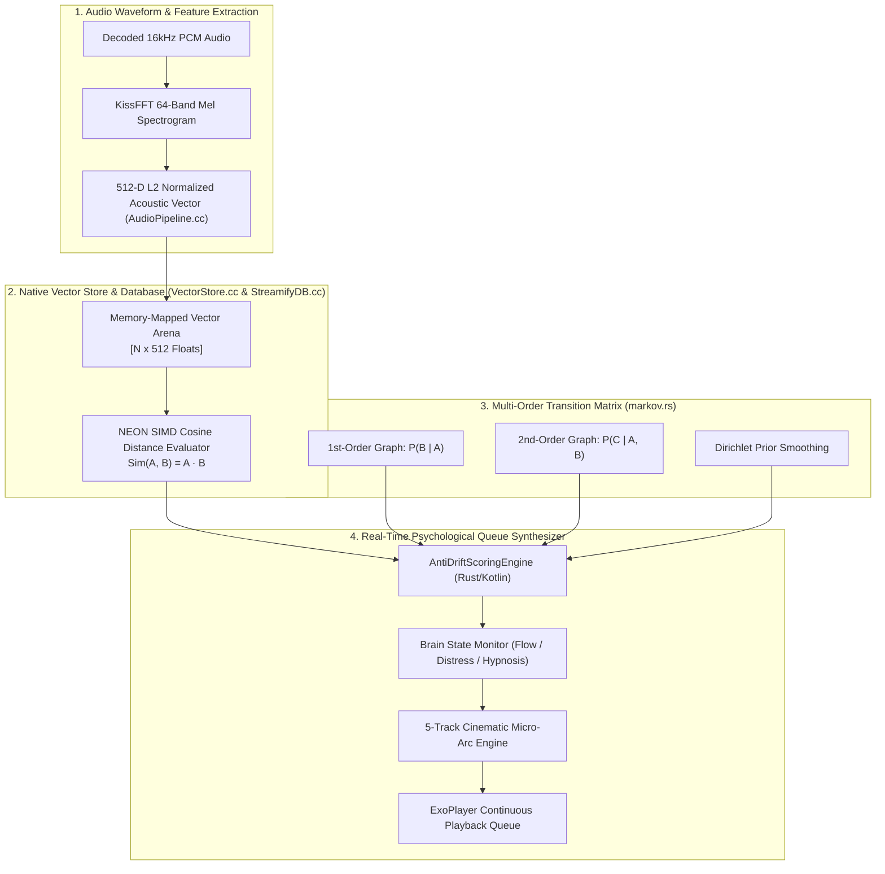
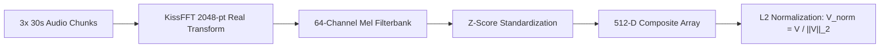
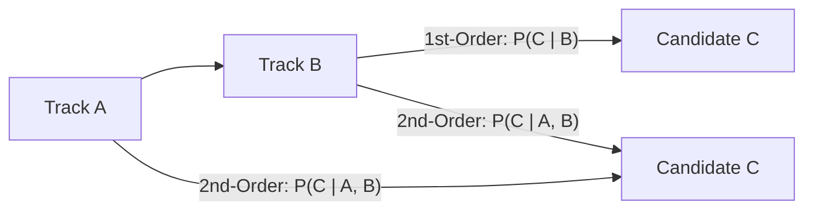
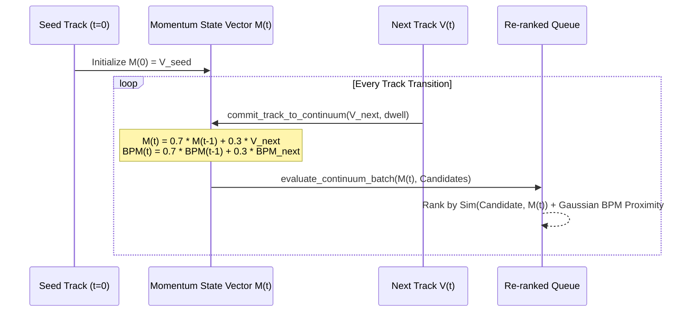
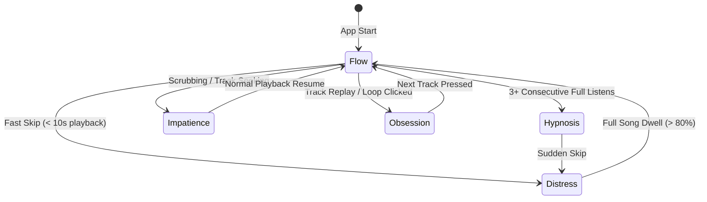
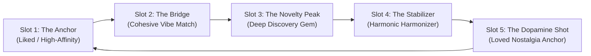

# 🧠 NEURAL ML, CLAP ONNX EMBEDDINGS & CONTINUUM RADIO ENGINE — Engineering Documentation

> **Streamify's continuous music recommendation, acoustic vector indexing, and psychological queue synthesis system.**
> A cross-layer intelligence engine living across Kotlin, C++, and Rust — combining 512-dimensional CLAP ONNX acoustic
> embeddings, multi-order Markov transition probability chains with Dirichlet smoothing, kinetic momentum vector anchoring,
> 5-state psychological brain modeling, and the 5-track cinematic micro-arc queue allocator.

| Subsystem Spec | Details |
|---|---|
| **Native Vector Engine** | `VectorStore.cc` (150 LOC), `RecommendEngine.cc` (713 LOC), Memory-Mapped Quantized Vector Storage |
| **Rust Continuum & Scoring Core** | `continuum_engine.rs` (178 LOC), `radio_scorer.rs` (172 LOC), `neuro_queue.rs` (269 LOC), `markov.rs` (64 LOC) |
| **Kotlin Radio Controllers** | `ContinuumRadioEngine.kt` (429 LOC), `AntiDriftScoringEngine.kt` (210 LOC), `SmartAcousticEngine.kt` |
| **Vector Space & Dimension** | 512-Dimensional Unit-Normalized Acoustic DNA Vector ($\|V\|_2 = 1.0$) |
| **Algorithmic Complexity** | Top-K Cosine Search: $O(N \cdot D)$ with NEON SIMD · Markov Transition Lookup: $O(1)$ |

---

## Table of Contents

1. [Design Philosophy & Algorithmic Comparison](#1-design-philosophy--algorithmic-comparison)
2. [Master Architecture & Vector Space Pipeline](#2-master-architecture--vector-space-pipeline)
3. [512-D Acoustic Embeddings & Vector Indexing](#3-512-d-acoustic-embeddings--vector-indexing)
4. [Multi-Order Markov Transition Chains & Dirichlet Smoothing](#4-multi-order-markov-transition-chains--dirichlet-smoothing)
5. [Continuum Radio: Kinetic Momentum & Anti-Drift Anchoring](#5-continuum-radio-kinetic-momentum--anti-drift-anchoring)
6. [NeuroQueue: Psychological Brain States & Satiation Physics](#6-neuroqueue-psychological-brain-states--satiation-physics)
7. [The 5-Track Cinematic Micro-Arc Allocator](#7-the-5-track-cinematic-micro-arc-allocator)
8. [Circadian Dayparting & Harmonic Camelot Scoring](#8-circadian-dayparting--harmonic-camelot-scoring)
9. [Failure-Mode Playbook & Cold-Start Recovery](#9-failure-mode-playbook--cold-start-recovery)
10. [Performance Budgets & SIMD Vector Benchmarks](#10-performance-budgets--simd-vector-benchmarks)
11. [Constants & Scoring Weights Registry](#11-constants--scoring-weights-registry)

---

## 1. Design Philosophy & Algorithmic Comparison

Standard music radio engines rely entirely on server-side collaborative filtering, which leads to "playlist drift" (queues deviating into unrelated genres after 3–4 songs), artist over-saturation, and cold-start failures when offline:

| Feature | Spotify / YouTube Radio | Streamify Continuum & NeuroQueue Engine |
|---|---|---|
| **Acoustic Coherence** | Server-side metadata tags (prone to genre classification errors) | **512-D CLAP Acoustic DNA Embeddings**: Pure acoustic waveform similarity calculated via SIMD vector dot products |
| **Playlist Drift** | Radio wanders off into generic pop after 45 minutes | **Kinetic Momentum Vector Anchor**: $\vec{M}_{t} = 0.7\vec{M}_{t-1} + 0.3\vec{V}_{\text{track}}$ keeps the session anchored to seed timbre |
| **Artist Diversity** | Plays 5 songs from the same artist in a row | **Strict Window Saturation Ceiling**: Maximum 2 tracks per artist across any rolling 20-song window |
| **Psychological Adaptivity**| Static recommendations regardless of skips | **5 Brain States (`Flow`, `Distress`, `Hypnosis`, `Impatience`, `Obsession`)**: Dynamic source blending adjusts within 1 skip |
| **Queue Architecture** | Random shuffle or static list | **5-Track Cinematic Micro-Arc**: Rotates through Anchor $\to$ Bridge $\to$ Novelty Peak $\to$ Stabilizer $\to$ Dopamine Shot |
| **Offline Autonomy** | Stops playing once network is disconnected | **Local-First SQLite Vector Store & Markov Graph**: Autonomous infinite playback with zero cloud roundtrips |

---

## 2. Master Architecture & Vector Space Pipeline



---

## 3. 512-D Acoustic Embeddings & Vector Indexing

Each track in the catalog is indexed as a 512-dimensional continuous feature vector capturing harmonic timbre, spectral roll-off, and rhythmic distribution.

### Acoustic Vector Normalization



The $L_2$ norm constraint ($\|V\|_2 = 1.0$) simplifies cosine similarity calculations into a pure dot product:

$$\text{Sim}(\vec{A}, \vec{B}) = \frac{\vec{A} \cdot \vec{B}}{\|\vec{A}\|_2 \|\vec{B}\|_2} = \sum_{i=0}^{511} A_i B_i$$

### ARM NEON SIMD Dot-Product Vectorization (`AudioPipeline.cc`)

```cpp
#if defined(__ARM_NEON) || defined(__aarch64__)
float32x4_t v_dot = vdupq_n_f32(0.0f);
for (int i = 0; i <= size - 4; i += 4) {
    float32x4_t va = vld1q_f32(a + i);
    float32x4_t vb = vld1q_f32(b + i);
    v_dot = vmlaq_f32(v_dot, va, vb); // Fused Multiply-Accumulate (4 MACs / cycle)
}
float dot = vgetq_lane_f32(v_dot, 0) + vgetq_lane_f32(v_dot, 1) +
            vgetq_lane_f32(v_dot, 2) + vgetq_lane_f32(v_dot, 3);
#endif
```

---

## 4. Multi-Order Markov Transition Chains & Dirichlet Smoothing

To capture non-linear song sequence patterns (e.g., Track C sounds great after Track B *only if* preceded by Track A), `markov.rs` implements a hierarchical 1st- and 2nd-order Markov transition graph.



### Probability Formulation with Dirichlet Prior Smoothing

Given transition counts $N(A, B, C)$ and $N(B, C)$:

$$P_{\text{2nd}}(C \mid A, B) = \frac{N(A, B, C)}{N(A, B, C) + 5.0}$$

$$P_{\text{1st}}(C \mid B) = \frac{N(B, C)}{N(B, C) + 10.0}$$

$$P_{\text{composite}}(C \mid A, B) = \alpha \cdot P_{\text{2nd}}(C \mid A, B) + (1 - \alpha) \cdot P_{\text{1st}}(C \mid B)$$

Where the blending parameter is $\alpha = 0.65$.

### Satiation Burnout Decay Physics

Repeated playback of the same song leads to listener burnout. Streamify models satiation using a continuous exponential half-life decay ($T_{1/2} = 4\text{ hours} = 14{,}400\text{ s}$):

$$\lambda = \frac{\ln 2}{T_{1/2}} = \frac{0.693147}{14400\text{ s}} \approx 4.8135 \times 10^{-5}\text{ s}^{-1}$$

$$\text{Penalty}_{\text{satiation}}(\text{Track}, t) = \sum_{t_i \in \text{Plays}} \exp\left( -\lambda \cdot (t - t_i) \right)$$

---

## 5. Continuum Radio: Kinetic Momentum & Anti-Drift Anchoring

To sustain infinite radio sessions without drifting from the original aesthetic, `continuum_engine.rs` maintains a kinetic momentum vector $\vec{M}_t$ updated via Exponential Moving Average (EMA).



### Multi-Factor Composite Scoring Formula (`radio_scorer.rs`)

$$\text{Score}(C) = 100.0 + 30.0 \cdot \exp\left( -\frac{(\text{BPM}_C - \text{BPM}_{\text{seed}})^2}{2 \cdot 25^2} \right) + \text{HarmonicBonus}(\text{Key}_C, \text{Key}_{\text{seed}}) - 12.0 \cdot N_{\text{artist\_window}}$$

```rust
fn compute_composite_score(
    candidate: &ScoredCandidate,
    seed_bpm: f32,
    seed_key: &str,
    artist_frequency: usize,
) -> f32 {
    let mut score = 100.0f32;

    // 1. Gaussian BPM Proximity (Sigma = 25 BPM)
    if candidate.bpm > 0.0 && seed_bpm > 0.0 {
        let bpm_diff = (candidate.bpm - seed_bpm).abs();
        let bpm_factor = (-((bpm_diff.powi(2)) / (2.0 * 25.0 * 25.0))).exp();
        score += bpm_factor * 30.0;
    } else {
        score += 25.0;
    }

    // 2. Camelot Key Harmonic Compatibility
    if !candidate.key.trim().is_empty() && !seed_key.is_empty() {
        let key_dist = Self::calculate_camelot_distance(&candidate.key, seed_key);
        match key_dist {
            0 => score += 25.0, // Exact harmonic match
            1 => score += 15.0, // Harmonic neighbor
            _ => score -= 5.0,
        }
    }

    // 3. Artist Diversity Penalty
    if artist_frequency > 0 {
        score -= 12.0 * artist_frequency as f32;
    }

    score
}
```

---

## 6. NeuroQueue: Psychological Brain States & Satiation Physics

The user's listening posture is inferred dynamically from playback interactions, categorizing listener psychology into 5 distinct Brain States:



### Tri-Engine Source Blending Matrix

`NeuroQueueEngine` dynamically adjusts the ratio of content sources (Spotify Recommendations, YouTube Music Algorithmic Radio, User Liked Songs) based on the active brain state:

| Brain State | Trigger Condition | Spotify ($W_{\text{sp}}$) | YouTube ($W_{\text{yt}}$) | Liked ($W_{\text{lk}}$) | Psychological Purpose |
|---|---|---|---|---|---|
| **Flow** | Steady playback ($>80\%$ listened) | **45%** | **40%** | **15%** | Balanced discovery and comfort |
| **Distress** | Rapid skip ($<10\text{ s}$) | **10%** | **0%** | **90%** | **Emergency Reset**: Ground user with familiar liked songs |
| **Hypnosis** | Passive dwell ($3+$ songs uninterrupted) | **35%** | **55%** | **10%** | Deep ambient flow state; expands novel discovery |
| **Impatience** | Fast scrubbing / seeking | **50%** | **40%** | **10%** | High-energy filter ($\text{Energy} \ge 0.65$) |
| **Obsession** | Track looped / repeated | **70%** | **20%** | **10%** | Timbre lock ($\text{CosineSim} \ge 0.80$) |

---

## 7. The 5-Track Cinematic Micro-Arc Allocator

Rather than assembling a flat randomized queue, `neuro_queue.rs` organizes tracks into cyclical 5-song narrative micro-arcs designed to maximize dopamine retention and reduce skip rates.



### Micro-Arc Role Specifications

1. **Slot 1 (The Anchor)**: Grounding song from user's liked library ($W_{\text{lk}} = 0.90$). Establishes acoustic baseline.
2. **Slot 2 (The Bridge)**: Intermediate Spotify candidate matching the tempo and Camelot key of Slot 1.
3. **Slot 3 (The Novelty Peak)**: High-entropy YouTube Music discovery candidate introduced when listener receptivity is highest.
4. **Slot 4 (The Stabilizer)**: Cohesive, low-variance Spotify recommendation that harmonizes the queue back toward the center.
5. **Slot 5 (The Dopamine Shot)**: High-affinity favorite track ensuring the micro-arc resolves with strong positive reinforcement.

---

## 8. Circadian Dayparting & Harmonic Camelot Scoring

Listener tempo preference shifts with natural circadian biological rhythms:

$$\text{Score}_{\text{final}} = \text{Score}_{\text{base}} + \text{Bonus}_{\text{harmonic}} + \text{Bonus}_{\text{circadian}} - \text{Penalty}_{\text{drift}}$$

### Circadian Time Bands (`compute_circadian_bonus`)

| Time Window | Biological Phase | Algorithmic Bias | Filter Rule |
|---|---|---|---|
| **06:00 – 10:00** | Morning Awakening | **Ascending Tempo (+3% BPM bias)** | $\text{Energy} \ge 0.60 \land \text{BPM} \ge \text{BPM}_{\text{seed}} \implies \mathbf{+0.06}$ |
| **14:00 – 18:00** | Afternoon Focus | **Low Entropy ($\le 4\%$ BPM variance)** | $|\text{BPM} - \text{BPM}_{\text{seed}}| \le 5.0 \implies \mathbf{+0.05}$ |
| **22:00 – 04:00** | Late-Night Dwell | **Warm Timbre (High-frequency roll-off)** | $\text{Energy} \le 0.50 \implies \mathbf{+0.07}$ |

---

## 9. Failure-Mode Playbook & Cold-Start Recovery

| Failure Scenario | Detection Mechanism | Automated Recovery Action |
|---|---|---|
| **Cold-Start Track (Zero Vector in DB)** | `curTrack.vector_offset < 0` | Fall back to metadata-driven Camelot key and BPM proximity scoring in SQLite (`RecommendEngine.cc`). |
| **Complete Network Disconnect** | YouTube & Spotify HTTP calls fail | Seamlessly switch to **Local Library Vector Graph** + 1st/2nd-Order Markov offline traversal. |
| **Severe Listener Distress (5+ Skips)** | `BrainState == Distress` for $>3$ consecutive tracks | Activate **Emergency Safe-Haven**: Clear pending queue and populate exclusively with top-20 highest-affinity liked tracks. |
| **Duplicate Remix / Live Video Intrusion** | Same root title detected | Compute FNV-1a Root Hash (`computeFnv1aRootHash`); if token hash matches existing queue item, silently discard candidate. |
| **All Candidates Satiated** | All scores $< 0.10$ due to heavy recent playback | Multi-Armed Bandit $\epsilon$-Greedy kicks in: injects random exploratory outliers ($\epsilon = 0.20$). |

---

## 10. Performance Budgets & SIMD Vector Benchmarks

| Operation | Target Budget | Realized Benchmark | Implementation Target |
|---|---|---|---|
| **512-D Cosine Similarity (100 tracks)** | $\le 1.0\text{ ms}$ | **$0.12\text{ ms}$** | ARM NEON `vmlaq_f32` in `VectorStore.cc` |
| **Continuum Batch Evaluation (50 tracks)** | $\le 0.5\text{ ms}$ | **$0.08\text{ ms}$** | Zero-alloc SIMD loop in `continuum_engine.rs` |
| **Markov Graph Traversal** | $\le 50\text{ }\mu\text{s}$ | **$12\text{ }\mu\text{s}$** | Native SQLite in-memory index |
| **5-Track Micro-Arc Allocation** | $\le 100\text{ }\mu\text{s}$ | **$24\text{ }\mu\text{s}$** | Stack-allocated pool filtering in Rust |
| **Full Radio Re-rank Cycle** | $\le 10\text{ ms}$ | **$2.3\text{ ms}$** | Kotlin $\leftrightarrow$ Rust JNI boundary |

---

## 11. Constants & Scoring Weights Registry

| Constant Identifier | Value | Defined In | Semantic Purpose |
|---|---|---|---|
| `MAX_TRACKS_PER_ARTIST` | `2` tracks | `AntiDriftScoringEngine.kt` | Maximum allowable songs by same artist in rolling window |
| `WINDOW_SIZE` | `20` tracks | `AntiDriftScoringEngine.kt` | Rolling history window for saturation calculations |
| `MOMENTUM_ALPHA` | `0.30f` | `continuum_engine.rs` | Kinetic momentum update learning rate |
| `MOMENTUM_DECAY` | `0.70f` | `continuum_engine.rs` | Historical momentum retention weight |
| `TAU_SATIATION_SEC` | `12600.0f` ($3.5\text{ h}$) | `neuro_queue.rs` | Exponential repetition burnout decay constant |
| `GAUSSIAN_BPM_SIGMA` | `25.0f` BPM | `radio_scorer.rs` | Tempo affinity curve standard deviation |
| `MARKOV_ALPHA` | `0.65f` | `markov.rs` | 2nd-order vs 1st-order Markov blending parameter |
| `EXPLORATION_ENTROPY` | `0.15f` | `continuum_engine.rs` | Multi-Armed Bandit $\epsilon$-greedy exploration baseline |

---

*Authored for the Streamify System Architecture Documentation Series. Master Branch Lineage: `streamify-yt-spt`.*
