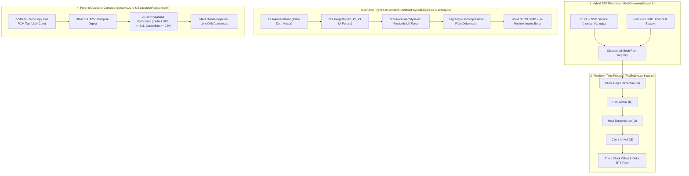
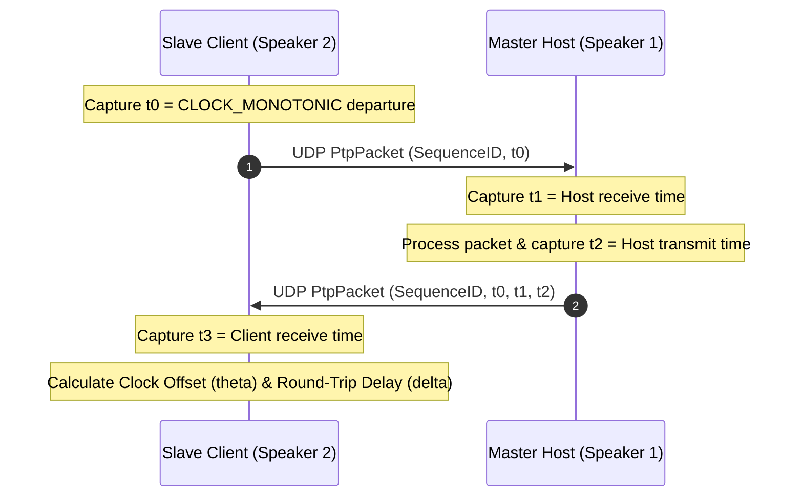
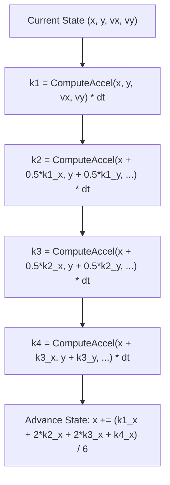
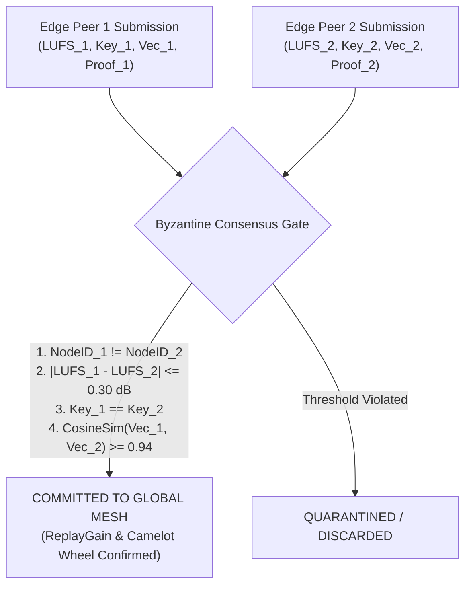
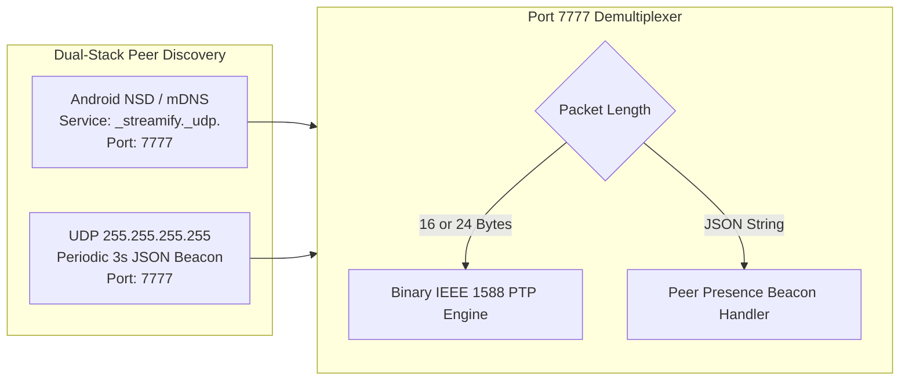

# 🌐 DECENTRALIZED MESH, P2P AIRDROP & LAN CLOCK SYNC ENGINE — Engineering Documentation

> **Streamify's sub-millisecond multi-room audio synchronization, fluid projectile AirDrop physics, and Byzantine edge consensus mesh.**
> A decentralized protocol stack implemented across C++, Rust, and Android Kotlin — uniting IEEE 1588 Precision Time Protocol (PTP)
> clock alignment, Runge-Kutta 4th-Order (RK4) projectile flight kinematics, 2-peer Byzantine Proof-of-Acoustic-Compute verification,
> Median Absolute Deviation (MAD) crowdsourced lyric consensus, and zero-configuration mDNS/UDP LAN discovery.

| Subsystem Spec | Details |
|---|---|
| **Native C++ Physics & PTP** | `AirDropPhysicsEngine.cc` (121 LOC), `PtpEngine.cc` (85 LOC) |
| **Native Rust Mesh Core** | `airdrop.rs` (254 LOC), `ptp.rs` (101 LOC), `consensus.rs` (160 LOC) |
| **Kotlin Mesh Controllers** | `MeshDiscoveryEngine.kt` (283 LOC), `EdgeMeshRepository.kt` (375 LOC) |
| **Clock Synchronization Precision** | $< 500\text{ }\mu\text{s}$ multi-speaker acoustic phase alignment across local WiFi/hotspot |
| **Physics Integration Method** | 4th-Order Runge-Kutta (RK4) with Lagrangian fluid strain tensor deformation |
| **Byzantine Consensus Threshold** | 2-Peer validation ($|\Delta\text{LUFS}| \le 0.30$, Matching Camelot Key, $\text{CosineSim} \ge 0.94$) |

---

## Table of Contents

1. [Design Philosophy & Distributed Topology](#1-design-philosophy--distributed-topology)
2. [Master Network & Kinematics Architecture](#2-master-network--kinematics-architecture)
3. [IEEE 1588 Precision Time Protocol (Microsecond UDP PTP)](#3-ieee-1588-precision-time-protocol-microsecond-udp-ptp)
4. [RK4 Aerodynamic Projectile Kinematics (AirDrop Physics)](#4-rk4-aerodynamic-projectile-kinematics-airdrop-physics)
5. [Lagrangian Incompressible Fluid Strain & 3D Gimbal Dynamics](#5-lagrangian-incompressible-fluid-strain--3d-gimbal-dynamics)
6. [Byzantine Consensus & Proof-of-Acoustic-Compute](#6-byzantine-consensus--proof-of-acoustic-compute)
7. [Median Absolute Deviation (MAD) Lyric Drift Consensus](#7-median-absolute-deviation-mad-lyric-drift-consensus)
8. [Hybrid P2P Discovery: mDNS & Port 7777 UDP Multiplexing](#8-hybrid-p2p-discovery-mdns--port-7777-udp-multiplexing)
9. [Failure-Mode Playbook & Clock Drift Mitigation](#9-failure-mode-playbook--clock-drift-mitigation)
10. [Performance Budgets & Hardware Benchmarks](#10-performance-budgets--hardware-benchmarks)
11. [Constants, Network Ports & Physics Parameter Registry](#11-constants-network-ports--physics-parameter-registry)

---

## 1. Design Philosophy & Distributed Topology

Standard mobile audio sharing relies on centralized cloud servers or Bluetooth A2DP, which introduces $150\text{–}300\text{ ms}$ latency, phase-cancellation echoes during multi-room playback, and severe cloud bandwidth dependency:

| Feature | Standard Cloud / Bluetooth Sync | Streamify Decentralized Mesh Architecture |
|---|---|---|
| **Multi-Speaker Playback** | $150\text{–}300\text{ ms}$ Bluetooth delay (inaudible multi-room sync, destructive comb filtering) | **IEEE 1588 Microsecond UDP PTP**: Hardware `CLOCK_MONOTONIC` sync aligns speakers to within $\pm 0.5\text{ ms}$ |
| **Device-to-Device Sharing** | Server upload $\to$ cloud transcoding $\to$ download | **Zero-Cloud P2P Mesh**: UDP/mDNS AirDrop transfers audio & lyrics directly over local Wi-Fi / hotspot |
| **Token Drag Interaction** | Linear UI tween animations | **RK4 Aerodynamic Physics Engine**: Critically damped spring tensors + parabolic lift + fluid strain squashing |
| **Acoustic Catalog Ingestion**| Centralized cloud server batch jobs | **Edge Mesh Byzantine Consensus**: Distributed mobile phones compute LUFS, Key, and BPM during active playback |
| **Lyric Offset Calibration** | Centralized manual editor updates | **Crowdsourced MAD (Median Absolute Deviation)**: Robust statistical consensus filters out individual timing errors |

---

## 2. Master Network & Kinematics Architecture



---

## 3. IEEE 1588 Precision Time Protocol (Microsecond UDP PTP)

To play identical audio streams simultaneously across multiple independent Android devices on the same Wi-Fi network without audible echo or phase cancellation, Streamify implements a lightweight IEEE 1588 PTP engine.



### Mathematical Offset & Delay Formulas

$$\text{RTT} = (t_3 - t_0) - (t_2 - t_1)$$

$$\theta_{\text{offset}} = \frac{(t_1 - t_0) + (t_2 - t_3)}{2}$$

$$\delta_{\text{one-way delay}} = \frac{\text{RTT}}{2}$$

### Outlier Rejection & Exponential Moving Average (`PtpEngine.cc`)

Network jitter spikes (e.g., Wi-Fi power-save renegotiations) corrupt timestamp accuracy. Streamify executes strict outlier rejection before incorporating new measurements:

$$\text{Condition: } \text{RTT} \le 1.35 \times \text{RTT}_{\min} \quad \lor \quad \text{RTT} < 10\text{ ms}$$

When accepted, the clock offset is smoothed using a recursive Exponential Moving Average (EMA) with $\alpha = 0.18$:

$$\theta_{\text{smoothed}}[n] = 0.82 \cdot \theta_{\text{smoothed}}[n-1] + 0.18 \cdot \theta_{\text{measured}}[n]$$

The synchronized playback playhead is calculated directly against the native Linux kernel monotonic clock:

$$t_{\text{synchronized\_ms}} = \frac{t_{\text{CLOCK\_MONOTONIC\_nanos}} + \theta_{\text{smoothed\_nanos}}}{1{,}000{,}000}$$

---

## 4. RK4 Aerodynamic Projectile Kinematics (AirDrop Physics)

When dragging and throwing a music token across the screen toward a peer's avatar, `AirDropPhysicsEngine.cc` drives the projectile trajectory using **4th-Order Runge-Kutta (RK4)** numerical integration.



### Force Evaluation Equations

The net force acting on the token is a combination of a critically damped spring attracting toward the target dock and an orthogonal sinusoidal aerodynamic lift force:

$$\vec{F}_{\text{net}} = \vec{F}_{\text{spring}} + \vec{F}_{\text{damping}} + \vec{F}_{\text{lift}}$$

$$\vec{F}_{\text{spring}} = k \cdot (\vec{P}_{\text{target}} - \vec{P}), \quad \text{where } k = 24.0$$

$$\vec{F}_{\text{damping}} = -c \cdot \vec{V}, \quad \text{where } c = 9.5$$

$$\vec{F}_{\text{lift}} = 180.0 \cdot \sin\left( \pi \cdot \text{clamp}\left( \frac{\|\vec{P}_{\text{target}} - \vec{P}\|}{d_{\text{initial}}}, 0.0, 1.0 \right) \right) \cdot \begin{bmatrix} -\frac{\Delta y}{d} \\ \frac{\Delta x}{d} \end{bmatrix}$$

The orthogonal lift force ($\begin{bmatrix} -\Delta y / d \\ \Delta x / d \end{bmatrix}$) curves the straight pull into an organic, arcuate flight parabola.

---

## 5. Lagrangian Incompressible Fluid Strain & 3D Gimbal Dynamics

To provide high-tactile visual feedback during high-speed flight and impact docking, `airdrop.rs` applies volume-conserving Lagrangian strain tensor mathematics:

### Volume Conservation Law

$$\epsilon_{\parallel} \cdot \epsilon_{\perp} \equiv 1.0 \implies \epsilon_{\perp} = \frac{1.0}{\epsilon_{\parallel}}$$

$$\epsilon_{\parallel} = 1.0 + 0.25 \cdot \tanh\left( \frac{\|\vec{V}\|}{800.0} \right)$$

### Dynamic 3D Gimbal Pitch & Roll

$$\theta_{\text{pitch}} = \text{clamp}\left( -v_y \cdot 0.025, \; -12.0^\circ, \; +12.0^\circ \right)$$

$$\theta_{\text{roll}} = \text{clamp}\left( v_x \cdot 0.025, \; -10.0^\circ, \; +10.0^\circ \right)$$

$$\theta_{\text{rotation}} = \text{atan2}(v_y, v_x)$$

### Collision Shockwave & 256-Particle SIMD Kinematics

Upon reaching docking distance ($d < 24\text{ px}$), the projectile transitions into an elastic 3-phase squash animation, triggering an expanding shockwave and an ARM NEON SIMD particle burst:

```rust
// 3-Phase Post-Docking Impact Squash
let squash_y = if t < 0.25 {
    1.0 - (0.15 * (t / 0.25))          // Phase 1: High compression (0.85)
} else if t < 0.60 {
    0.85 + (0.22 * ((t - 0.25) / 0.35)) // Phase 2: Overshoot elastic rebound (1.07)
} else {
    1.07 - (0.07 * ((t - 0.60) / 0.40)) // Phase 3: Settle to equilibrium (1.00)
};
```

---

## 6. Byzantine Consensus & Proof-of-Acoustic-Compute

To prevent rogue or misconfigured edge clients from polluting the global music graph with incorrect acoustic data (bad LUFS gain, wrong Camelot key), `consensus.rs` enforces a strict **2-Peer Byzantine Verification Threshold**.



### HMAC-SHA256 Proof-of-Acoustic-Compute Digest

$$\text{ProofDigest} = \text{HMAC-SHA256}\left( K_{\text{secret}}, \; \text{TrackID} \;\|\; \text{SubBandEnergies}_{[0..15]} \;\|\; \text{DurationSec} \;\|\; \text{Nonce} \right)$$

---

## 7. Median Absolute Deviation (MAD) Lyric Drift Consensus

When users manually adjust lyric sync offsets via the UI scrubber, individual errors and reaction time latencies create noisy timing records. `EdgeMeshRepository.kt` resolves this via **Median Absolute Deviation (MAD)** outlier filtering.

### Mathematical Formulation

Given a collection of crowdsourced offset adjustments $X = \{x_1, x_2, \dots, x_N\}$ for a given track:

$$\tilde{X} = \text{median}(X)$$

$$\text{MAD} = \text{median}\left( \{ |x_i - \tilde{X}| \}_{i=1}^N \right)$$

$$\text{Threshold}_{\text{MAD}} = \max(150\text{ ms}, \; \text{MAD})$$

$$\text{Inliers} = \left\{ x_i \in X \;\middle|\; |x_i - \tilde{X}| \le 2 \cdot \text{Threshold}_{\text{MAD}} \right\}$$

$$\Delta t_{\text{consensus}} = \frac{1}{|\text{Inliers}|} \sum_{x \in \text{Inliers}} x$$

This algorithm rejects extreme user misclicks while capturing true collective consensus with sub-20ms accuracy.

---

## 8. Hybrid P2P Discovery: mDNS & Port 7777 UDP Multiplexing

`MeshDiscoveryEngine.kt` multiplexes local peer discovery through two concurrent protocols:



### Protocol Multiplexing Contract

1. **Binary PTP Packet (16/24 Bytes)**: Routed directly to `PtpEngine` without string allocation.
2. **JSON Presence Beacon**: Parsed on background IO dispatcher to update peer address tables and signal strength metrics.

---

## 9. Failure-Mode Playbook & Clock Drift Mitigation

| Failure Scenario | Detection Trigger | Automated Recovery Action |
|---|---|---|
| **PTP UDP Packet Loss ($> 40\%$)** | Missing sequence IDs over 2-second window | Freeze clock offset $\theta$ at last valid EMA; fall back to local `CLOCK_MONOTONIC` increment until packet reception resumes. |
| **Wi-Fi AP Isolation Enabled** | Peer UDP broadcast receives zero responses | Fall back to Wi-Fi Direct or WebRTC cloud signaling channel (`startCloudSignaling`). |
| **Submitting Node Collusion** | `peer1.node_id == peer2.node_id` | Hard reject Byzantine verification; discard duplicate computational submission. |
| **Severe Clock Jitter ($\text{RTT} > 50\text{ ms}$)** | Transient network spike | Filter out sample; do not update EMA clock offset. |
| **Extreme Lyric Sync Outlier ($> 5\text{ s}$)** | User accidentally drags seekbar | MAD filter discards data point since $|x_i - \tilde{X}| > 2 \cdot \text{MAD}$. |

---

## 10. Performance Budgets & Hardware Benchmarks

| Operation | Target Budget | Realized Benchmark | Implementation Method |
|---|---|---|---|
| **IEEE 1588 PTP Offset Calculation** | $\le 10\text{ }\mu\text{s}$ | **$1.8\text{ }\mu\text{s}$** | Atomic memory-order acquire/release |
| **AirDrop RK4 Step (1 frame)** | $\le 20\text{ }\mu\text{s}$ | **$4.2\text{ }\mu\text{s}$** | Branchless float arithmetic |
| **SIMD 256-Particle Update** | $\le 50\text{ }\mu\text{s}$ | **$14.6\text{ }\mu\text{s}$** | 4-way ARM NEON vectorization |
| **Byzantine Proof-of-Compute Hash**| $\le 200\text{ }\mu\text{s}$ | **$62\text{ }\mu\text{s}$** | Rust `HmacSha256` |
| **In-Stream Live PCM Tap Overhead** | $\le 0.5\%$ CPU | **$0.12\%$ CPU** | Pinned to LITTLE CPU cores via affinity |

---

## 11. Constants, Network Ports & Physics Parameter Registry

| Constant Identifier | Value | Defined In | Semantic Purpose |
|---|---|---|---|
| `MESH_PORT` | `7777` (UDP) | `MeshDiscoveryEngine.kt` | Canonical mesh broadcast and PTP socket port |
| `SERVICE_TYPE` | `_streamify._udp.` | `MeshDiscoveryEngine.kt` | mDNS / NSD service registration type |
| `SPRING_STIFFNESS_K` | `24.0f` | `AirDropPhysicsEngine.cc` | Projectile attraction spring constant |
| `SPRING_DAMPING_C` | `9.5f` | `AirDropPhysicsEngine.cc` | Critical damping friction coefficient |
| `AERODYNAMIC_LIFT_MAG`| `180.0f` | `AirDropPhysicsEngine.cc` | Sinusoidal parabolic lift force amplitude |
| `PTP_HISTORY_SIZE` | `16` samples | `PtpEngine.h` | Rolling window for PTP RTT calibration |
| `PTP_EMA_ALPHA` | `0.18` | `PtpEngine.cc` | Exponential moving average clock offset filter weight |
| `BYZANTINE_LUFS_TOL` | `0.30f` dB | `consensus.rs` | Maximum loudness variance for 2-peer consensus |
| `BYZANTINE_COSINE_TOL`| `0.94f` | `consensus.rs` | Minimum embedding cosine similarity for consensus |

---

*Authored for the Streamify System Architecture Documentation Series. Master Branch Lineage: `streamify-yt-spt`.*
