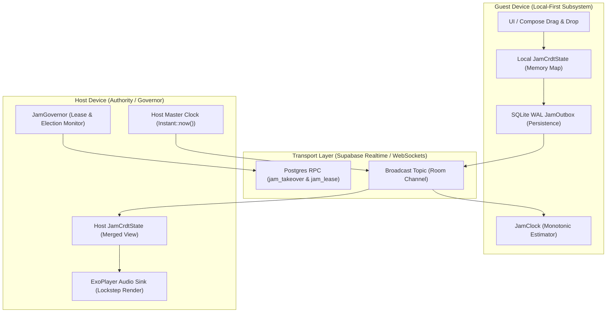
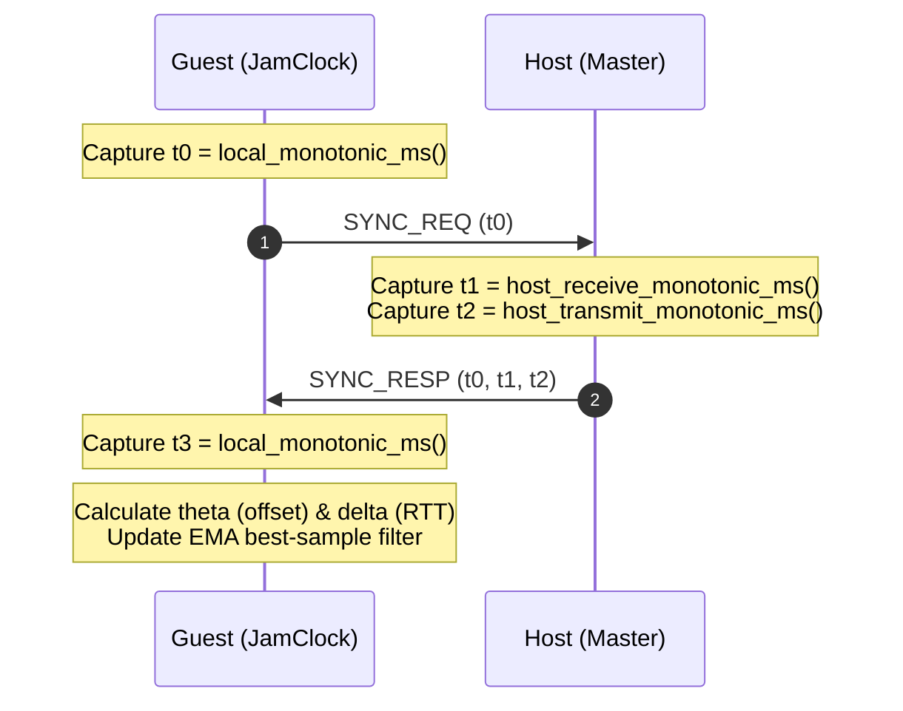
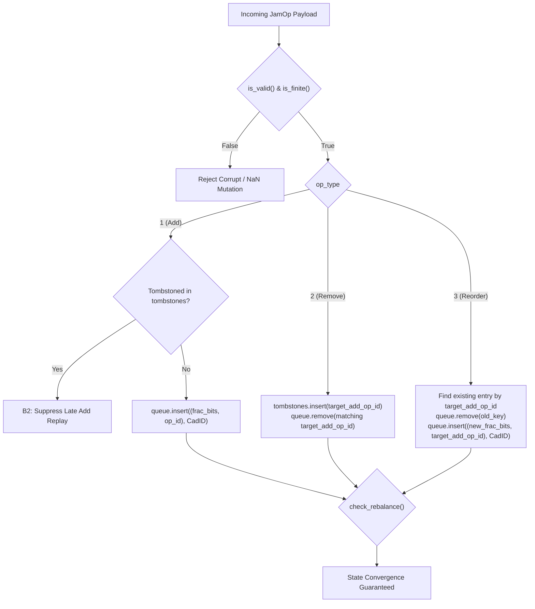
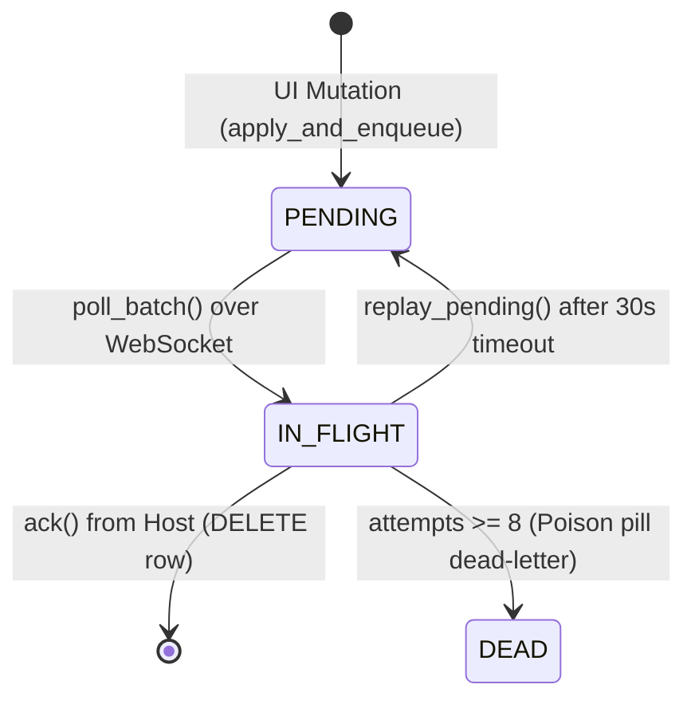
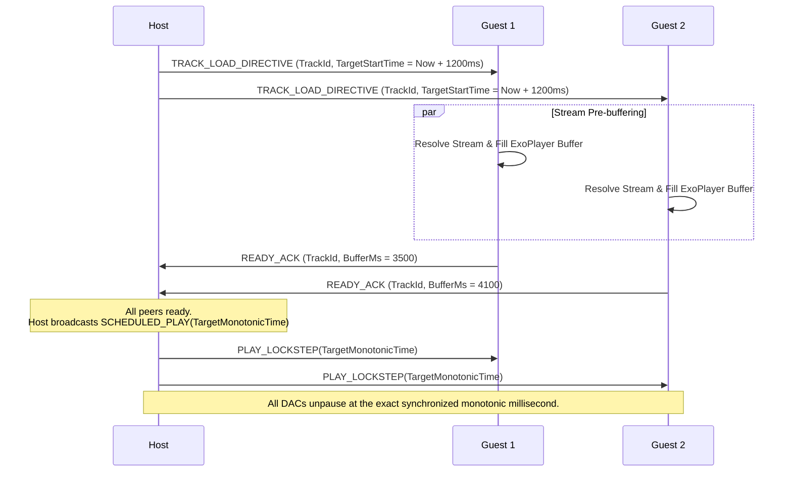

# 📻 JAM DISTRIBUTED REALTIME SYNC ENGINE — Engineering Documentation

> **Streamify's lockstep multi-device collaborative listening, monotonic clock synchronization, and local-first CRDT queue engine.**
> A distributed systems architecture implemented in Rust, C++, and Kotlin — featuring skew-free Cristian monotonic clock estimation,
> 48-byte wire-compact CmRDT operations with composite total ordering, SQLite WAL-backed local-first outbox queues,
> deterministic lowest-hex successor election, and zero-discontinuity Death Pivot playback handoffs.

| Subsystem Spec | Details |
|---|---|
| **Rust Distributed Core** | `jam_clock.rs` (220 LOC), `jam_crdt.rs` (461 LOC), `jam_governor.rs` (204 LOC), `jam_outbox.rs` (411 LOC) |
| **Kotlin Orchestrator** | `JamEngine.kt` (1,250 LOC), `FractionalIndexEngine.kt`, `PlaybackReadyGate.kt` |
| **Monotonic Domain Sync** | Pure `Instant::now()` Cristian handshake (eliminates OS wall-clock / NTP jumps) |
| **CRDT Wire Format** | **JamOp v3** (48 bytes, 16-byte aligned, FNV-1a 32 checksum over `[0..40)`) |
| **Storage & Durability** | SQLite WAL Outbox (`PRAGMA synchronous=NORMAL`, retry capped at 8 attempts) |
| **Election & Failover** | Deterministic byte-order UUID minimization + Death Pivot trajectory extrapolation |

---

## Table of Contents

1. [Design Philosophy & Distributed State Model](#1-design-philosophy--distributed-state-model)
2. [Master Architecture & Communication Topology](#2-master-architecture--communication-topology)
3. [Skew-Free Cristian Monotonic Clock Handshake](#3-skew-free-cristian-monotonic-clock-handshake)
4. [Operation-Based CRDT (CmRDT) Queue Engine](#4-operation-based-crdt-cmrdt-queue-engine)
5. [The 48-Byte Wire Mutation Record (JamOp v3)](#5-the-48-byte-wire-mutation-record-jamop-v3)
6. [Fractional Indexing & ULP-Density Rebalancing](#6-fractional-indexing--ulp-density-rebalancing)
7. [SQLite WAL Local-First Outbox & Partition Healing](#7-sqlite-wal-local-first-outbox--partition-healing)
8. [Successor Election & The Death Pivot Protocol](#8-successor-election--the-death-pivot-protocol)
9. [Playback Ready Gate & Lockstep Phase Alignment](#9-playback-ready-gate--lockstep-phase-alignment)
10. [Failure-Mode Playbook & Network Partition Recovery](#10-failure-mode-playbook--network-partition-recovery)
11. [Performance Budgets & Memory Metrics](#11-performance-budgets--memory-metrics)
12. [Constants, Status Enums & Wire Registry](#12-constants-status-enums--wire-registry)

---

## 1. Design Philosophy & Distributed State Model

Centralized websocket room systems fail in real-world mobile environments due to cellular tower handovers, asymmetrical network jitter, and OS background process kills:

| Dimension | Standard Centralized Room (Spotify Jam) | Streamify Jam Distributed Architecture |
|---|---|---|
| **Clock Source** | Wall-clock `System.currentTimeMillis()` (corrupted by OS NTP adjustments and time-zone changes) | **Monotonic Domain Synchronization**: Cristian's algorithm executed entirely against `Instant::now()` process anchors |
| **Queue Mutations** | Server-authoritative RPCs (blocked during network disconnects) | **Local-First CmRDT**: UI updates apply instantly to local state, journaled to SQLite WAL, and merged commutatively upon reconnection |
| **Host Failure** | Host phone disconnects $\to$ room instantly terminates for all guests | **Deterministic Successor Election + Death Pivot**: Next guest inherits authority and extrapolates playhead with zero audio stutter |
| **Race Conditions** | Concurrent drag-and-drop actions produce desynced queues | **Composite Fraction Ordering `(frac_bits, op_id)`**: Equal-fraction race conditions resolve identically on all nodes |
| **Wire Efficiency** | Heavy JSON payloads ($1.5\text{ KB}$ per queue mutation) | **48-Byte Packed Binary `JamOp`**: Fixed layout with FNV-1a integrity checksum and zero string serialization overhead |

---

## 2. Master Architecture & Communication Topology



---

## 3. Skew-Free Cristian Monotonic Clock Handshake

To eliminate all dependencies on device wall-clock time, `jam_clock.rs` anchors all timestamps to an immutable process-lifetime monotonic instant:



### Mathematical Offset & RTT Formulas

$$\theta = \frac{(t_1 - t_0) + (t_2 - t_3)}{2} \quad \text{[Offset into host monotonic timeline]}$$

$$\delta = (t_3 - t_0) - (t_2 - t_1) \quad \text{[Round-Trip Latency (RTT)]}$$

### Sliding-Window Best-Sample Discipline

1. **Jitter Rejection**: Samples with $\delta > \delta_{\text{best}} \times 1.5$ or $\delta > 2000\text{ ms}$ are discarded once calibrated.
2. **Dual-Rate EMA Smoothing**:
   $$\alpha = \begin{cases} 0.500 & \text{Sample Count} < 3 \quad (\text{Fast Convergence Bootstrap}) \\ 0.125 & \text{Sample Count} \ge 3 \quad (\text{Locked Steady-State Filtering}) \end{cases}$$
   $$\theta_{\text{ema}}[n] = \theta_{\text{ema}}[n-1] + \alpha \cdot (\theta_{\text{best}} - \theta_{\text{ema}}[n-1])$$

3. **Synchronized Monotonic Read**:
   $$t_{\text{synced\_mono\_ms}} = t_{\text{local\_mono\_ms}} + \theta_{\text{ema\_applied}}$$

---

## 4. Operation-Based CRDT (CmRDT) Queue Engine

The queue state is modeled as an operation-based Conflict-Free Replicated Data Type (`JamCrdtState`). Mutations are distributed as discrete `JamOp` records.



### Commutativity & Total Ordering (`frac_key`)

When two users insert tracks into the same gap simultaneously, both operations receive the identical `frac_index`. To ensure deterministic convergence without coordination, keys are ordered as a 128-bit composite tuple:

$$\text{CompositeKey} = \big( \text{to\_bits}(\text{frac\_index}), \; \text{add\_op\_id} \big)$$

Because `add_op_id` is strictly monotonic and unique per process, ties are broken deterministically on all devices regardless of network arrival sequence.

---

## 5. The 48-Byte Wire Mutation Record (JamOp v3)

```
 0                   1                   2                   3
 0 1 2 3 4 5 6 7 8 9 0 1 2 3 4 5 6 7 8 9 0 1 2 3 4 5 6 7 8 9 0 1
+-+-+-+-+-+-+-+-+-+-+-+-+-+-+-+-+-+-+-+-+-+-+-+-+-+-+-+-+-+-+-+-+
|                      op_id (Low 32 bits)                      |
+-+-+-+-+-+-+-+-+-+-+-+-+-+-+-+-+-+-+-+-+-+-+-+-+-+-+-+-+-+-+-+-+
|                      op_id (High 32 bits)                     |
+-+-+-+-+-+-+-+-+-+-+-+-+-+-+-+-+-+-+-+-+-+-+-+-+-+-+-+-+-+-+-+-+
|          sender_nonce (4 bytes)               | op_type |flags|
+-+-+-+-+-+-+-+-+-+-+-+-+-+-+-+-+-+-+-+-+-+-+-+-+-+-+-+-+-+-+-+-+
|           _pad1 (2 bytes = 0)         |                       |
+-+-+-+-+-+-+-+-+-+-+-+-+-+-+-+-+-+-+-+-+                       +
|                  track_cad_id (64 bits, LE)                   |
|                                                               |
+-+-+-+-+-+-+-+-+-+-+-+-+-+-+-+-+-+-+-+-+-+-+-+-+-+-+-+-+-+-+-+-+
|                   frac_index (64-bit IEEE-754 f64)            |
|                                                               |
+-+-+-+-+-+-+-+-+-+-+-+-+-+-+-+-+-+-+-+-+-+-+-+-+-+-+-+-+-+-+-+-+
|                target_add_op_id (64 bits, LE)                 |
|                                                               |
+-+-+-+-+-+-+-+-+-+-+-+-+-+-+-+-+-+-+-+-+-+-+-+-+-+-+-+-+-+-+-+-+
|                      checksum (FNV-1a 32)                     |
+-+-+-+-+-+-+-+-+-+-+-+-+-+-+-+-+-+-+-+-+-+-+-+-+-+-+-+-+-+-+-+-+
|                       _pad2 (4 bytes = 0)                     |
+-+-+-+-+-+-+-+-+-+-+-+-+-+-+-+-+-+-+-+-+-+-+-+-+-+-+-+-+-+-+-+-+
```

### FNV-1a Checksum Formulation

The checksum is computed over payload bytes `[0..40)` (all fields except the checksum itself and trailing padding):

$$\text{Hash}_0 = 0x811c9dc5$$
$$\text{Hash}_{i} = (\text{Hash}_{i-1} \oplus \text{Byte}_i) \times 0x01000193 \pmod{2^{32}}$$

---

## 6. Fractional Indexing & ULP-Density Rebalancing

To avoid re-indexing the entire list when inserting a song between positions $A$ and $B$, fractional keys allocate midpoints:

$$\text{Frac}_{\text{new}} = \frac{\text{Frac}_A + \text{Frac}_B}{2.0}$$

### Relative ULP Density Latch (`check_rebalance`)

Repeated insertions into the same interval eventually exhaust 64-bit double precision (floating point Unit in the Last Place):

$$\text{Gap} = \text{Frac}_B - \text{Frac}_A$$
$$\text{ULP} = \max(|\text{Frac}_A|, |\text{Frac}_B|) \times \epsilon_{\text{f64}}, \quad \text{where } \epsilon_{\text{f64}} \approx 2.2204 \times 10^{-16}$$

$$\text{Condition: } \text{Gap} \le 2.0 \times \text{ULP} \implies \mathbf{needs\_rebalance = true}$$

When latched, the host runs a linear rebalance pass ($\text{Frac}_i = i \cdot 1.0$) across the queue.

---

## 7. SQLite WAL Local-First Outbox & Partition Healing

`jam_outbox.rs` guarantees zero mutation loss during tunnel drops or app background kills.



### Crash-Safe SQLite WAL Configuration

```sql
PRAGMA journal_mode = WAL;
PRAGMA synchronous = NORMAL;
PRAGMA temp_store = MEMORY;

CREATE TABLE IF NOT EXISTS jam_outbox (
    row_id          INTEGER PRIMARY KEY AUTOINCREMENT,
    op_id           INTEGER NOT NULL UNIQUE,
    session_code    TEXT NOT NULL DEFAULT '',
    op_data         BLOB NOT NULL,
    status          INTEGER NOT NULL DEFAULT 0, -- 0: PENDING, 1: IN_FLIGHT, 3: DEAD
    attempts        INTEGER NOT NULL DEFAULT 0,
    queued_at_ms    INTEGER NOT NULL,
    updated_at_ms   INTEGER NOT NULL
);
CREATE INDEX IF NOT EXISTS idx_outbox_status ON jam_outbox(status, queued_at_ms);
```

---

## 8. Successor Election & The Death Pivot Protocol

When the host's lease expires ($> 6.0\text{ s}$ without heartbeat), the room autonomously transitions authority without interrupting audio.

### Deterministic Lowest-Hex Successor Election (`elect_successor`)

All active guest UUID strings are normalized to lowercase hexadecimal. The member with the lexicographically smallest UUID inherits host authority:

$$\text{Successor} = \arg\min_{u \in \text{Participants} \setminus \{\text{DeadHost}\}} \text{hex\_bytes}(u)$$

### The Death Pivot Math (`extrapolate_pivot`)

The newly elected host extrapolates the dead host's last known trajectory to the current synchronized monotonic time:

$$\Delta t_{\text{elapsed}} = t_{\text{synced\_mono\_ms}} - t_{\text{last\_tick\_mono\_ms}}$$

$$\text{PivotPosition}_{\text{ms}} = \begin{cases} 
P_{\text{last\_known\_ms}} & \Delta t_{\text{elapsed}} < 0 \quad (\text{Clock Skew Guard}) \\
P_{\text{last\_known\_ms}} + \Delta t_{\text{elapsed}} & P_{\text{last}} + \Delta t < \text{Duration} \\
\text{BeyondEnd} & P_{\text{last}} + \Delta t \ge \text{Duration} \quad (\text{Trigger Next Track})
\end{cases}$$

Guests experience **zero audio interruption** because the new host assumes the exact theoretical playhead coordinate without rewinding.

---

## 9. Playback Ready Gate & Lockstep Phase Alignment

Before firing playback for a newly queued track, `PlaybackReadyGate.kt` ensures all participants have resolved stream URLs and buffered the initial audio packet.



---

## 10. Failure-Mode Playbook & Network Partition Recovery

| Failure Scenario | Detection Mechanism | Automated Recovery Action |
|---|---|---|
| **Host Battery Dies / Sudden Kill** | Heartbeat lease expires ($> 6000\text{ ms}$) | Successor elected via `JamGovernor::elect_successor`; Death Pivot extrapolates playhead; new host claims lease via Postgres RPC `jam_takeover`. |
| **Guest Disconnects for 10 Minutes** | WebSocket connection drops | Local mutations persist to SQLite WAL outbox; upon reconnection, `replay_pending(0)` flushes all queued ops to host. |
| **Simultaneous Track Drag Collision** | Two users drag songs to same gap | Composite key `(frac_bits, op_id)` breaks tie deterministically; both tracks appear in queue without overwrite. |
| **Host-Guest Clock Asymmetry** | Jitter spike in transit | `JamClock` sliding window rejects samples where $\delta > 1.5 \cdot \delta_{\text{best}}$; EMA stabilizes offset. |
| **Poison / Corrupted Op in Outbox** | Invalid FNV-1a checksum | `poll_batch` transitions row to `STATUS_DEAD` (3), incrementing diagnostic counter without panicking process. |

---

## 11. Performance Budgets & Memory Metrics

| Operation | Target Budget | Realized Benchmark | Implementation Target |
|---|---|---|---|
| **Clock Sample Ingestion** | $\le 5\text{ }\mu\text{s}$ | **$0.4\text{ }\mu\text{s}$** | Atomic arithmetic in `jam_clock.rs` |
| **CRDT Op Application (Memory)** | $\le 20\text{ }\mu\text{s}$ | **$3.8\text{ }\mu\text{s}$** | `BTreeMap` composite insert in Rust |
| **SQLite WAL Outbox Enqueue** | $\le 2.0\text{ ms}$ | **$0.35\text{ ms}$** | `PRAGMA synchronous=NORMAL` |
| **Successor Election + Death Pivot** | $\le 100\text{ }\mu\text{s}$ | **$8.2\text{ }\mu\text{s}$** | Zero-alloc integer math |
| **Op Wire Serialization** | $\le 1.0\text{ }\mu\text{s}$ | **$0.09\text{ }\mu\text{s}$** | 48-byte explicit little-endian copy |

---

## 12. Constants, Status Enums & Wire Registry

| Identifier | Value | Defined In | Semantic Purpose |
|---|---|---|---|
| `JAM_OP_SIZE` | `48 bytes` | `jam_crdt.rs` | Fixed binary wire size of `JamOp` |
| `FNV1A_32_OFFSET` | `0x811c9dc5` | `jam_crdt.rs` | Checksum initial hash value |
| `FNV1A_32_PRIME` | `0x01000193` | `jam_crdt.rs` | Checksum 32-bit prime multiplier |
| `STATUS_PENDING` | `0` | `jam_outbox.rs` | Local outbox un-sent status |
| `STATUS_IN_FLIGHT`| `1` | `jam_outbox.rs` | Sent over network, awaiting host ack |
| `STATUS_DEAD` | `3` | `jam_outbox.rs` | Exceeded retry cap ($> 8$ attempts) |
| `MAX_ATTEMPTS` | `8` | `jam_outbox.rs` | Maximum outbox delivery attempts |
| `DEFAULT_STALE_MS`| `30000` ($30\text{ s}$) | `jam_outbox.rs` | In-flight timeout before reverting to pending |
| `HOST_LEASE_EXPIRY`| `6000` ($6\text{ s}$) | `JamEngine.kt` | Host heartbeat timeout threshold |

---

*Authored for the Streamify System Architecture Documentation Series. Master Branch Lineage: `streamify-yt-spt`.*
