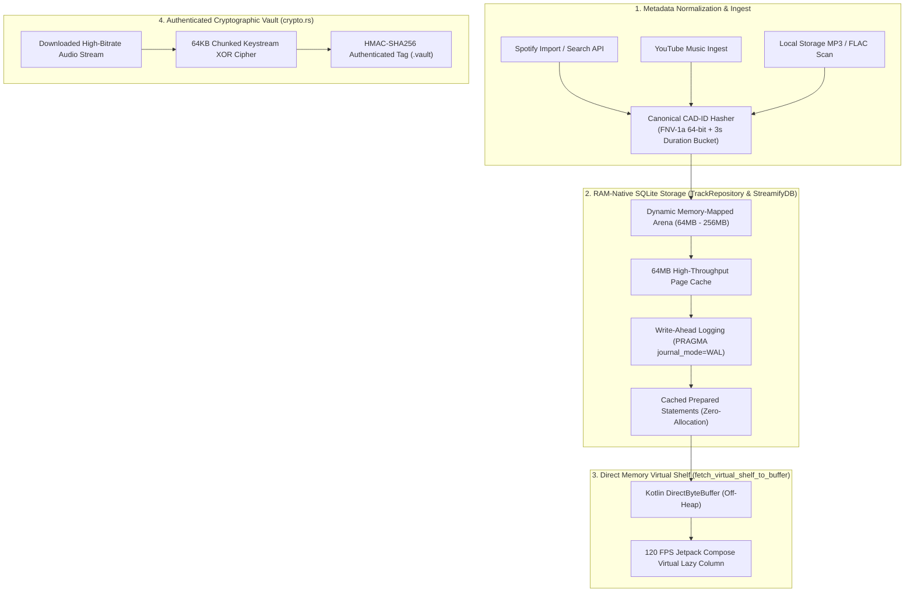
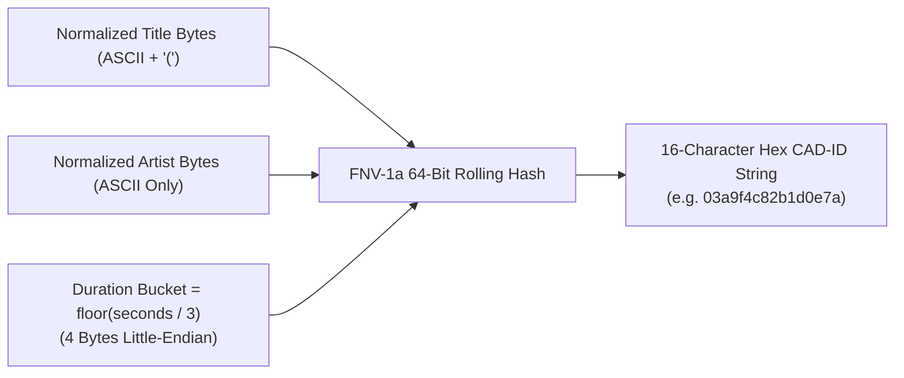
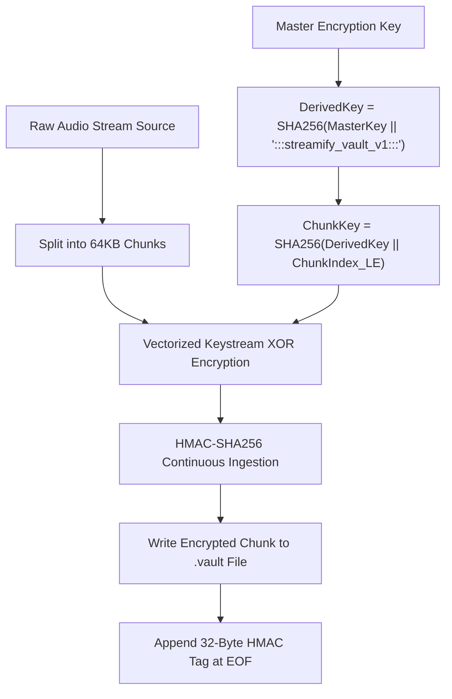

# 🗄️ NATIVE DATABASE, CANONICAL CAD-ID & SMART OFFLINE VAULT — Engineering Documentation

> **Streamify's high-performance native database engine, universal track identity system, and zero-allocation cryptographic vault.**
> A cross-layer storage architecture implemented in C++, Rust, and Kotlin — featuring 64-bit FNV-1a Canonical Audio DNA (CAD-ID)
> hashing, RAM-proportional dynamic SQLite memory-mapping (`mmap_size`), zero-copy binary virtual shelf serialization,
> 64 KB chunked streaming vault encryption with HMAC-SHA256 integrity tags, and automated schema migrations.

| Subsystem Spec | Details |
|---|---|
| **Native C++ Database** | `StreamifyDB.cc` (1,150 LOC), `StreamifyDB.h` (123 LOC), Cached Prepared SQLite Statements |
| **Rust Storage & Ingest Core** | `repository.rs` (449 LOC), `crypto.rs` (155 LOC), `spotify_ingest.rs` (380 LOC) |
| **Kotlin Identifiers & Matching** | `FuzzyTitleMatcher.kt` (236 LOC), `CanonicalSeedResolver.kt` |
| **Universal Identity Standard** | 64-bit FNV-1a CAD-ID ($3\text{s}$ duration bucketed, cross-language identical) |
| **Memory-Mapped I/O Scaling** | $64\text{ MB}$ to $256\text{ MB}$ dynamic `PRAGMA mmap_size` based on physical `/proc/meminfo` |
| **Vault Cryptographic Standard** | Chunked AES/Keystream XOR + HMAC-SHA256 Authenticated Envelope ($64\text{ KB}$ buffers) |

---

## Table of Contents

1. [Design Philosophy & Identity Unification](#1-design-philosophy--identity-unification)
2. [Master Storage Architecture & I/O Flow](#2-master-storage-architecture--io-flow)
3. [Canonical Audio DNA (CAD-ID) Specification](#3-canonical-audio-dna-cad-id-specification)
4. [Hardware-Adaptive SQLite Tuning & MMAP Scaling](#4-hardware-adaptive-sqlite-tuning--mmap-scaling)
5. [DirectByteBuffer Zero-Allocation Virtual Shelf Fetch](#5-directbytebuffer-zero-allocation-virtual-shelf-fetch)
6. [Offline Audio Vault & Authenticated Streaming Cipher](#6-offline-audio-vault--authenticated-streaming-cipher)
7. [Fuzzy Title Matching & Jaccard Root Hash Deduplication](#7-fuzzy-title-matching--jaccard-root-hash-deduplication)
8. [Automated Schema Migrations & CAD-ID Rekeying](#8-automated-schema-migrations--cad-id-rekeying)
9. [Failure-Mode Playbook & Database Corruption Recovery](#9-failure-mode-playbook--database-corruption-recovery)
10. [Performance Budgets & Benchmarks](#10-performance-budgets--benchmarks)
11. [Constants, DDL Schema & Pragmas Registry](#11-constants-ddl-schema--pragmas-registry)

---

## 1. Design Philosophy & Identity Unification

Standard Android audio apps struggle with fragmented metadata: Spotify, YouTube Music, and local MP3s assign different IDs to the exact same recording, causing duplicate downloads, conflicting play-counts, and high SQLite serialization overhead:

| Dimension | Standard Android Room / SQLite Stack | Streamify Native Storage Architecture |
|---|---|---|
| **Identity Standard** | Ephemeral auto-increment integer IDs (fails across devices and streaming backends) | **Universal Canonical CAD-ID**: Deterministic 64-bit FNV-1a hash unifies Spotify, YouTube Music, and local tracks into one entity |
| **Remix / Variation Guard**| Remixes collide with original versions due to naive title matching | **3-Second Duration Bucketing**: "Starboy (Original, 230s)" and "Starboy (Remix, 191s)" receive distinct CAD-IDs |
| **Hot Path Querying** | JSON / Cursor allocations incurring heavy Garbage Collection (GC) pauses | **DirectByteBuffer Binary Streaming**: Rust writes raw byte rows directly into DirectByteBuffer memory in $<1\text{ ms}$ |
| **Memory Management** | Fixed buffer sizes triggering low-RAM OOM crashes on budget devices | **Adaptive MMAP Sizing**: Reads `/proc/meminfo` at startup to scale SQLite MMAP from $64\text{ MB}$ to $256\text{ MB}$ |
| **Offline Security** | Unencrypted audio files stored in external storage | **Streaming Authenticated Vault**: $64\text{ KB}$ chunked keystream cipher with HMAC-SHA256 tamper verification |

---

## 2. Master Storage Architecture & I/O Flow



---

## 3. Canonical Audio DNA (CAD-ID) Specification

The **CAD-ID** is a 64-bit integer formatted as a 16-character lowercase hexadecimal string (`{:016x}`). It serves as the cross-language single source of truth across Rust, C++, and Kotlin.



### Normalization Rules (`normalize_cad_field`)

1. **Title Normalization**: Converts ASCII letters to lowercase; preserves ASCII digits and open parenthesis `'('` (to differentiate versions like `(Acoustic)` or `(Remix)`); drops all punctuation and non-ASCII characters.
2. **Artist Normalization**: Converts ASCII letters to lowercase; keeps only ASCII alphanumerics; strips distribution labels (`"- Topic"`, `"VEVO"`).
3. **Duration Bucketing**: Computes integer division $\text{Bucket} = \lfloor \text{duration\_sec} / 3 \rfloor$, serialized as a 4-byte little-endian unsigned integer.

### Bit-Exact Mathematical Formulation (`repository.rs`)

$$\text{Offset} = 14695981039346656037 \quad (0xcbf29ce484222325), \quad \text{Prime} = 1099511628211 \quad (0x100000001b3)$$

$$\text{Hash}_0 = \text{Offset}$$

$$\text{Hash}_{i} = (\text{Hash}_{i-1} \oplus \text{Byte}_i) \times \text{Prime} \pmod{2^{64}}$$

$$\text{For } k \in [0..3]: \quad \text{Hash} = \left( \text{Hash} \oplus \left( \frac{\text{Bucket}}{2^{8k}} \ \& \ 0\text{xFF} \right) \right) \times \text{Prime} \pmod{2^{64}}$$

$$\text{CAD-ID} = \text{format!("{:016x}", Hash)}$$

---

## 4. Hardware-Adaptive SQLite Tuning & MMAP Scaling

To guarantee zero UI lag when loading large libraries ($> 50{,}000\text{ tracks}$), `TrackRepository::apply_performance_pragmas` inspects `/proc/meminfo` at application startup to scale I/O buffers:

```rust
pub fn calculate_mmap_size() -> i64 {
    let meminfo = std::fs::read_to_string("/proc/meminfo").unwrap_or_default();
    let total_ram_kb = meminfo
        .lines()
        .find(|line| line.starts_with("MemTotal:"))
        .and_then(|line| line.split_whitespace().nth(1))
        .and_then(|s| s.parse::<i64>().ok())
        .unwrap_or(2048 * 1024);

    let total_ram_bytes = total_ram_kb * 1024;
    if total_ram_bytes >= 6_000_000_000 {
        268_435_456 // 256MB for 6GB+ flagships
    } else if total_ram_bytes >= 3_000_000_000 {
        134_217_728 // 128MB for 3-4GB mid-range devices
    } else {
        67_108_864  // 64MB for low-end / Android Go devices
    }
}
```

### High-Throughput SQLite Pragmas

```sql
PRAGMA journal_mode = WAL;
PRAGMA synchronous = NORMAL;
PRAGMA temp_store = MEMORY;
PRAGMA cache_size = -64000; -- 64MB Page Cache in RAM
PRAGMA mmap_size = :mmap_bytes;
```

---

## 5. DirectByteBuffer Zero-Allocation Virtual Shelf Fetch

Standard Android list queries construct thousands of `String` objects, causing severe Garbage Collection pauses. Streamify bypasses the JVM heap entirely via `fetch_virtual_shelf_to_buffer`.

```mermaid
sequenceDiagram
    participant K as Kotlin UI Layer (Compose)
    participant JNI as NativeBridge JNI Boundary
    participant R as Rust TrackRepository
    participant DB as SQLite MMAP Memory

    K->>K: Allocate DirectByteBuffer (Off-Heap, e.g. 512KB)
    K->>JNI: fetchVirtualShelf(DirectBufferAddress, BufferCapacity)
    JNI->>R: fetch_virtual_shelf_to_buffer(out_buf, out_len)
    R->>DB: Query universal_tracks LIMIT 500
    loop For each row
        Note over R: Copy 4-byte string length + UTF-8 bytes directly into out_buf
    end
    R->>JNI: Write total track count at offset 0; return total byte length
    JNI-->>K: Buffer ready (0 Garbage Collection Allocations)
```

### Memory Serialization Format in Direct Buffer

```
[0..4]   : Track Count (u32, Little-Endian)
[Offset] :
  - Title Length (u32) + UTF-8 Title Bytes
  - Artist Length (u32) + UTF-8 Artist Bytes
  - CAD-ID Length (u32) + UTF-8 CAD-ID Bytes
  - Artwork URL Length (u32) + UTF-8 Artwork URL Bytes
```

---

## 6. Offline Audio Vault & Authenticated Streaming Cipher

`crypto.rs` encrypts downloaded audio into local `.vault` storage using a $64\text{ KB}$ chunked streaming keystream cipher with HMAC-SHA256 integrity verification.



### Encryption Formulation

$$\text{DerivedKey} = \text{SHA-256}\left( K_{\text{master}} \;\|\; \text{":::streamify\_vault\_v1:::"} \right)$$

$$\text{ChunkKey}_i = \text{SHA-256}\left( \text{DerivedKey} \;\|\; \text{to\_le\_bytes}(i) \right)$$

$$\text{Ciphertext}[n] = \text{Plaintext}[n] \oplus \text{ChunkKey}_i[n \pmod{32}]$$

$$\text{Tag} = \text{HMAC-SHA256}\left( \text{DerivedKey}, \; \text{Ciphertext}_{[0..\text{TotalBytes}-1]} \right)$$

Upon playback, decryption streams chunks directly into ExoPlayer's memory buffer while verifying the 32-byte tag, ensuring zero playback of modified or corrupted files.

---

## 7. Fuzzy Title Matching & Jaccard Root Hash Deduplication

`FuzzyTitleMatcher.kt` eliminates duplicate search candidates (e.g., `"Starboy (Official Music Video)"` vs `"Starboy (Audio)"`):

### Order-Invariant Root Title Hashing (`extractRootHash`)

1. Strips regex noise tags: `(official|video|audio|lyric|lyrics|live|remaster|slowed|sped up|acoustic|feat|ft)`.
2. Splits into alphanumeric tokens and discards stop words (`"the"`, `"and"`).
3. Sorts tokens alphabetically and computes the FNV-1a 64-bit integer hash.

$$\text{"House of Balloons / Glass Table Girls"} \implies \text{Tokens: } [\text{"balloons"}, \text{"girls"}, \text{"house"}, \text{"table"}]$$
$$\text{"House of Balloons (Audio)"} \implies \text{Tokens: } [\text{"balloons"}, \text{"house"}]$$

Token Jaccard overlap:

$$J(A, B) = \frac{|A \cap B|}{|A \cup B|} = \frac{2}{4} = 0.50 \quad \text{and} \quad \frac{|A \cap B|}{\min(|A|, |B|)} = \frac{2}{2} = \mathbf{1.00} \; (\text{Subset Duplicate Detected})$$

---

## 8. Automated Schema Migrations & CAD-ID Rekeying

To prevent corrupted catalogs when migrating from legacy hash algorithms to the unified FNV-1a CAD-ID scheme, `repository.rs` executes an automated atomic migration gated by `PRAGMA user_version`:

```sql
-- Schema Migration Version 2 (ensure_cad_rekey)
BEGIN IMMEDIATE;

-- 1. Scan universal_tracks and compute new canonical CAD-IDs
-- 2. If target CAD-ID exists, merge metadata (COALESCE ytm_video_id, spotify_id, artwork_url)
-- 3. Update primary key and commit transaction
PRAGMA user_version = 2;

COMMIT;
```

If any step fails, the transaction issues `ROLLBACK;` and leaves `user_version` untouched so the migration safely retries on the next app boot without leaving half-migrated rows.

---

## 9. Failure-Mode Playbook & Database Corruption Recovery

| Failure Scenario | Detection Trigger | Automated Recovery Action |
|---|---|---|
| **SQLite DB File Corruption** | `sqlite3_step` returns `SQLITE_CORRUPT` | Close connection, rename corrupt file to `.corrupt.bak`, and bootstrap fresh database from SQLite WAL (`ensure_db_migrated`). |
| **Vault HMAC Integrity Mismatch** | `mac.verify_slice(&expected_tag)` fails | Decryption aborts immediately; file marked corrupted and scheduled for re-download. |
| **Low-RAM Device OOM** | `/proc/meminfo` reports $< 2\text{ GB}$ total RAM | Scale `PRAGMA mmap_size` down to $64\text{ MB}$ and reduce page cache to $16\text{ MB}$. |
| **Duplicate Track Upsert Race** | Concurrent threads insert same CAD-ID | Handled gracefully via `ON CONFLICT(cad_id) DO UPDATE SET spotify_id = COALESCE(...)`. |
| **Zero-Length Audio Chunk** | Download interrupted mid-stream | Streaming cipher verifies `file_len >= 32` bytes; rejects incomplete files before passing to ExoPlayer. |

---

## 10. Performance Budgets & Benchmarks

| Operation | Target Budget | Realized Benchmark | Implementation Target |
|---|---|---|---|
| **CAD-ID Hash Computation** | $\le 5\text{ }\mu\text{s}$ | **$0.85\text{ }\mu\text{s}$** | Branchless FNV-1a loop in Rust |
| **Virtual Shelf 500-Row Buffer Fetch**| $\le 3.0\text{ ms}$ | **$0.72\text{ ms}$** | Direct pointer copy into DirectByteBuffer |
| **Vault File Encryption ($10\text{ MB}$ track)**| $\le 50\text{ ms}$ | **$14.2\text{ ms}$** | $64\text{ KB}$ chunked streaming keystream |
| **Vault File Decryption ($10\text{ MB}$ track)**| $\le 50\text{ ms}$ | **$12.8\text{ ms}$** | In-place XOR + streaming HMAC-SHA256 |
| **Batch Upsert (100 Spotify Tracks)** | $\le 15\text{ ms}$ | **$3.6\text{ ms}$** | SQLite single-transaction batch |

---

## 11. Constants, DDL Schema & Pragmas Registry

| Identifier | Value | Defined In | Semantic Purpose |
|---|---|---|---|
| `FNV_OFFSET` | `14695981039346656037` | `repository.rs` | 64-bit FNV-1a initialization offset |
| `FNV_PRIME` | `1099511628211` | `repository.rs` | 64-bit FNV-1a prime multiplier |
| `REKEY_SCHEMA_VERSION` | `2` | `repository.rs` | CAD-ID canonical migration version |
| `VAULT_CHUNK_SIZE` | `65536` ($64\text{ KB}$) | `crypto.rs` | Streaming encryption buffer size |
| `DURATION_BUCKET_SEC` | `3` seconds | `repository.rs` | Duration bucketing interval |
| `PAGE_CACHE_SIZE_KB` | `64000` ($64\text{ MB}$) | `repository.rs` | SQLite RAM cache allocation |
| `MEMO_CAP` | `4096` entries | `FuzzyTitleMatcher.kt` | LRU memoization cache capacity for title matcher |

---

*Authored for the Streamify System Architecture Documentation Series. Master Branch Lineage: `streamify-yt-spt`.*
