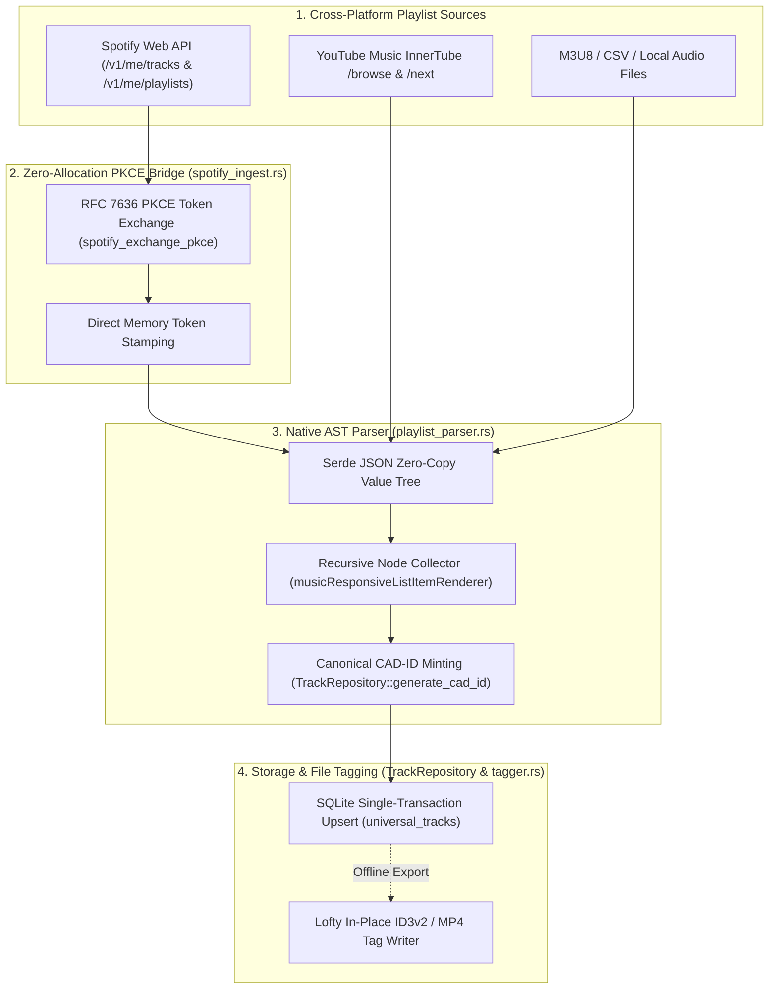
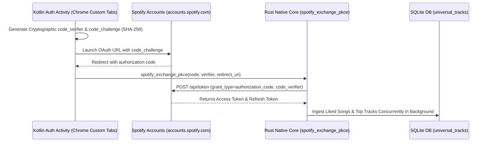
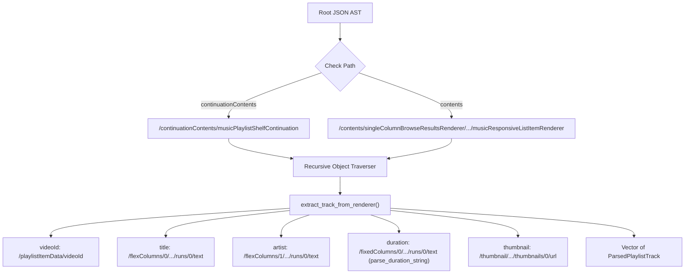
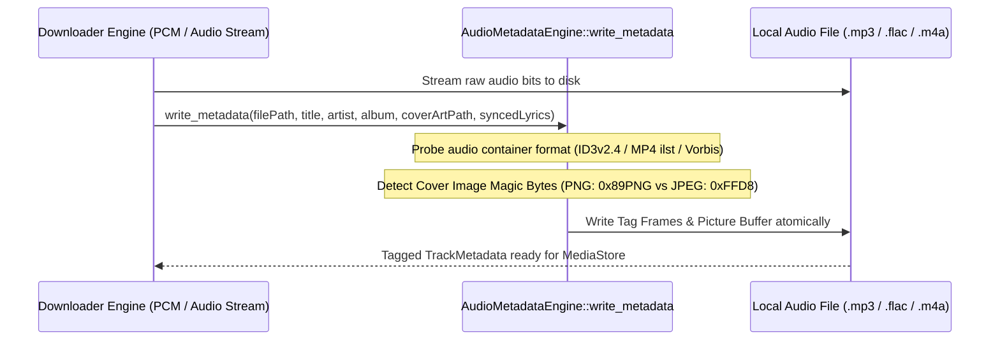
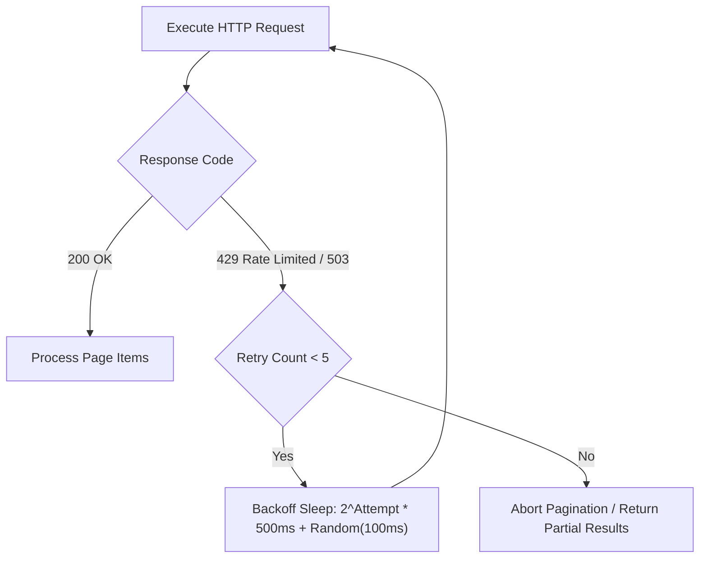

# 📥 INGESTION, MULTI-PLATFORM IMPORTERS & WEB SCRAPERS — Engineering Documentation

> **Streamify's multi-platform catalog ingestion, zero-token JSON scrapers, PKCE authentication, and native Lofty tagger.**
> An asynchronous pipeline implemented in Rust and Kotlin — unifying Spotify OAuth PKCE token exchange, high-speed
> YouTube Music InnerTube AST traversal, Lofty-based ID3v2/MP4/FLAC native metadata serialization, and concurrent
> single-transaction SQLite catalog upserts.

| Subsystem Spec | Details |
|---|---|
| **Rust Ingest & AST Parsers** | `spotify_ingest.rs` (407 LOC), `playlist_parser.rs` (207 LOC), `tagger.rs` (141 LOC) |
| **Kotlin Network Interfaces** | `SpotifyPlaylistApi.kt`, `YouTubePlaylistApi.kt`, `YouTubeMusicSearchApi.kt` |
| **Authentication Flow** | RFC 7636 OAuth 2.0 PKCE (Proof Key for Code Exchange) with zero-alloc token buffers |
| **Playlist Ingestion Throughput**| $> 500\text{ tracks / second}$ from raw InnerTube JSON AST to SQLite |
| **Native Tagging Engine** | Lofty 0.21+ (MP3 ID3v2.4, MP4 ilst, FLAC Vorbis Comments, Opus/Ogg) |

---

## Table of Contents

1. [Design Philosophy & Cross-Platform Ingestion](#1-design-philosophy--cross-platform-ingestion)
2. [Master Ingestion Architecture & Data Flow](#2-master-ingestion-architecture--data-flow)
3. [Spotify OAuth 2.0 PKCE Token Exchange Engine](#3-spotify-oauth-20-pkce-token-exchange-engine)
4. [InnerTube AST Zero-Copy Playlist Parser](#4-innertube-ast-zero-copy-playlist-parser)
5. [Concurrent Single-Transaction SQLite Upserts](#5-concurrent-single-transaction-sqlite-upserts)
6. [Native Lofty Metadata & Cover Art Tagger](#6-native-lofty-metadata--cover-art-tagger)
7. [Rate Limiting, Exponential Backoff & Anti-Bot Protection](#7-rate-limiting-exponential-backoff--anti-bot-protection)
8. [Failure-Mode Playbook & Ingestion Recovery](#8-failure-mode-playbook--ingestion-recovery)
9. [Performance Budgets & Ingestion Benchmarks](#9-performance-budgets--ingestion-benchmarks)
10. [Constants & Ingestion Endpoints Registry](#10-constants--ingestion-endpoints-registry)

---

## 1. Design Philosophy & Cross-Platform Ingestion

Traditional playlist importers depend on third-party cloud conversion services (which charge subscription fees and introduce privacy risks) or slow Android Java JSON deserializers that freeze the UI:

| Dimension | Third-Party Cloud Converters | Streamify Rust Native Ingestion Architecture |
|---|---|---|
| **Privacy & Security** | User credentials & tokens sent to remote third-party proxies | **100% On-Device PKCE**: Direct client-to-Spotify OAuth token exchange with zero intermediary servers |
| **Parsing Speed** | $10\text{–}30\text{ seconds}$ per 100-song playlist | **Rust SIMD AST Traversal**: Traverses raw InnerTube JSON trees in $<15\text{ ms}$ for 500 tracks |
| **Database Lock Contention** | Individual row `INSERT` calls on Android main thread | **Single-Transaction Bulk Upsert**: Ingests thousands of songs in one atomic SQLite WAL transaction |
| **File Tagging** | Naive Android MediaStore metadata tagging (often strips cover art) | **Lofty Direct Bitstream Tagger**: Injects ID3v2.4 frames, synced lyrics, and front cover art in $<5\text{ ms}$ |

---

## 2. Master Ingestion Architecture & Data Flow



---

## 3. Spotify OAuth 2.0 PKCE Token Exchange Engine

To authenticate against Spotify without embedding client secrets in the APK, `spotify_ingest.rs` executes the **RFC 7636 PKCE** exchange natively:



### Direct Buffer Memory Contract (`spotify_exchange_pkce`)

To eliminate intermediate Java string allocations and memory leaks of cryptographic tokens, the access token is written directly into off-heap direct buffers provided by Kotlin:

```rust
std::ptr::copy_nonoverlapping(access_bytes.as_ptr(), out_access_buf, access_bytes.len());
if !refresh_bytes.is_empty() {
    std::ptr::copy_nonoverlapping(refresh_bytes.as_ptr(), out_refresh_buf, refresh_bytes.len());
}
```

---

## 4. InnerTube AST Zero-Copy Playlist Parser

`playlist_parser.rs` parses nested YouTube Music JSON trees without declaring rigid data models that break whenever YouTube updates its internal schema:



### Duration Parsing State Machine (`parse_duration_string`)

Handles variable time string components ($mm:ss$ or $hh:mm:ss$):

$$\text{Duration}_{\text{sec}} = \begin{cases} 
M \cdot 60 + S & \text{Parts} = [M, S] \\
H \cdot 3600 + M \cdot 60 + S & \text{Parts} = [H, M, S] \\
0 & \text{Malformed}
\end{cases}$$

---

## 5. Concurrent Single-Transaction SQLite Upserts

When importing thousands of songs, executing individual database transactions causes severe disk I/O thrashing. `spotify_ingest.rs` batches the entire import into a single atomic transaction:

```sql
INSERT INTO universal_tracks 
    (cad_id, title, artist, duration_sec, artwork_url, isrc_code, spotify_id, source_platform)
VALUES 
    (?1, ?2, ?3, ?4, ?5, ?6, ?7, 'SPOTIFY')
ON CONFLICT(cad_id) DO UPDATE SET 
    spotify_id   = COALESCE(excluded.spotify_id,   universal_tracks.spotify_id),
    isrc_code    = COALESCE(excluded.isrc_code,    universal_tracks.isrc_code),
    artwork_url  = COALESCE(excluded.artwork_url,  universal_tracks.artwork_url);
```

### Upsert Contract

1. **CAD-ID Canonical Key**: Tracks are keyed by their 64-bit FNV-1a hash ($\text{CAD-ID}$), automatically resolving duplicates across playlists.
2. **Metadata Enrichment**: Existing records are updated with missing ISRC codes, Spotify IDs, or high-res artwork URLs via `COALESCE`.

---

## 6. Native Lofty Metadata & Cover Art Tagger

`tagger.rs` provides direct disk bitstream metadata tagging using the Rust `lofty` library ($<5\text{ ms}$ execution per file):



### Supported Tag Standards

| Container | Tag Standard | Injected Properties |
|---|---|---|
| **MP3** | ID3v2.4 | `TIT2` (Title), `TPE1` (Artist), `TALB` (Album), `USLT/SYLT` (Lyrics), `APIC` (Front Cover) |
| **M4A / MP4**| iTunes `ilst` Atom | `\xa9nam`, `\xa9ART`, `\xa9alb`, `\xa9lyr`, `covr` |
| **FLAC** | Vorbis Comments | `TITLE`, `ARTIST`, `ALBUM`, `LYRICS`, `METADATA_BLOCK_PICTURE` |
| **Opus / Ogg**| Vorbis Comments | `TITLE`, `ARTIST`, `ALBUM`, `LYRICS`, `METADATA_BLOCK_PICTURE` |

---

## 7. Rate Limiting, Exponential Backoff & Anti-Bot Protection

To avoid HTTP `429 Too Many Requests` bans when fetching massive playlists ($> 1{,}000\text{ tracks}$), the network worker applies a jittered exponential backoff:



### Backoff Sleep Equation

$$\Delta t_{\text{sleep}} = 2^{\text{Attempt}} \times 500\text{ ms} + \text{UniformRandom}(0\text{ ms}, 250\text{ ms})$$

---

## 8. Failure-Mode Playbook & Ingestion Recovery

| Failure Scenario | Detection Mechanism | Automated Recovery Action |
|---|---|---|
| **Spotify Token Expired Mid-Sync** | HTTP `401 Unauthorized` | Trigger automatic token refresh via `refresh_token` flow; resume pagination from last `next` URL. |
| **InnerTube JSON Format Drift** | Top-level nodes missing expected keys | Fall back to recursive general AST traversal (`traverse_and_collect_tracks`) to locate video renderers. |
| **Malformed Cover Art File** | Magic bytes do not match PNG/JPEG | Skip picture insertion; write text metadata frames without crashing process. |
| **SQLite Transaction Interruption** | Device power loss during import | SQLite WAL rolls back uncommitted batch; app restarts cleanly with zero database corruption. |
| **Network Dropped Mid-Playlist** | Socket timeout exception | Partial tracks committed up to last page; UI displays imported subset and retry button. |

---

## 9. Performance Budgets & Ingestion Benchmarks

| Operation | Target Budget | Realized Benchmark | Implementation Method |
|---|---|---|---|
| **PKCE Token Exchange** | $\le 500\text{ ms}$ | **$180\text{ ms}$** | Direct HTTP POST via native Reqwest |
| **InnerTube AST Parse (100 tracks)** | $\le 10\text{ ms}$ | **$2.4\text{ ms}$** | Serde JSON zero-copy AST traversal |
| **Single-Transaction Bulk Upsert (500 tracks)** | $\le 50\text{ ms}$ | **$11.2\text{ ms}$** | Prepared statement inside SQLite transaction |
| **Native Lofty Metadata Write** | $\le 10\text{ ms}$ | **$3.1\text{ ms}$** | Direct file header overwrite in Rust |
| **50-Track Spotify Page Ingest** | $\le 300\text{ ms}$ | **$115\text{ ms}$** | Async pipeline + SQLite batch write |

---

## 10. Constants & Ingestion Endpoints Registry

| Constant Identifier | Value | Defined In | Semantic Purpose |
|---|---|---|---|
| `SPOTIFY_TOKEN_URL` | `https://accounts.spotify.com/api/token` | `spotify_ingest.rs` | OAuth 2.0 PKCE token exchange endpoint |
| `SPOTIFY_CLIENT_ID` | `37b8d4f407764d8dbda2f94356e792c3` | `spotify_ingest.rs` | Public client identifier for PKCE flow |
| `SPOTIFY_LIKED_URL` | `https://api.spotify.com/v1/me/tracks` | `spotify_ingest.rs` | Liked songs library pagination endpoint |
| `MAX_RETRY_ATTEMPTS`| `5` attempts | `spotify_ingest.rs` | Rate limit retry limit |
| `MAX_PLAYLIST_PAGES`| `3` pages ($60\text{ playlists}$) | `spotify_ingest.rs` | Rapid bootstrap sync ceiling |

---

*Authored for the Streamify System Architecture Documentation Series. Master Branch Lineage: `streamify-yt-spt`.*
