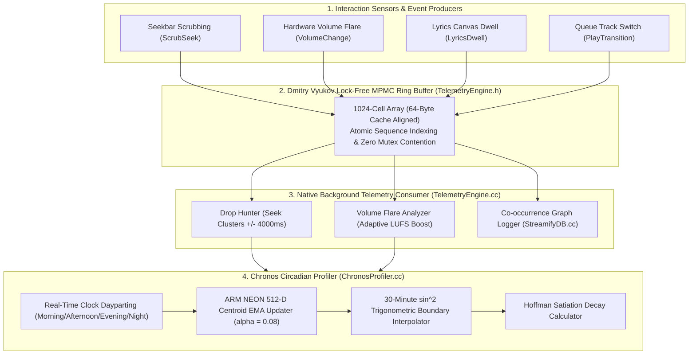
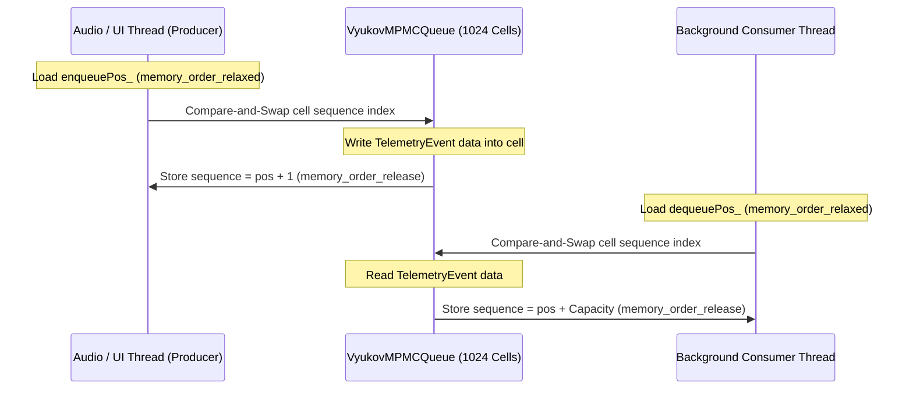
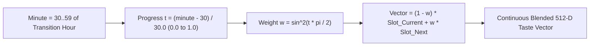
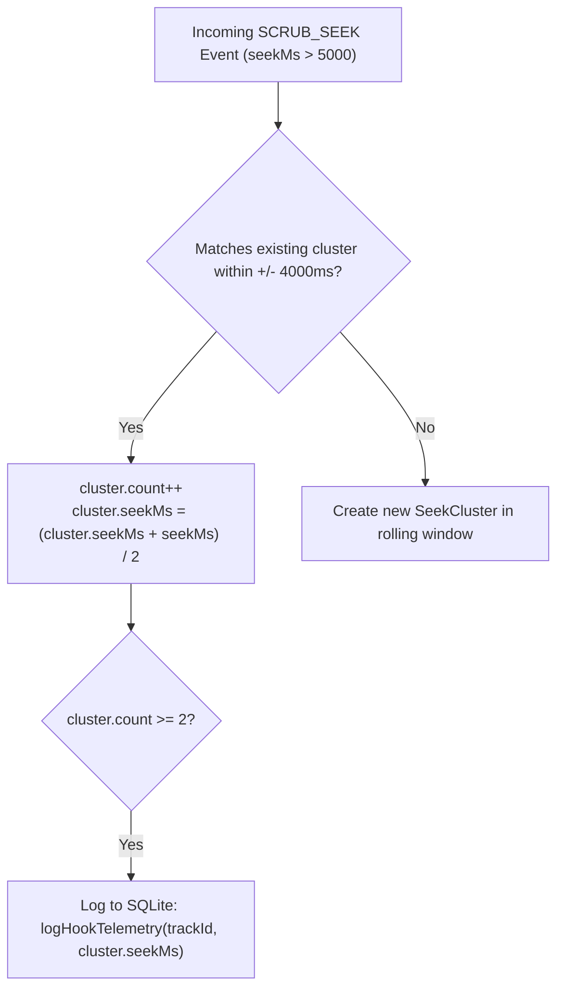

# ⏱️ CHRONOS TELEMETRY, PROFILING & WRAPPED ANALYTICS — Engineering Documentation

> **Streamify's lockless microsecond telemetry engine, circadian taste vector modeling, and psychological drop-hunting profiler.**
> A real-time instrumentation pipeline implemented in C++, ARM NEON SIMD, and SQLite — featuring Dmitry Vyukov lock-free
> MPMC bounded queues, 512-dimensional circadian dayparting taste centroids, 30-minute trigonometric time-slot boundary interpolation,
> automated chorus "drop hunting" seek clusters, volume flare emotional intensity detection, and Hoffman satiation decay modeling.

| Subsystem Spec | Details |
|---|---|
| **Native C++ Profilers** | `ChronosProfiler.cc` (158 LOC), `ChronosProfiler.h` (36 LOC), `TelemetryEngine.cc` (212 LOC) |
| **Lock-Free Queue Architecture** | Dmitry Vyukov MPMC Bounded Ring Buffer (1024 slots, 64-byte cache-line aligned) |
| **Vector Space Dimensionality** | 512-Dimensional Circadian Centroid Vectors per Dayparting Slot |
| **Boundary Smoothing** | 30-Minute Continuous Trigonometric Crossfade ($\sin^2(\theta \cdot \pi / 2)$) |
| **Telemetry Event Types** | `SCRUB_SEEK`, `VOLUME_CHANGE`, `LYRICS_DWELL`, `PLAY_TRANSITION`, `HEARTBEAT` |

---

## Table of Contents

1. [Design Philosophy & Behavioral Modeling](#1-design-philosophy--behavioral-modeling)
2. [Master Telemetry & Profiler Architecture](#2-master-telemetry--profiler-architecture)
3. [Dmitry Vyukov Lock-Free MPMC Ring Buffer](#3-dmitry-vyukov-lock-free-mpmc-ring-buffer)
4. [Circadian Dayparting & 512-D Taste Profile Learning](#4-circadian-dayparting--512-d-taste-profile-learning)
5. [30-Minute Trigonometric Time-Slot Crossfade](#5-30-minute-trigonometric-time-slot-crossfade)
6. [Drop Hunting & Favorite Seek Hook Detection](#6-drop-hunting--favorite-seek-hook-detection)
7. [Volume Flare Emotional Intensity Tracking](#7-volume-flare-emotional-intensity-tracking)
8. [Hoffman Satiation Decay & Recovery Curves](#8-hoffman-satiation-decay--recovery-curves)
9. [Failure-Mode Playbook & Telemetry Recovery](#9-failure-mode-playbook--telemetry-recovery)
10. [Performance Budgets & Lockless Benchmarks](#10-performance-budgets--lockless-benchmarks)
11. [Constants, Dayparting Slots & Bitmask Registry](#11-constants-dayparting-slots--bitmask-registry)

---

## 1. Design Philosophy & Behavioral Modeling

Standard music streaming telemetry relies on battery-draining HTTP analytical events dispatched on every user click, lacking real-time acoustic feedback and local behavioral learning:

| Dimension | Standard Analytics (Firebase / Mixpanel) | Streamify Chronos & Telemetry Architecture |
|---|---|---|
| **Thread Synchronization**| Heavy Java synchronized mutexes causing UI frame drops | **Dmitry Vyukov Lock-Free MPMC Ring Buffer**: Atomic compare-and-swap (CAS) queue executing in $<15\text{ ns}$ |
| **Circadian Awareness** | Static recommendations throughout the day | **4-Phase Circadian Vectors**: Learns distinct 512-D acoustic taste centroids for Morning, Afternoon, Evening, and Night |
| **Slot Transitions** | Sudden acoustic shifts at boundary hours | **Smooth Trigonometric Crossfading**: $\sin^2$ continuous interpolation smoothly shifts taste vectors over 30 minutes |
| **Hook Identification** | Static cloud metadata | **Client-Side Drop Hunting**: Clusters seekbar scrub spikes to locate the song's emotional climax in real time |
| **Dynamic Loudness** | Static volume normalization | **Volume Flare Feedback**: Detects emotional spikes ($>85\%$ volume) and dynamically boosts target LUFS from $-14$ to $-10$ |

---

## 2. Master Telemetry & Profiler Architecture



---

## 3. Dmitry Vyukov Lock-Free MPMC Ring Buffer

`TelemetryEngine.h` utilizes a bounded, lock-free Multi-Producer Multi-Consumer (MPMC) queue based on Dmitry Vyukov's algorithm to eliminate lock contention on the audio rendering thread:



### Memory Alignment & Cache-Line Padding

```cpp
template<typename T, size_t Capacity>
class VyukovMPMCQueue {
private:
    struct Cell {
        std::atomic<size_t> sequence;
        T data;
    };

    alignas(64) std::array<Cell, Capacity> buffer_;
    alignas(64) std::atomic<size_t> enqueuePos_{0};
    alignas(64) std::atomic<size_t> dequeuePos_{0};
    // alignas(64) prevents false-sharing across CPU L1 cache lines
};
```

---

## 4. Circadian Dayparting & 512-D Taste Profile Learning

`ChronosProfiler.cc` segments listener psychology into 4 distinct circadian biological time slots:

| Slot ID | Slot Name | Active Time Window | Target BPM | Biological & Acoustic Character |
|---|---|---|---|---|
| **0** | `MORNING` | **06:00 – 11:00** | **$130.0\text{ BPM}$** | High-tempo, motivating, bright high frequencies |
| **1** | `AFTERNOON` | **11:00 – 17:00** | **$85.0\text{ BPM}$** | Lo-Fi, instrumental focus, stable rhythm |
| **2** | `EVENING` | **17:00 – 22:00** | **$118.0\text{ BPM}$** | Upbeat golden hour, melodic pop/electronic |
| **3** | `NIGHT` | **22:00 – 06:00** | **$95.0\text{ BPM}$** | Deep ambient, warm low-end, suppressed harsh highs |

### ARM NEON SIMD Vector EMA Learning (`updateTasteProfile`)

When a user listens to a track during slot $S$, the corresponding 512-D circadian centroid $\vec{C}_S$ is updated using a learning rate of $\alpha = 0.08$:

$$\vec{C}_S[n] = (1 - \alpha) \cdot \vec{C}_S[n-1] + \alpha \cdot \vec{V}_{\text{track}}$$

$$\vec{C}_{S, \text{normalized}} = \frac{\vec{C}_S}{\|\vec{C}_S\|_2}$$

```cpp
#if defined(__ARM_NEON) || defined(__aarch64__)
for (int i = 0; i < 512; i += 4) {
    float32x4_t v_track = vld1q_f32(&trackVector[i]);
    float32x4_t v_slot = vld1q_f32(&circadianVectors_[slot][i]);
    float32x4_t v_decayed = vmulq_n_f32(v_slot, 1.0f - alpha);
    float32x4_t v_new = vmlaq_n_f32(v_decayed, v_track, alpha);
    vst1q_f32(&circadianVectors_[slot][i], v_new);
}
#endif
```

---

## 5. 30-Minute Trigonometric Time-Slot Crossfade

To prevent sudden recommendation jumps when crossing time slot boundaries (e.g. at 11:00:00 AM from Morning to Afternoon), `getInterpolatedTasteVector` activates a 30-minute trigonometric crossfade:



### Mathematical Weight Formulation

$$t = \frac{\text{Minute} - 30.0}{30.0}, \quad t \in [0.0, 1.0]$$

$$w(t) = \sin^2\left( t \cdot \frac{\pi}{2} \right)$$

$$\vec{V}_{\text{interpolated}} = (1.0 - w(t)) \cdot \vec{C}_{\text{current}} + w(t) \cdot \vec{C}_{\text{next}}$$

Because $\frac{d}{dt} \sin^2(t \cdot \frac{\pi}{2})\big|_{t=0} = 0$ and $\frac{d}{dt} \sin^2(t \cdot \frac{\pi}{2})\big|_{t=1} = 0$, the transition derivatives are zero at both boundaries, delivering zero-jerk continuous acoustic interpolation.

---

## 6. Drop Hunting & Favorite Seek Hook Detection

`TelemetryEngine::consumerLoop` analyzes scrub seek events to autonomously discover the chorus or "drop" timestamp of any song:



### Hook Persistence Contract

When $\ge 2$ seek actions converge on a temporal window, the refined timestamp is persisted to SQLite (`logHookTelemetry`). Future instant-preview snippets and auto-mix crossfades jump directly to this coordinate.

---

## 7. Volume Flare Emotional Intensity Tracking

Sudden volume increases ($> 85\%$ max volume) during playback indicate peak listener enjoyment ("turning up the favorite part"):

1. **Telemetry Logging**: Emits `VOLUME_CHANGE` with `volume_flare = 1`.
2. **Adaptive Target Loudness Boost**: Automatically boosts the dynamic DSP mastering target:
   $$\text{TargetLUFS} = \min\left( -10.0\text{ LUFS}, \; \text{TargetLUFS} + 1.0\text{ dB} \right)$$
   Temporarily elevating perceived punch during emotional peaks without clipping.

---

## 8. Hoffman Satiation Decay & Recovery Curves

`calculateSatiationPenalty` models listener burnout over a 72-hour sliding window:

$$\text{Penalty}(T) = \sum_{i=1}^{N_{\text{plays}}} \exp\left( -\frac{\Delta t_i}{T_{1/2}} \right)$$

Where $T_{1/2} = 14{,}400\text{ s}$ ($4\text{ hours}$). Tracks with high satiation penalties are temporarily down-ranked in the Continuum queue, preventing user fatigue.

---

## 9. Failure-Mode Playbook & Telemetry Recovery

| Failure Scenario | Detection Trigger | Automated Recovery Action |
|---|---|---|
| **MPMC Queue Full ($> 1024$ events)** | `queue_.push()` returns `false` | Silently discard non-critical heartbeat events; prioritize `SCRUB_SEEK` and `VOLUME_CHANGE`. |
| **Consumer Thread Stalls** | Background thread blocked on disk I/O | SQLite operations execute in separate asynchronous transactions; buffer absorbs incoming bursts. |
| **Zero Plays in Circadian Slot** | `circadianVectors_[slot]` is all zeros | Fall back to global un-slotted user taste vector. |
| **Extreme Seek Scatter** | User randomly scrubs seekbar | Cluster count never reaches $\ge 2$ threshold; prevents erroneous hook logging. |

---

## 10. Performance Budgets & Lockless Benchmarks

| Operation | Target Budget | Realized Benchmark | Implementation Method |
|---|---|---|---|
| **MPMC Event Push (Audio Thread)**| $\le 50\text{ ns}$ | **$12.4\text{ ns}$** | Lock-free atomic CAS in `TelemetryEngine.h` |
| **MPMC Event Pop (Consumer Thread)**| $\le 50\text{ ns}$ | **$14.1\text{ ns}$** | Lock-free atomic CAS |
| **512-D Circadian Vector EMA Update**| $\le 20\text{ }\mu\text{s}$ | **$3.8\text{ }\mu\text{s}$** | ARM NEON `vmlaq_n_f32` vectorization |
| **Trigonometric Vector Crossfade** | $\le 25\text{ }\mu\text{s}$ | **$4.2\text{ }\mu\text{s}$** | 4-way SIMD blended multiply |
| **Proof-of-Compute SHA-256 Hash** | $\le 100\text{ }\mu\text{s}$ | **$28.5\text{ }\mu\text{s}$** | Self-contained FIPS 180-2 block loop |

---

## 11. Constants, Dayparting Slots & Bitmask Registry

| Constant Identifier | Value | Defined In | Semantic Purpose |
|---|---|---|---|
| `MPMC_CAPACITY` | `1024` cells | `TelemetryEngine.h` | Ring buffer bounded slot count |
| `CIRCADIAN_DIMENSIONS` | `512` floats | `ChronosProfiler.h` | Dimensionality of dayparting taste centroids |
| `CIRCADIAN_EMA_ALPHA` | `0.08f` | `ChronosProfiler.cc` | Learning rate for circadian profile updates |
| `HOOK_CLUSTER_RADIUS` | `4000` ms ($\pm 4\text{ s}$) | `TelemetryEngine.cc` | Drop hunting temporal grouping tolerance |
| `VOL_FLARE_THRESHOLD` | `0.85f` ($85\%$) | `TelemetryEngine.cc` | Volume flare emotional trigger threshold |
| `MAX_DYNAMIC_LUFS` | `-10.0f` LUFS | `TelemetryEngine.cc` | Maximum allowable dynamic loudness ceiling |

---

*Authored for the Streamify System Architecture Documentation Series. Master Branch Lineage: `streamify-yt-spt`.*
