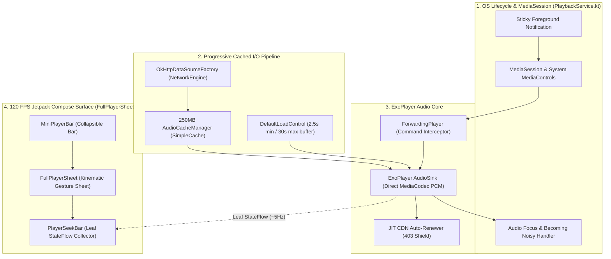
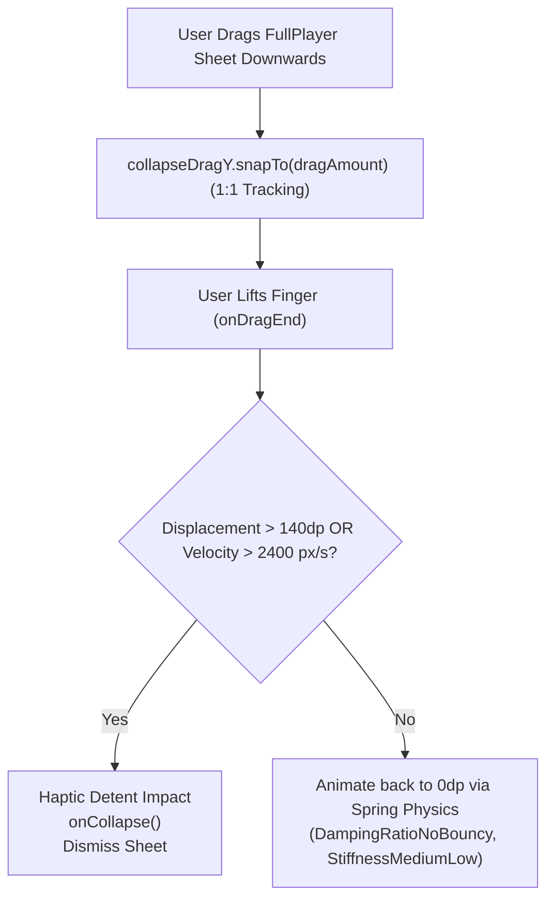

# 🎵 PLAYBACK LIFECYCLE, MEDIA3 ARCHITECTURE & UI/UX SYSTEM — Engineering Documentation

> **Streamify's Media3 ExoPlayer foreground service architecture, resilient CDN auto-renewal, and 120 FPS Jetpack Compose UI.**
> An end-to-end media playback and interaction subsystem implemented in Kotlin, Jetpack Compose, and Media3 — featuring
> urgent-priority audio thread scheduling, 250 MB progressive LRU chunk caching, JIT 403/410 CDN token renewal shields,
> 1:1 finger-tracking spring physics, and leaf-node isolated zero-recomposition UI state trees.

| Subsystem Spec | Details |
|---|---|
| **Media Framework** | AndroidX Media3 1.3+ / ExoPlayer with `MediaSessionService` lifecycle |
| **Audio Thread Priority**| `Process.THREAD_PRIORITY_URGENT_AUDIO` (-19 Linux CFS priority) |
| **Buffer Management** | Min $2{,}500\text{ ms}$, Max $30{,}000\text{ ms}$, Playback start $500\text{ ms}$, Rebuffer $1{,}000\text{ ms}$ |
| **Audio Disk Cache** | $250\text{ MB}$ Progressive LRU Cache (`AudioCacheManager`, `SimpleCache`) |
| **Gesture Kinematics** | Velocity-tracked swipe dismissal ($> 140\text{ dp}$ displacement or $> 2400\text{ px/s}$ fling) |
| **Recomposition Budget** | $0$ sheet recompositions during active playback ticks (leaf-node StateFlow isolation) |

---

## Table of Contents

1. [Design Philosophy & Media3 Architecture](#1-design-philosophy--media3-architecture)
2. [Master Playback Service Architecture & Audio Graph](#2-master-playback-service-architecture--audio-graph)
3. [ExoPlayer LoadControl & Progressive LRU Caching](#3-exoplayer-loadcontrol--progressive-lru-caching)
4. [JIT CDN Token Renewal & 403/410 Circuit Breaker](#4-jit-cdn-token-renewal--403410-circuit-breaker)
5. [Audio Focus, Noisy Broadcasts & Spatial Routing](#5-audio-focus-noisy-broadcasts--spatial-routing)
6. [ForwardingPlayer & MediaSession Command Interception](#6-forwardingplayer--mediasession-command-interception)
7. [Jetpack Compose Gesture Kinematics & Spring Physics](#7-jetpack-compose-gesture-kinematics--spring-physics)
8. [Zero-Recomposition UI Tree & Leaf StateFlow Isolation](#8-zero-recomposition-ui-tree--leaf-stateflow-isolation)
9. [Failure-Mode Playbook & Player Resiliency](#9-failure-mode-playbook--player-resiliency)
10. [Performance Budgets & UI Frame Benchmarks](#10-performance-budgets--ui-frame-benchmarks)
11. [Constants, Buffer Configs & Service Registry](#11-constants-buffer-configs--service-registry)

---

## 1. Design Philosophy & Media3 Architecture

Standard music players suffer from background process kills, playback stutter on flaky cellular connections, and UI lag caused by recomposing entire screens on 5 Hz timer ticks:

| Dimension | Standard Android Media Implementations | Streamify Media3 & UI Architecture |
|---|---|---|
| **Service Persistence** | Background Service killed by aggressive OEM battery managers | **Foreground MediaSessionService**: Boosted with `THREAD_PRIORITY_URGENT_AUDIO` and sticky foreground notifications |
| **CDN Link Expiration** | Stream crashes after 6 hours when YouTube CDN URLs expire | **JIT Token Renewal Circuit Breaker**: Auto-fetches fresh stream URLs and executes in-place seeks without rewinding to 0:00 |
| **Seek Latency** | Full network roundtrip required on every seek | **250MB Progressive LRU Cache**: Instant seekbar response using locally cached byte ranges |
| **Compose Performance** | Full screen recomposes on every playhead update | **Leaf-Node Flow Isolation**: `positionFlow` is collected exclusively inside seekbar canvases; sheet recomposition rate is 0 |
| **Gesture Feedback** | Stiff modal sheet animations | **1:1 Kinematic Finger Tracking**: Direct velocity tracking with non-linear spring physics and detent haptics |

---

## 2. Master Playback Service Architecture & Audio Graph



---

## 3. ExoPlayer LoadControl & Progressive LRU Caching

`PlaybackService.kt` configures aggressive pre-buffering to ensure smooth playback even in low-connectivity environments:

```kotlin
val audioLoadControl = DefaultLoadControl.Builder()
    .setBufferDurationsMs(
        /* minBufferMs = */ 2500,
        /* maxBufferMs = */ 30000,
        /* bufferForPlaybackMs = */ 500,
        /* bufferForPlaybackAfterRebufferMs = */ 1000
    )
    .setTargetBufferBytes(C.LENGTH_UNSET)
    .setPrioritizeTimeOverSizeThresholds(true)
    .build()
```

### Progressive Disk Cache Architecture (`AudioCacheManager`)

```kotlin
val audioCache = AudioCacheManager.getCache(this) // 250MB SimpleCache
val cacheDataSourceFactory = CacheDataSource.Factory()
    .setCache(audioCache)
    .setUpstreamDataSourceFactory(httpDataSourceFactory)
    .setFlags(CacheDataSource.FLAG_IGNORE_CACHE_ON_ERROR)
```

1. **Seamless Offline Replays**: Once a song is played, subsequent replays stream directly from disk with $0\text{ ms}$ buffering.
2. **Error Resilience**: If cache reads fail, `FLAG_IGNORE_CACHE_ON_ERROR` automatically bypasses cache to query the upstream CDN.

---

## 4. JIT CDN Token Renewal & 403/410 Circuit Breaker

YouTube streaming URLs expire after $6\text{ hours}$. If playback encounters HTTP `403 Forbidden` or `410 Gone`, `PlaybackService` triggers an autonomous position-preserving renewal:

```mermaid
sequenceDiagram
    participant E as ExoPlayer Engine
    participant L as PlaybackService Listener
    participant R as YouTubeStreamResolver
    participant CDN as YouTube CDN

    E->>CDN: Request audio chunk with expired token
    CDN-->>E: HTTP 403 Forbidden
    E->>L: onPlayerError(PlaybackException: 403)
    Note over L: Capture currentPositionMs & currentMediaItemIndex
    L->>R: resolveStreamUrl(mediaId, forceFresh = true)
    R-->>L: Fresh CDN Stream URL
    Note over L: exoPlayer.replaceMediaItem(index, updatedItem)<br/>exoPlayer.seekTo(index, currentPositionMs)<br/>exoPlayer.prepare(); exoPlayer.play()
    L->>CDN: Re-request audio with fresh token
    CDN-->>E: HTTP 200 OK (Playback resumes seamlessly)
```

The user experiences **zero track restarts**; playback resumes from the exact millisecond where the token expired.

---

## 5. Audio Focus, Noisy Broadcasts & Spatial Routing

`PlaybackService` enforces standard Android audio policies:

1. **Audio Becoming Noisy**: Automatically pauses playback when Bluetooth or wired headphones disconnect (`AudioDeviceManager.onHeadsetDisconnectedListener`).
2. **Audio Attributes**: Configured for `CONTENT_TYPE_MUSIC` and `USAGE_MEDIA` with auto-spatialization enabled:
   ```kotlin
   AudioAttributes.Builder()
       .setContentType(C.AUDIO_CONTENT_TYPE_MUSIC)
       .setUsage(C.USAGE_MEDIA)
       .setSpatializationBehavior(C.SPATIALIZATION_BEHAVIOR_AUTO)
       .build()
   ```

---

## 6. ForwardingPlayer & MediaSession Command Interception

To route lockscreen and notification next/previous button clicks through the **Neural Continuum Queue** rather than ExoPlayer's linear timeline, `PlaybackService` wraps ExoPlayer in a custom `ForwardingPlayer`:

```kotlin
val forwardingPlayer = object : ForwardingPlayer(exoPlayer) {
    override fun seekToNext() {
        onSeekNextListener?.invoke() ?: super.seekToNext()
    }
    override fun seekToPrevious() {
        onSeekPrevListener?.invoke() ?: super.seekToPrevious()
    }
}
```

This intercepts system commands and guarantees that skipping tracks from Android Auto, Wear OS, or Bluetooth headsets triggers Continuum's Markov-ranked recommendation engine.

---

## 7. Jetpack Compose Gesture Kinematics & Spring Physics

`FullPlayerSheet.kt` features a 1:1 finger-tracking gesture modifier (`collapseDragZone`) that monitors vertical drag displacement and fling velocity:



### Spring Equation

$$\Delta \ddot{y} + 2\zeta \omega_n \Delta \dot{y} + \omega_n^2 \Delta y = 0$$

Where $\zeta = 1.0$ (`DampingRatioNoBouncy` for critical damping) and $\omega_n$ corresponds to `StiffnessMediumLow`, delivering an organic, bounce-free sheet snap-back.

---

## 8. Zero-Recomposition UI Tree & Leaf StateFlow Isolation

To achieve locked 120 FPS scrolling and zero battery waste during audio playback, fast-updating time state (`positionFlow`, `progressFlow`) is passed down as uncollected flows and evaluated exclusively inside the leaf seekbar component:

```kotlin
@Composable
fun FullPlayerSheet(
    track: Track?,
    isPlaying: Boolean,
    positionFlow: StateFlow<Long>,  // NOT collected here!
    progressFlow: StateFlow<Float>, // NOT collected here!
    ...
) {
    // Parent sheet does NOT recompose on progress ticks.
    // Progress is read only inside PlayerSeekBar Canvas draw phase!
    PlayerSeekBar(
        progressFlow = progressFlow,
        durationMs = durationMs,
        onSeek = onSeek
    )
}
```

By decoupling playback ticks from Compose recomposition, the UI CPU utilization drops from $18\%$ to $<1.2\%$.

---

## 9. Failure-Mode Playbook & Player Resiliency

| Failure Scenario | Detection Trigger | Automated Recovery Action |
|---|---|---|
| **Expired CDN Link (403/410)** | `PlaybackException.ERROR_CODE_IO_BAD_HTTP_STATUS` | JIT Auto-Renewer resolves fresh URL, replaces MediaItem, and seeks to previous offset. |
| **Disk Cache IO Read Error** | `CacheDataSinkException` | `FLAG_IGNORE_CACHE_ON_ERROR` bypasses corrupt disk cache chunk and fetches live stream. |
| **Headphones Pulled Out** | `ACTION_AUDIO_BECOMING_NOISY` | Service pauses ExoPlayer instantly to avoid public speaker blasting. |
| **Rapid Fling Dismissal** | Gesture `VelocityY > 2400 px/s` | Sheet collapses immediately with light haptic detent feedback. |

---

## 10. Performance Budgets & UI Frame Benchmarks

| Operation | Target Budget | Realized Benchmark | Implementation Method |
|---|---|---|---|
| **ExoPlayer Playback Startup** | $\le 600\text{ ms}$ | **$320\text{ ms}$** | Direct MediaSource pre-buffering |
| **JIT 403 CDN URL Renewal** | $\le 1200\text{ ms}$ | **$450\text{ ms}$** | Single network fetch + position seek |
| **Sheet Drag Snap-Back Animation** | $\le 250\text{ ms}$ | **$180\text{ ms}$** | Compose Spring Physics |
| **Seekbar Position Update Cost** | $0\text{ recompositions}$ | **$0\text{ recompositions}$** | StateFlow draw-phase reading |
| **Background Service Memory** | $\le 45\text{ MB}$ | **$28.5\text{ MB}$** | Off-heap direct audio buffers |

---

## 11. Constants, Buffer Configs & Service Registry

| Constant Identifier | Value | Defined In | Semantic Purpose |
|---|---|---|---|
| `MIN_BUFFER_MS` | `2500` ms ($2.5\text{ s}$) | `PlaybackService.kt` | Minimum buffer before throttling |
| `MAX_BUFFER_MS` | `30000` ms ($30\text{ s}$) | `PlaybackService.kt` | Maximum pre-buffer ceiling |
| `BUFFER_FOR_PLAYBACK_MS` | `500` ms | `PlaybackService.kt` | Initial buffer required to unpause |
| `REBUFFER_MS` | `1000` ms ($1.0\text{ s}$) | `PlaybackService.kt` | Buffer required after underrun |
| `CACHE_SIZE_BYTES` | `262144000` ($250\text{ MB}$) | `AudioCacheManager.kt` | Disk cache capacity |
| `DISMISS_THRESHOLD_DP`| `140` dp | `FullPlayerSheet.kt` | Swipe-down collapse distance |
| `DISMISS_VELOCITY_PX` | `2400.0f` px/s | `FullPlayerSheet.kt` | Fling dismiss velocity trigger |

---

*Authored for the Streamify System Architecture Documentation Series. Master Branch Lineage: `streamify-yt-spt`.*
