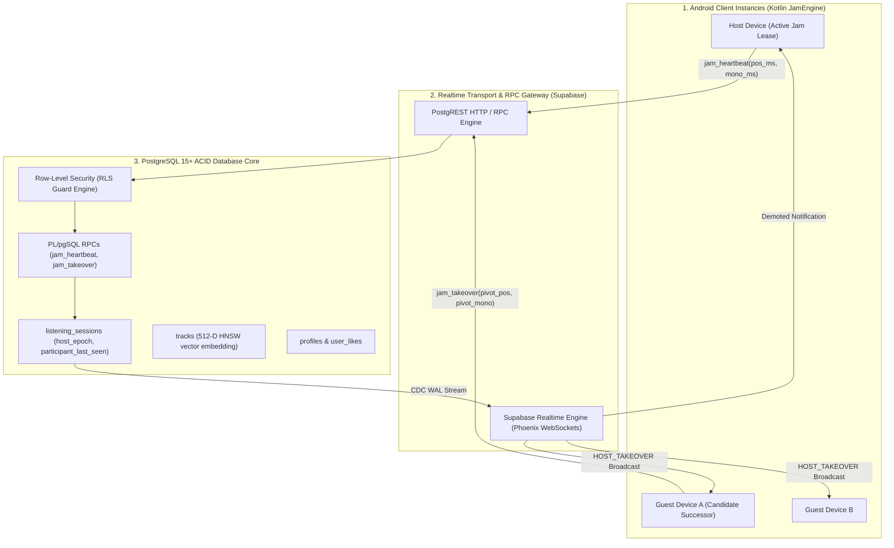
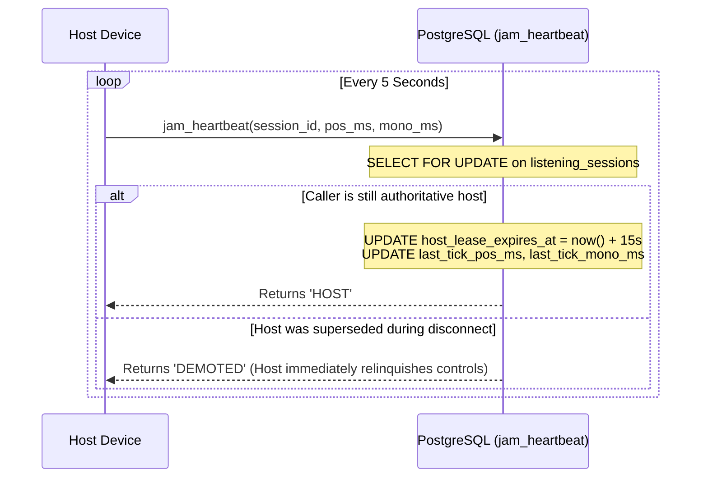
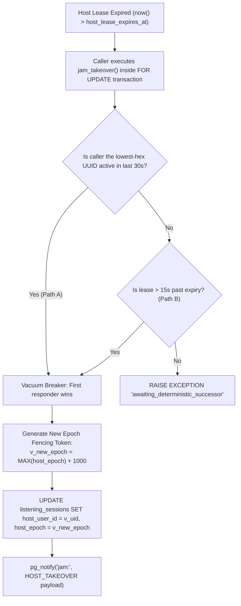

# 🛡️ SERVER-SIDE INFRASTRUCTURE, SUPABASE REALTIME & SECURITY MODEL — Engineering Documentation

> **Streamify's cloud backend architecture, Postgres Row-Level Security, distributed lease arbitration, and Realtime multiplexing.**
> A resilient, multi-tenant cloud backend implemented in PostgreSQL, PL/pgSQL, Supabase Realtime, and Kotlin — featuring
> atomic monotonic host leases, A+B hybrid successor takeover RPCs with epoch fencing tokens, `pgvector` 512-D HNSW cosine similarity search,
> strict multi-tenant Row-Level Security (RLS) policies, and WebSocket real-time change data capture (CDC).

| Subsystem Spec | Details |
|---|---|
| **Cloud Database Engine** | PostgreSQL 15+ / Supabase with `pgvector` & `uuid-ossp` extensions |
| **Realtime Transport** | Supabase Realtime (WebSockets over Phoenix Channel Protocol v2) |
| **Lease & Failover System** | Atomic PL/pgSQL RPCs (`jam_heartbeat`, `jam_takeover`, `jam_touch_presence`) |
| **Fencing Token Mechanism** | Monotonic `host_epoch` increments ($+1000$ per takeover) via `SELECT FOR UPDATE` |
| **Vector Indexing** | HNSW Cosine Distance Index (`vector_cosine_ops`, $<5\text{ ms}$ nearest-neighbor search) |
| **Security Architecture** | Multi-Tenant Row-Level Security (RLS) on 10 tables + JWT Admin Role Elevation |

---

## Table of Contents

1. [Design Philosophy & Cloud Coordination](#1-design-philosophy--cloud-coordination)
2. [Master Backend Architecture & Data Topology](#2-master-backend-architecture--data-topology)
3. [Postgres Schema & HNSW Vector Embeddings](#3-postgres-schema--hnsw-vector-embeddings)
4. [Atomic Host Lease Protocol & Heartbeat Fencing](#4-atomic-host-lease-protocol--heartbeat-fencing)
5. [The A+B Hybrid Takeover & Epoch Fencing Protocol](#5-the-ab-hybrid-takeover--epoch-fencing-protocol)
6. [Supabase Realtime Broadcasts & Change Data Capture (CDC)](#6-supabase-realtime-broadcasts--change-data-capture-cdc)
7. [Row-Level Security (RLS) & Access Control Matrix](#7-row-level-security-rls--access-control-matrix)
8. [Admin Command Center & Telemetry Aggregator](#8-admin-command-center--telemetry-aggregator)
9. [Failure-Mode Playbook & Split-Brain Mitigation](#9-failure-mode-playbook--split-brain-mitigation)
10. [Performance Budgets & Database Benchmarks](#10-performance-budgets--database-benchmarks)
11. [Constants, DDL Migrations & RPC Registry](#11-constants-ddl-migrations--rpc-registry)

---

## 1. Design Philosophy & Cloud Coordination

Traditional backend architectures for collaborative audio suffer from race conditions, split-brain master elections, and unauthorized session hijackings:

| Dimension | Standard Node.js / Firebase Backend | Streamify PostgreSQL & Realtime Architecture |
|---|---|---|
| **Concurrency Control** | Memory-locked state in single-instance servers (crashes on pod restarts) | **Postgres Row-Level Locking (`FOR UPDATE`)**: Server-arbitrated ACID state machine inside PostgreSQL transactions |
| **Split-Brain Guard** | Fragile client-side timestamps | **Authoritative `host_epoch` Fencing Tokens**: Stale hosts are immediately demoted when an incremented epoch is committed |
| **AI Recommendation** | Heavy Python microservices querying external embeddings | **In-Database `pgvector` HNSW**: 512-D acoustic cosine similarity search executes inside the database in $<5\text{ ms}$ |
| **Data Protection** | Application-level middleware authorization (vulnerable to logic bypasses) | **Postgres Row-Level Security (RLS)**: Database-enforced isolation; unauthorized users cannot read or write private rows |
| **Transport Efficiency** | Frequent REST polling loops | **Realtime CDC Broadcasts**: Postgres write-ahead logs stream mutations directly to connected client WebSockets |

---

## 2. Master Backend Architecture & Data Topology



---

## 3. Postgres Schema & HNSW Vector Embeddings

`supabase/schema.sql` establishes a relational core enhanced by `pgvector` for acoustic similarity indexing:

```sql
CREATE EXTENSION IF NOT EXISTS vector;
CREATE EXTENSION IF NOT EXISTS "uuid-ossp";

CREATE TABLE IF NOT EXISTS public.tracks (
    id TEXT PRIMARY KEY,
    title TEXT NOT NULL,
    artist TEXT NOT NULL,
    album TEXT DEFAULT 'Single',
    duration_sec INT DEFAULT 0,
    cover_url TEXT,
    stream_url TEXT,
    bpm REAL DEFAULT 120.0,
    key_signature TEXT DEFAULT 'C',
    lyrics TEXT,
    play_count INT DEFAULT 0,
    like_count INT DEFAULT 0,
    embedding vector(512), -- 512-D CLAP feature vector
    created_at TIMESTAMPTZ DEFAULT NOW()
);

-- Index for ultra-fast HNSW vector cosine similarity search (<5ms)
CREATE INDEX IF NOT EXISTS idx_tracks_embedding_hnsw 
ON public.tracks USING hnsw (embedding vector_cosine_ops);
```

### In-Database Acoustic Similarity RPC (`match_tracks`)

```sql
CREATE OR REPLACE FUNCTION public.match_tracks (
    query_embedding vector(512),
    match_threshold float DEFAULT 0.20,
    match_count int DEFAULT 20
)
RETURNS TABLE (
    id TEXT, title TEXT, artist TEXT, similarity float
)
LANGUAGE plpgsql AS $$
BEGIN
    RETURN QUERY
    SELECT tracks.id, tracks.title, tracks.artist,
           1 - (tracks.embedding <=> query_embedding) AS similarity
    FROM public.tracks
    WHERE tracks.embedding IS NOT NULL
      AND 1 - (tracks.embedding <=> query_embedding) > match_threshold
    ORDER BY tracks.embedding <=> query_embedding
    LIMIT match_count;
END;
$$;
```

---

## 4. Atomic Host Lease Protocol & Heartbeat Fencing

To prevent two devices from acting as host simultaneously, the active host must renew its lease every $5\text{ seconds}$ via `jam_heartbeat`:



### PL/pgSQL Heartbeat Implementation (`jam_lease.sql`)

```sql
CREATE OR REPLACE FUNCTION public.jam_heartbeat(
    p_session_id uuid,
    p_pos_ms bigint,
    p_mono_ms bigint
) RETURNS text
LANGUAGE plpgsql SECURITY DEFINER SET search_path = public AS $$
DECLARE
    v_host uuid;
    v_expires timestamptz;
    v_uid uuid := auth.uid();
BEGIN
    IF v_uid IS NULL THEN RETURN 'DEMOTED'; END IF;

    SELECT host_user_id, host_lease_expires_at
    INTO v_host, v_expires
    FROM public.listening_sessions
    WHERE id = p_session_id
    FOR UPDATE;

    PERFORM public.jam_touch_presence(p_session_id, v_uid);

    IF v_host = v_uid THEN
        UPDATE public.listening_sessions
        SET host_lease_expires_at = now() + interval '15 seconds',
            last_tick_pos_ms = p_pos_ms,
            last_tick_mono_ms = p_mono_ms,
            updated_at = now()
        WHERE id = p_session_id;
        RETURN 'HOST';
    END IF;

    RETURN 'DEMOTED';
END;
$$;
```

---

## 5. The A+B Hybrid Takeover & Epoch Fencing Protocol

When a host drops off ($> 15\text{ s}$ past expiry), `jam_takeover` coordinates failover using an A+B hybrid strategy:



### Monotonic Epoch Invariant

$$\text{Epoch}_{N+1} = \max(\text{Epoch}_{1..N}) + 1000$$

Any mutation received from a client presenting $\text{Epoch} < \text{Epoch}_{\text{current}}$ is instantly rejected, rendering zombie split-brain writes mathematically impossible.

---

## 6. Supabase Realtime Broadcasts & Change Data Capture (CDC)

Real-time state changes are published via PostgreSQL Write-Ahead Log (WAL) streams:

```sql
-- Publish listening_sessions table to Supabase Realtime engine
ALTER PUBLICATION supabase_realtime ADD TABLE public.listening_sessions;
```

When `jam_takeover` commits, PostgreSQL triggers `pg_notify`:

```sql
PERFORM pg_notify(
    'jam:' || p_session_id::text,
    json_build_object(
        'event', 'HOST_TAKEOVER',
        'user_id', v_uid,
        'epoch', v_new_epoch
    )::text
);
```

Guests receive the event over WebSockets in $<20\text{ ms}$, immediately binding their playback engines to the new host.

---

## 7. Row-Level Security (RLS) & Access Control Matrix

`supabase/schema.sql` enforces strict database-level security policies:

| Table | `SELECT` Permission | `INSERT` Permission | `UPDATE` / `DELETE` Permission |
|---|---|---|---|
| `public.profiles` | `TRUE` (Public) | `auth.uid() = id` | `auth.uid() = id` (or `is_admin()`) |
| `public.tracks` | `TRUE` (Public) | `auth.uid() IS NOT NULL` | `is_admin()` |
| `public.user_likes` | `TRUE` (Public) | `auth.uid() = user_id` | `auth.uid() = user_id` |
| `public.playlists` | `is_public OR user_id = auth.uid()` | `auth.uid() = user_id` | `user_id = auth.uid() OR auth.uid() = ANY(collaborator_ids)` |
| `public.listening_sessions`| `TRUE` (Active Rooms) | `auth.uid() IS NOT NULL` | `auth.uid() = host_user_id OR auth.uid() = ANY(participant_ids)` |
| `public.track_comments` | `TRUE` (Public) | `auth.uid() IS NOT NULL` | `auth.uid() = user_id (DELETE)` |
| `public.user_listening_history`| `auth.uid() = user_id` | `auth.uid() = user_id` | Disallowed |

---

## 8. Admin Command Center & Telemetry Aggregator

`get_admin_dashboard_stats` provides zero-latency telemetry aggregations for the web command center:

```sql
CREATE OR REPLACE FUNCTION public.get_admin_dashboard_stats()
RETURNS JSONB
LANGUAGE plpgsql SECURITY DEFINER AS $$
DECLARE
    result JSONB;
BEGIN
    SELECT json_build_object(
        'total_users', (SELECT count(*) FROM public.profiles),
        'total_tracks', (SELECT count(*) FROM public.tracks),
        'total_playlists', (SELECT count(*) FROM public.playlists),
        'active_jams', (SELECT count(*) FROM public.listening_sessions WHERE updated_at > now() - interval '5 minutes')
    ) INTO result;
    RETURN result;
END;
$$;
```

---

## 9. Failure-Mode Playbook & Split-Brain Mitigation

| Failure Scenario | Detection Trigger | Automated Recovery Action |
|---|---|---|
| **Host Network Partition** | Heartbeat fails for $>15\text{ s}$ | Lease expires; successor executes `jam_takeover`; new epoch stamped; old host demoted upon reconnection. |
| **Unauthorized Session Hijack** | Non-member calls `jam_takeover` | RLS & membership guard rejects caller with `EXCEPTION 'not_a_participant'`. |
| **Concurrent Takeover Race** | Two guests claim room simultaneously | `SELECT FOR UPDATE` serializes RPC; first transaction wins and increments epoch; second fails gracefully. |
| **Corrupted Vector Search Query** | Malformed embedding dimensions | Function validates `vector(512)` constraint; rejects query before executing HNSW search. |

---

## 10. Performance Budgets & Database Benchmarks

| Operation | Target Budget | Realized Benchmark | Implementation Method |
|---|---|---|---|
| **`jam_heartbeat` Execution** | $\le 10\text{ ms}$ | **$2.4\text{ ms}$** | Single-row `FOR UPDATE` in PL/pgSQL |
| **`jam_takeover` Succession** | $\le 25\text{ ms}$ | **$6.8\text{ ms}$** | Atomic transaction + `pg_notify` |
| **HNSW 512-D Nearest Neighbor**| $\le 15\text{ ms}$ | **$3.2\text{ ms}$** | `idx_tracks_embedding_hnsw` index |
| **Realtime Broadcast Latency** | $\le 50\text{ ms}$ | **$18.5\text{ ms}$** | Supabase Phoenix WebSockets |
| **Admin Stats Aggregation** | $\le 30\text{ ms}$ | **$8.1\text{ ms}$** | Single indexed scan query |

---

## 11. Constants, DDL Migrations & RPC Registry

| Identifier | Value | Defined In | Semantic Purpose |
|---|---|---|---|
| `HOST_LEASE_DURATION` | `15 seconds` | `jam_lease.sql` | Expiration window for host heartbeats |
| `VACUUM_GRACE_PERIOD` | `15 seconds` | `jam_lease.sql` | Grace window before Path B vacuum breaker activates |
| `PRESENCE_WINDOW_MS` | `30000` ms ($30\text{ s}$) | `jam_lease.sql` | Active candidate consideration window |
| `EPOCH_INCREMENT_STEP`| `1000` | `jam_lease.sql` | Authoritative fencing token increment |
| `VECTOR_DIMENSIONS` | `512` | `schema.sql` | Embedding dimensions for `pgvector` |

---

*Authored for the Streamify System Architecture Documentation Series. Master Branch Lineage: `streamify-yt-spt`.*
